Update
========================================================
author: Richèl J.C. Bilderbeek
date: 2021-07-15
autosize: true

[https://github.com/richelbilderbeek/igp_presentation_20210715](https://github.com/richelbilderbeek/igp_presentation_20210715) 

<style>
.small-code pre code {
  font-size: 1em;
}
</style>

Setup
========================================================

 * Describe GCAE
 * Share proof of concept results
   * Spoiler: the encouraging results are rather contrived
   * Could use ideas here

***
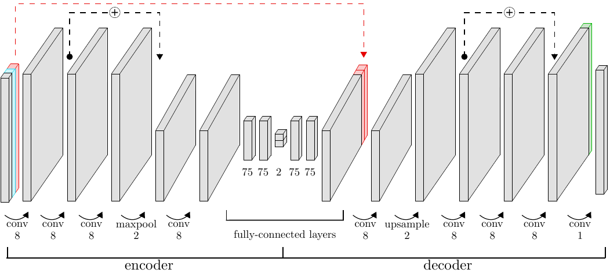

When you are lucky
========================================================

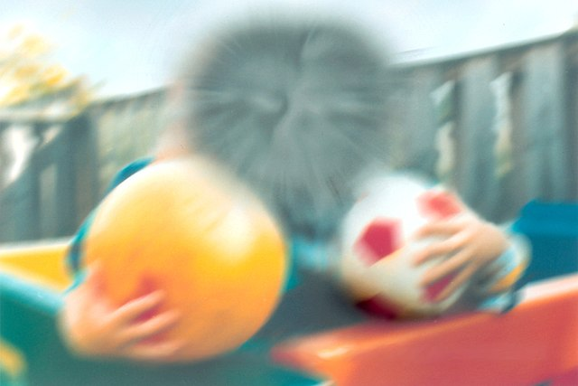

***

Age (years)|Incidence
-----------|---------
50-60      | 0.4%
60-70      | 0.7%
70-80      | 2.3%
80+        | 12%

 * Smoking 

The first GWAS
========================================================


Eagle, R. C. (2006). doi:10.1016/s0084-392x(08)70396-4

***

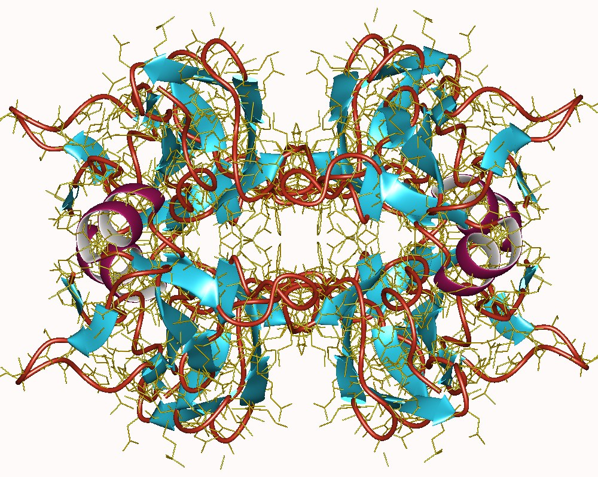

Today's GWAS
========================================================


Today's GWAS
========================================================


38 citations

***


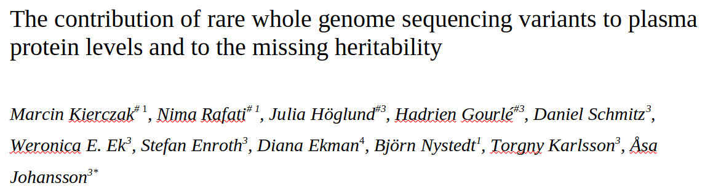

Introduction
========================================================

Quantitive trait associations, e.g. protein levels, are important.

Works well when:

 * 1 SNP -> 1 phenotype, e.g PLINK
 * More SNPs linearly determine a phenotype, e.g. SKAT

Research question
========================================================

Can we find novel associations using machine learning?

Novel == un(der)detected using existing methods

***


GCAE
========================================================


Problem
========================================================

 * Dimensionality reduction
 * PCA is linear, where data is complex
 * Deep learning learn non-linear and complex features

PCA is useful
========================================================

Lao, Oscar, et al. "Correlation between genetic and geographic structure in Europe." Current Biology 18.16 (2008): 1241-1248.

***

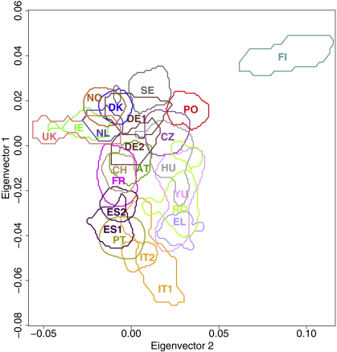

Potential to do better than PCA
========================================================

Ausmees, Kristiina and Nettelblad, Carl. "A deep learning framework for characterization of genotype data." bioRxiv (2020)

***

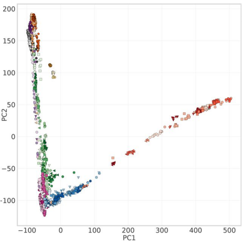

Do better than PCA using GCAE
========================================================

Ausmees, Kristiina and Nettelblad, Carl. "A deep learning framework for characterization of genotype data." bioRxiv (2020)

***

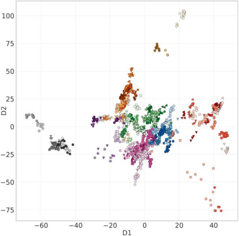

GCAE
========================================================

Character|Full         |What
---------|-------------|------------------------------
G        |Genomic      |Works on genomic data
C        |Convolutional|Works on processed data
A        |Auto         |Learns by itself
E        |Encoder      |to efficiently encode the data

***


Type of analysis
========================================================

 * Prediction and association
 * Quantitative and binary traits

Research question
========================================================

Can we find novel associations using GCAE?

Novel == un(der)detected using existing methods

***


State of GCAE now
========================================================

 * Does not yet allow a trait nor covariates to be encoded along genotype

Finding novel associations
========================================================

Proof of concept:

 * No association
 * Additive association
 * XOR
 * EXP
 * Your suggestion

***


```r
library(plinkr)
set.seed(314)
mafs <- 0.49
n_individuals <- 1000
```

Random phenotype
========================================================

A phenotype that is completely unrelated to the SNPs investigated

***

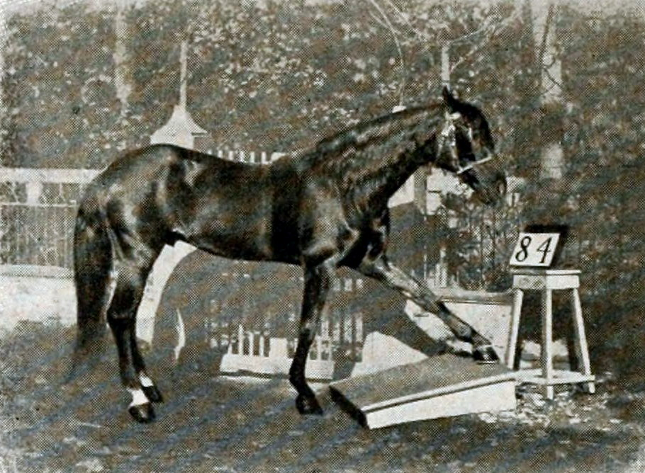

Random phenotype
========================================================
class: small-code


```r
snvs <- create_snvs(
  n_individuals = 4
)
calc_random_phenotype <- function(snvs) {
  stats::runif(nrow(snvs))
}
snvs$random <- calc_random_phenotype(snvs)
```


```r
knitr::kable(snvs)
```

***


|snv_1a |snv_1b |    random|
|:------|:------|---------:|
|A      |A      | 0.0988320|
|A      |C      | 0.2714778|
|C      |A      | 0.7665282|
|C      |C      | 0.2246424|


Random trait
========================================================
class: small-code


```r
random_trait <- create_custom_trait(
  phenotype = "random",
  mafs = 0.49,
  n_snps = 1,
  calc_phenotype_function =
    calc_random_phenotype
)
random_data <- create_demo_assoc_qt_params(
  traits = random_trait,
  n_individuals = n_individuals
)
```


```r
knitr::kable(
  head(
    cbind(
      random_data$ped_table[, -seq(1, 6)],
      random_data$phe_table[, 3]
    )
  )
)
```

***


|snv_1a |snv_1b |    random|
|:------|:------|---------:|
|C      |C      | 0.4666161|
|C      |C      | 0.3510843|
|A      |A      | 0.9266955|
|C      |A      | 0.9974184|
|C      |C      | 0.4981833|
|C      |C      | 0.4371469|
|C      |C      | 0.3710171|
|A      |A      | 0.4765347|
|C      |A      | 0.8747569|
|A      |A      | 0.0703521|
|C      |A      | 0.5177573|
|A      |C      | 0.7403552|
|C      |A      | 0.6766470|
|C      |C      | 0.3195054|
|A      |C      | 0.6527457|
|C      |C      | 0.2545512|
|A      |A      | 0.4073478|
|C      |A      | 0.8687714|
|A      |C      | 0.9359008|
|A      |C      | 0.7342456|
|C      |C      | 0.4629348|
|C      |A      | 0.9954340|
|A      |C      | 0.4298082|
|C      |A      | 0.5565240|
|A      |C      | 0.2405035|
|A      |A      | 0.2429802|
|C      |A      | 0.4378420|
|A      |C      | 0.9054450|
|C      |C      | 0.0004699|
|A      |C      | 0.5640251|
|A      |C      | 0.8818015|
|A      |C      | 0.5051586|
|A      |C      | 0.8302418|
|C      |C      | 0.4009614|
|C      |C      | 0.9330289|
|A      |C      | 0.1390164|
|C      |C      | 0.5665199|
|C      |C      | 0.8372669|
|C      |C      | 0.5175253|
|A      |C      | 0.2984122|
|A      |C      | 0.3875989|
|C      |C      | 0.6318162|
|A      |C      | 0.1600651|
|A      |A      | 0.5808374|
|A      |C      | 0.7287619|
|A      |A      | 0.9184051|
|C      |A      | 0.9380222|
|C      |C      | 0.0702222|
|C      |A      | 0.9573446|
|A      |C      | 0.4708177|
|A      |A      | 0.2436554|
|A      |A      | 0.6870006|
|C      |C      | 0.6033164|
|C      |A      | 0.5356131|
|C      |A      | 0.0292049|
|C      |A      | 0.4869139|
|C      |C      | 0.2194685|
|C      |C      | 0.6752314|
|A      |C      | 0.2737835|
|A      |C      | 0.0111437|
|C      |A      | 0.6616764|
|C      |A      | 0.9479069|
|A      |C      | 0.8620828|
|A      |A      | 0.7223205|
|C      |A      | 0.6246416|
|C      |A      | 0.2143780|
|C      |A      | 0.8565959|
|C      |A      | 0.4969844|
|C      |C      | 0.2784219|
|A      |C      | 0.5260534|
|C      |C      | 0.8121509|
|A      |A      | 0.0180577|
|A      |A      | 0.2200433|
|A      |A      | 0.0813889|
|A      |A      | 0.4023108|
|A      |A      | 0.1350695|
|A      |C      | 0.3755708|
|C      |C      | 0.4239408|
|C      |A      | 0.2754110|
|C      |C      | 0.9584926|
|C      |C      | 0.7027859|
|A      |A      | 0.1828515|
|C      |C      | 0.9035468|
|A      |A      | 0.1277749|
|C      |C      | 0.8167092|
|A      |A      | 0.2538690|
|C      |A      | 0.0027642|
|A      |A      | 0.1268870|
|A      |A      | 0.6045920|
|C      |A      | 0.9469801|
|A      |C      | 0.1704597|
|C      |A      | 0.8230466|
|C      |A      | 0.0168202|
|C      |C      | 0.0859954|
|C      |C      | 0.4236687|
|A      |C      | 0.7816329|
|C      |C      | 0.9444947|
|A      |A      | 0.5371656|
|A      |C      | 0.1330566|
|C      |C      | 0.2114321|
|C      |C      | 0.5724692|
|C      |C      | 0.5780750|
|C      |A      | 0.9633829|
|C      |C      | 0.9526718|
|A      |C      | 0.5886201|
|A      |A      | 0.0163122|
|A      |C      | 0.0382191|
|C      |A      | 0.3778935|
|C      |C      | 0.0038855|
|C      |A      | 0.0121057|
|C      |C      | 0.4895431|
|A      |C      | 0.0337622|
|A      |A      | 0.2711655|
|A      |A      | 0.1523292|
|C      |C      | 0.3226183|
|A      |A      | 0.4908241|
|A      |A      | 0.7293634|
|A      |C      | 0.0257039|
|A      |C      | 0.7650239|
|C      |A      | 0.5917298|
|C      |A      | 0.6006035|
|A      |C      | 0.5050879|
|A      |C      | 0.6207248|
|C      |A      | 0.3582780|
|C      |A      | 0.6181159|
|A      |A      | 0.7827187|
|A      |C      | 0.8107463|
|A      |C      | 0.3900908|
|C      |C      | 0.5550675|
|A      |A      | 0.8697689|
|C      |A      | 0.6257760|
|C      |C      | 0.1150237|
|A      |A      | 0.2682994|
|A      |C      | 0.6718922|
|A      |A      | 0.4927311|
|A      |A      | 0.3011806|
|C      |C      | 0.9527706|
|A      |A      | 0.7095233|
|C      |C      | 0.1852366|
|C      |C      | 0.0880095|
|C      |C      | 0.9357250|
|C      |A      | 0.5798597|
|C      |A      | 0.9648490|
|C      |A      | 0.8572698|
|C      |A      | 0.3553385|
|A      |A      | 0.9173626|
|A      |A      | 0.1446935|
|A      |A      | 0.3120757|
|C      |C      | 0.8112037|
|C      |C      | 0.4203017|
|A      |C      | 0.8600740|
|A      |A      | 0.4282796|
|C      |A      | 0.7158796|
|C      |A      | 0.9363899|
|A      |A      | 0.8646936|
|C      |A      | 0.7376986|
|A      |A      | 0.4498195|
|C      |C      | 0.9727773|
|A      |C      | 0.9998425|
|C      |A      | 0.1005272|
|A      |C      | 0.9234042|
|C      |A      | 0.6666076|
|C      |C      | 0.7758992|
|C      |C      | 0.9524245|
|C      |C      | 0.6979056|
|A      |A      | 0.5840827|
|A      |C      | 0.4836001|
|A      |A      | 0.5444697|
|C      |C      | 0.6110389|
|C      |C      | 0.4334467|
|A      |A      | 0.3880146|
|A      |A      | 0.9274434|
|A      |C      | 0.9546580|
|C      |A      | 0.2964629|
|A      |A      | 0.8237353|
|C      |A      | 0.3723806|
|A      |A      | 0.2829903|
|A      |C      | 0.4270406|
|C      |A      | 0.6376593|
|A      |A      | 0.7983570|
|C      |C      | 0.9672294|
|C      |A      | 0.9162136|
|C      |A      | 0.0765617|
|C      |A      | 0.0258274|
|A      |C      | 0.7534460|
|C      |A      | 0.6852524|
|A      |C      | 0.5883287|
|A      |A      | 0.3084476|
|C      |C      | 0.9655612|
|C      |A      | 0.4132219|
|C      |A      | 0.1131252|
|C      |A      | 0.9391504|
|A      |C      | 0.1644022|
|A      |A      | 0.6183585|
|A      |A      | 0.2059833|
|A      |A      | 0.0693161|
|A      |C      | 0.6643047|
|A      |A      | 0.6711986|
|C      |A      | 0.1668075|
|A      |C      | 0.4708659|
|C      |C      | 0.0919447|
|A      |C      | 0.7919454|
|A      |A      | 0.2781073|
|C      |C      | 0.7272416|
|C      |C      | 0.8716855|
|C      |A      | 0.6365015|
|C      |A      | 0.4435521|
|A      |C      | 0.4834481|
|C      |C      | 0.0300629|
|C      |A      | 0.0607565|
|C      |A      | 0.7375413|
|C      |C      | 0.1812268|
|A      |C      | 0.9947233|
|C      |C      | 0.2821435|
|A      |A      | 0.5398953|
|C      |A      | 0.6412068|
|C      |C      | 0.7300088|
|A      |A      | 0.1584773|
|A      |A      | 0.6409074|
|A      |C      | 0.5719852|
|C      |C      | 0.6577698|
|C      |A      | 0.4374673|
|C      |C      | 0.0751168|
|C      |A      | 0.8529090|
|A      |A      | 0.1090336|
|A      |C      | 0.4546626|
|C      |C      | 0.0300427|
|A      |A      | 0.5566143|
|A      |A      | 0.3970274|
|A      |C      | 0.2698140|
|A      |C      | 0.2315345|
|C      |A      | 0.3791137|
|C      |C      | 0.1723093|
|A      |C      | 0.3270362|
|A      |A      | 0.0662876|
|C      |A      | 0.6814550|
|A      |C      | 0.3778047|
|C      |A      | 0.7434023|
|A      |A      | 0.9084648|
|C      |C      | 0.7016574|
|C      |C      | 0.9376146|
|A      |A      | 0.3336255|
|A      |C      | 0.0929231|
|A      |C      | 0.3122960|
|A      |A      | 0.6207482|
|A      |A      | 0.0894140|
|C      |A      | 0.4606120|
|C      |C      | 0.9397063|
|A      |C      | 0.2824683|
|A      |A      | 0.4579554|
|A      |A      | 0.5545835|
|A      |C      | 0.0274181|
|C      |A      | 0.0861547|
|C      |C      | 0.9054060|
|A      |C      | 0.4573563|
|C      |A      | 0.6247406|
|A      |A      | 0.5317663|
|C      |C      | 0.3005938|
|C      |C      | 0.1392729|
|A      |A      | 0.2387616|
|A      |C      | 0.1973084|
|C      |C      | 0.6949484|
|C      |C      | 0.5096948|
|A      |A      | 0.4282848|
|C      |A      | 0.1956676|
|A      |C      | 0.6238853|
|C      |A      | 0.4144428|
|A      |C      | 0.3102670|
|A      |C      | 0.8887328|
|A      |C      | 0.0651954|
|C      |A      | 0.8564127|
|C      |C      | 0.8273041|
|A      |A      | 0.1106101|
|C      |A      | 0.5602648|
|A      |A      | 0.5980109|
|C      |C      | 0.8423409|
|C      |C      | 0.7017333|
|A      |A      | 0.3589375|
|C      |C      | 0.4320411|
|A      |A      | 0.3000680|
|A      |A      | 0.2733039|
|C      |A      | 0.9491902|
|C      |C      | 0.6232438|
|C      |A      | 0.5312069|
|A      |C      | 0.8239511|
|A      |C      | 0.6032270|
|A      |A      | 0.9730198|
|C      |C      | 0.2214207|
|A      |C      | 0.7614851|
|A      |A      | 0.3774368|
|C      |A      | 0.9415224|
|C      |C      | 0.8791712|
|A      |A      | 0.9317173|
|A      |A      | 0.2708685|
|A      |C      | 0.8860205|
|A      |C      | 0.5942857|
|A      |A      | 0.5006507|
|A      |C      | 0.7532699|
|A      |C      | 0.5723658|
|C      |A      | 0.6797457|
|C      |C      | 0.8078294|
|C      |C      | 0.9364945|
|A      |A      | 0.7718503|
|C      |A      | 0.4540436|
|A      |C      | 0.5019872|
|A      |C      | 0.4921837|
|C      |C      | 0.6803712|
|A      |A      | 0.6168179|
|A      |C      | 0.1636093|
|C      |A      | 0.1297464|
|A      |C      | 0.0467316|
|C      |A      | 0.7535574|
|A      |C      | 0.2825315|
|C      |C      | 0.5807508|
|A      |A      | 0.6842838|
|A      |C      | 0.3901077|
|A      |C      | 0.2145733|
|C      |C      | 0.5894208|
|C      |A      | 0.0924488|
|A      |A      | 0.5320341|
|A      |C      | 0.0799992|
|C      |C      | 0.5880456|
|C      |A      | 0.4731335|
|C      |C      | 0.1679480|
|C      |A      | 0.7268089|
|C      |C      | 0.9582479|
|A      |C      | 0.4659862|
|A      |C      | 0.3902719|
|A      |C      | 0.5835994|
|C      |A      | 0.9905484|
|C      |C      | 0.3358580|
|C      |A      | 0.6327363|
|C      |C      | 0.9960790|
|A      |C      | 0.6282579|
|A      |A      | 0.5723205|
|C      |A      | 0.0441136|
|A      |A      | 0.5927434|
|C      |A      | 0.1058055|
|C      |A      | 0.6372760|
|C      |A      | 0.1617871|
|A      |A      | 0.7651678|
|A      |C      | 0.2782309|
|A      |A      | 0.2005444|
|C      |A      | 0.2166562|
|A      |C      | 0.1304861|
|A      |A      | 0.4531552|
|A      |C      | 0.6676283|
|C      |A      | 0.9269115|
|A      |A      | 0.4658814|
|C      |A      | 0.5433713|
|A      |A      | 0.7827837|
|A      |A      | 0.4566344|
|A      |C      | 0.8840102|
|C      |C      | 0.6096605|
|C      |C      | 0.2648941|
|C      |C      | 0.4075191|
|C      |C      | 0.8307778|
|C      |C      | 0.7968948|
|C      |C      | 0.1388298|
|A      |A      | 0.9912732|
|C      |A      | 0.7109792|
|A      |A      | 0.4586971|
|C      |C      | 0.9792808|
|C      |A      | 0.6055506|
|A      |A      | 0.7651727|
|A      |A      | 0.3540049|
|A      |A      | 0.8544064|
|A      |A      | 0.3275437|
|A      |A      | 0.6680774|
|A      |A      | 0.6450859|
|A      |C      | 0.1256085|
|C      |A      | 0.9879515|
|C      |A      | 0.3822403|
|A      |C      | 0.5895235|
|A      |C      | 0.6756132|
|A      |C      | 0.5499352|
|A      |C      | 0.2013024|
|C      |C      | 0.4566241|
|C      |C      | 0.6708180|
|C      |A      | 0.3597837|
|A      |C      | 0.5049601|
|A      |A      | 0.5807733|
|A      |A      | 0.2570299|
|C      |A      | 0.0312179|
|C      |C      | 0.4180220|
|A      |A      | 0.6158686|
|A      |C      | 0.3979164|
|C      |A      | 0.2347665|
|A      |A      | 0.7863461|
|C      |A      | 0.7588834|
|C      |A      | 0.6698301|
|C      |C      | 0.0199496|
|A      |A      | 0.3171380|
|C      |C      | 0.7460284|
|C      |A      | 0.8814165|
|C      |A      | 0.9444794|
|C      |A      | 0.6895219|
|A      |A      | 0.8037568|
|A      |C      | 0.6065219|
|A      |A      | 0.5186909|
|A      |A      | 0.3691207|
|C      |A      | 0.7582214|
|C      |C      | 0.4658594|
|C      |C      | 0.0109562|
|A      |A      | 0.0402317|
|C      |C      | 0.3225180|
|A      |C      | 0.3721057|
|A      |A      | 0.8311548|
|A      |C      | 0.7403355|
|A      |A      | 0.2121572|
|A      |A      | 0.9137420|
|C      |C      | 0.5756018|
|A      |C      | 0.6160652|
|C      |C      | 0.6574057|
|C      |C      | 0.4914116|
|C      |A      | 0.2492873|
|C      |C      | 0.1104924|
|A      |A      | 0.5445646|
|C      |C      | 0.4836012|
|A      |A      | 0.7877096|
|C      |A      | 0.6815864|
|A      |C      | 0.5830562|
|A      |C      | 0.2364739|
|C      |C      | 0.8665226|
|C      |C      | 0.1136608|
|A      |C      | 0.8163246|
|C      |C      | 0.0798466|
|C      |C      | 0.5734623|
|C      |C      | 0.1143040|
|A      |C      | 0.5521747|
|C      |C      | 0.7928454|
|A      |C      | 0.3337094|
|C      |C      | 0.4243316|
|C      |A      | 0.5178803|
|A      |A      | 0.2550578|
|C      |A      | 0.9746749|
|A      |C      | 0.4399638|
|C      |C      | 0.8821483|
|A      |C      | 0.5132134|
|C      |A      | 0.8709597|
|A      |A      | 0.7688647|
|C      |C      | 0.9730690|
|A      |A      | 0.6724718|
|A      |A      | 0.0793417|
|A      |A      | 0.0568489|
|C      |C      | 0.5389315|
|C      |A      | 0.7198852|
|A      |C      | 0.8596539|
|C      |A      | 0.3299948|
|C      |A      | 0.1809232|
|C      |A      | 0.1541132|
|A      |C      | 0.4853563|
|C      |A      | 0.0763109|
|A      |A      | 0.6944921|
|A      |C      | 0.0913871|
|A      |C      | 0.2556522|
|C      |A      | 0.5825426|
|C      |C      | 0.3350374|
|A      |C      | 0.0817167|
|A      |C      | 0.0326506|
|A      |C      | 0.3916646|
|A      |A      | 0.3329409|
|A      |A      | 0.4059414|
|A      |A      | 0.3480986|
|A      |A      | 0.5644677|
|A      |C      | 0.0820233|
|C      |C      | 0.7641447|
|C      |C      | 0.9782927|
|A      |C      | 0.6282667|
|C      |A      | 0.2604343|
|A      |A      | 0.1055512|
|C      |C      | 0.3294907|
|A      |A      | 0.2784329|
|A      |C      | 0.3182845|
|A      |A      | 0.4178078|
|A      |A      | 0.3412568|
|A      |C      | 0.4434163|
|C      |A      | 0.0523547|
|C      |C      | 0.8839304|
|A      |C      | 0.0279326|
|C      |C      | 0.9090986|
|C      |C      | 0.7269895|
|A      |C      | 0.5814303|
|A      |A      | 0.5198086|
|A      |A      | 0.9312780|
|A      |C      | 0.8720374|
|C      |C      | 0.0802594|
|A      |C      | 0.6709002|
|A      |C      | 0.9502418|
|C      |C      | 0.4284022|
|C      |C      | 0.9457046|
|A      |C      | 0.1184846|
|C      |C      | 0.3919949|
|A      |A      | 0.7434794|
|A      |C      | 0.5504710|
|A      |C      | 0.1252938|
|A      |C      | 0.8128436|
|A      |A      | 0.0324762|
|C      |A      | 0.6587953|
|C      |A      | 0.5446679|
|C      |A      | 0.5077797|
|A      |A      | 0.7111439|
|A      |C      | 0.2926608|
|C      |C      | 0.9292295|
|A      |A      | 0.5777770|
|A      |C      | 0.0705725|
|A      |A      | 0.0911942|
|A      |C      | 0.2016614|
|C      |C      | 0.3770013|
|C      |C      | 0.5488359|
|C      |A      | 0.4962836|
|C      |A      | 0.9188033|
|C      |A      | 0.7398807|
|C      |A      | 0.7661714|
|C      |A      | 0.2307042|
|C      |C      | 0.6085597|
|A      |C      | 0.2730960|
|A      |C      | 0.9367553|
|A      |C      | 0.4768693|
|A      |A      | 0.8828825|
|C      |A      | 0.5600388|
|A      |A      | 0.7312513|
|C      |C      | 0.2443317|
|A      |A      | 0.7024435|
|A      |A      | 0.4544640|
|C      |C      | 0.8928226|
|C      |A      | 0.4014438|
|C      |C      | 0.8794568|
|A      |C      | 0.3005931|
|C      |A      | 0.1992199|
|C      |C      | 0.0891043|
|C      |A      | 0.4610701|
|C      |A      | 0.5419761|
|A      |A      | 0.1031305|
|A      |A      | 0.8874168|
|C      |A      | 0.1115674|
|A      |C      | 0.7893450|
|C      |A      | 0.1685595|
|A      |A      | 0.3102403|
|C      |C      | 0.4486753|
|A      |A      | 0.7870413|
|A      |C      | 0.3145313|
|C      |A      | 0.7487236|
|C      |A      | 0.9384275|
|A      |C      | 0.9735567|
|A      |C      | 0.3490794|
|C      |A      | 0.3031048|
|C      |C      | 0.5282730|
|A      |A      | 0.5894396|
|A      |C      | 0.7473248|
|A      |C      | 0.2220238|
|A      |A      | 0.5627885|
|C      |A      | 0.3863824|
|C      |A      | 0.5601803|
|C      |C      | 0.2104119|
|A      |C      | 0.5909070|
|C      |A      | 0.1891368|
|C      |C      | 0.2782372|
|C      |C      | 0.7389831|
|A      |C      | 0.0935567|
|A      |A      | 0.1592087|
|A      |C      | 0.2916470|
|A      |C      | 0.7679305|
|A      |A      | 0.5165332|
|A      |A      | 0.0532552|
|C      |A      | 0.3616485|
|C      |A      | 0.6980632|
|C      |A      | 0.7042008|
|C      |A      | 0.0180456|
|C      |A      | 0.4890411|
|C      |C      | 0.3586478|
|C      |C      | 0.7681677|
|C      |A      | 0.7762700|
|C      |C      | 0.9220175|
|A      |C      | 0.2605463|
|A      |A      | 0.6112005|
|A      |C      | 0.5194468|
|C      |A      | 0.9498760|
|A      |C      | 0.9781126|
|A      |C      | 0.4260136|
|A      |A      | 0.9400258|
|C      |A      | 0.0753193|
|A      |C      | 0.6347329|
|A      |A      | 0.1111704|
|A      |C      | 0.9178106|
|A      |A      | 0.0084370|
|A      |C      | 0.7032672|
|A      |C      | 0.6268811|
|A      |C      | 0.7864589|
|C      |C      | 0.2446179|
|A      |C      | 0.8149701|
|A      |A      | 0.5030566|
|C      |C      | 0.6979812|
|A      |C      | 0.7457462|
|C      |A      | 0.4749425|
|A      |A      | 0.9244362|
|C      |C      | 0.8343865|
|A      |C      | 0.4354053|
|A      |C      | 0.4199613|
|A      |A      | 0.7842396|
|C      |A      | 0.4967197|
|C      |A      | 0.4116587|
|C      |A      | 0.2135292|
|C      |C      | 0.7614026|
|A      |C      | 0.9789993|
|A      |A      | 0.6061888|
|A      |C      | 0.6241813|
|C      |A      | 0.8388331|
|C      |C      | 0.7525550|
|C      |C      | 0.3925327|
|A      |A      | 0.8604693|
|C      |A      | 0.3459759|
|A      |A      | 0.0545327|
|C      |C      | 0.8017420|
|C      |A      | 0.9695920|
|C      |C      | 0.1236853|
|A      |A      | 0.9120288|
|A      |A      | 0.3156028|
|A      |A      | 0.8655264|
|C      |C      | 0.1944189|
|A      |C      | 0.7597411|
|C      |A      | 0.7116087|
|A      |A      | 0.3538896|
|A      |A      | 0.2582500|
|C      |A      | 0.8361822|
|C      |A      | 0.7681128|
|C      |A      | 0.1944977|
|A      |A      | 0.8549429|
|C      |C      | 0.0231320|
|A      |A      | 0.3286483|
|A      |A      | 0.6407425|
|A      |A      | 0.8321432|
|A      |A      | 0.6892191|
|A      |C      | 0.5677826|
|C      |C      | 0.3923747|
|C      |C      | 0.1019067|
|A      |C      | 0.7111376|
|A      |C      | 0.1782497|
|A      |A      | 0.1330976|
|A      |C      | 0.6104559|
|C      |C      | 0.5210718|
|C      |C      | 0.4700686|
|C      |A      | 0.3273444|
|C      |A      | 0.3160120|
|C      |A      | 0.1786410|
|C      |A      | 0.0658570|
|C      |C      | 0.4093793|
|A      |A      | 0.6046722|
|A      |C      | 0.0858282|
|C      |A      | 0.3388073|
|A      |C      | 0.3834126|
|C      |A      | 0.0116835|
|A      |A      | 0.0112445|
|C      |A      | 0.4121569|
|A      |C      | 0.9247135|
|A      |C      | 0.1454897|
|A      |A      | 0.2454147|
|A      |A      | 0.9511524|
|C      |A      | 0.6405375|
|C      |A      | 0.2474059|
|C      |A      | 0.3827176|
|A      |C      | 0.3558224|
|A      |C      | 0.0385165|
|C      |C      | 0.7631317|
|A      |A      | 0.0603459|
|A      |C      | 0.7562703|
|C      |C      | 0.8110166|
|C      |C      | 0.1020797|
|A      |C      | 0.4861379|
|A      |A      | 0.8026842|
|A      |C      | 0.1012761|
|A      |A      | 0.9824437|
|A      |C      | 0.5367259|
|A      |A      | 0.3918665|
|C      |C      | 0.4767991|
|C      |C      | 0.4829490|
|A      |A      | 0.9996209|
|C      |C      | 0.3729697|
|A      |C      | 0.1410470|
|A      |A      | 0.2062874|
|C      |C      | 0.9618192|
|C      |C      | 0.0906319|
|C      |A      | 0.5334823|
|A      |A      | 0.5464305|
|C      |C      | 0.9904428|
|A      |A      | 0.9420824|
|A      |C      | 0.4738046|
|C      |A      | 0.1177171|
|C      |A      | 0.2939928|
|A      |A      | 0.7020855|
|A      |A      | 0.1635664|
|A      |A      | 0.1304048|
|A      |C      | 0.3013606|
|A      |A      | 0.3560951|
|A      |A      | 0.9182480|
|C      |C      | 0.9419227|
|C      |C      | 0.6407294|
|C      |A      | 0.9975696|
|C      |A      | 0.1684956|
|C      |A      | 0.1338170|
|A      |C      | 0.7395642|
|A      |A      | 0.7951193|
|A      |A      | 0.3942684|
|C      |C      | 0.3185834|
|A      |A      | 0.1769174|
|A      |C      | 0.8473011|
|A      |A      | 0.7013506|
|A      |A      | 0.7514620|
|A      |C      | 0.1314984|
|A      |C      | 0.7492562|
|C      |A      | 0.6941915|
|A      |A      | 0.0894323|
|C      |A      | 0.2023432|
|A      |C      | 0.9676830|
|A      |C      | 0.8427891|
|A      |A      | 0.8668877|
|C      |C      | 0.4233567|
|A      |A      | 0.5595452|
|C      |A      | 0.4989349|
|A      |C      | 0.8534839|
|A      |C      | 0.6549371|
|A      |A      | 0.6801301|
|C      |A      | 0.2197171|
|A      |C      | 0.0720694|
|A      |C      | 0.6260967|
|A      |A      | 0.4657452|
|C      |A      | 0.5047930|
|A      |C      | 0.6344040|
|C      |C      | 0.0371545|
|C      |A      | 0.6377103|
|A      |A      | 0.1216814|
|C      |A      | 0.0817386|
|C      |A      | 0.7859042|
|C      |C      | 0.2358361|
|A      |A      | 0.7904143|
|A      |A      | 0.4276631|
|A      |C      | 0.9634062|
|A      |C      | 0.4589111|
|A      |C      | 0.7922427|
|A      |C      | 0.2395715|
|A      |A      | 0.2957950|
|A      |C      | 0.5664626|
|A      |C      | 0.3977834|
|A      |C      | 0.7897962|
|C      |A      | 0.7960711|
|C      |A      | 0.5024974|
|A      |C      | 0.1899999|
|C      |A      | 0.1612482|
|A      |A      | 0.1777423|
|A      |A      | 0.9264901|
|A      |A      | 0.3763493|
|C      |A      | 0.5371158|
|A      |A      | 0.0746483|
|C      |C      | 0.8766525|
|A      |A      | 0.1646734|
|C      |A      | 0.5599592|
|A      |A      | 0.8225924|
|C      |C      | 0.6737581|
|A      |A      | 0.1107575|
|C      |A      | 0.9393545|
|C      |C      | 0.6835719|
|C      |A      | 0.5665965|
|A      |A      | 0.9557607|
|C      |C      | 0.5076551|
|C      |A      | 0.6653639|
|A      |C      | 0.0002148|
|A      |A      | 0.0426709|
|C      |A      | 0.5900110|
|C      |C      | 0.5154159|
|C      |A      | 0.2601222|
|C      |A      | 0.4304230|
|C      |A      | 0.1899322|
|C      |C      | 0.7844609|
|C      |A      | 0.6725929|
|A      |A      | 0.4455120|
|C      |A      | 0.6318241|
|A      |A      | 0.1208290|
|C      |C      | 0.6405798|
|C      |C      | 0.0772491|
|C      |A      | 0.0075431|
|C      |C      | 0.1039240|
|A      |A      | 0.0486205|
|A      |A      | 0.4838083|
|C      |C      | 0.7950885|
|A      |A      | 0.5251844|
|A      |A      | 0.8911304|
|C      |A      | 0.8988009|
|C      |A      | 0.5750265|
|A      |C      | 0.2756697|
|A      |A      | 0.8558785|
|C      |A      | 0.1155735|
|C      |C      | 0.5339752|
|C      |A      | 0.2779338|
|C      |A      | 0.9846536|
|C      |A      | 0.4794410|
|A      |C      | 0.2742371|
|A      |C      | 0.7986782|
|A      |A      | 0.8771590|
|A      |A      | 0.3869111|
|C      |A      | 0.6041917|
|A      |C      | 0.7879579|
|C      |C      | 0.8875683|
|C      |C      | 0.1976407|
|C      |A      | 0.9041664|
|A      |C      | 0.8137890|
|A      |A      | 0.1112325|
|C      |A      | 0.4248483|
|C      |A      | 0.6160928|
|C      |C      | 0.6551671|
|C      |A      | 0.4247597|
|C      |C      | 0.2352774|
|C      |C      | 0.8606986|
|A      |C      | 0.2716826|
|A      |C      | 0.1273805|
|A      |A      | 0.2708936|
|C      |C      | 0.0139387|
|C      |A      | 0.9731068|
|C      |A      | 0.3391411|
|A      |A      | 0.8744968|
|A      |C      | 0.6225029|
|C      |C      | 0.6996219|
|C      |C      | 0.8130248|
|C      |A      | 0.5553371|
|C      |C      | 0.5842930|
|A      |C      | 0.4082653|
|C      |C      | 0.2432749|
|A      |C      | 0.3091446|
|A      |C      | 0.3561779|
|A      |C      | 0.0928875|
|C      |C      | 0.8022082|
|C      |C      | 0.1010219|
|A      |C      | 0.8901768|
|A      |A      | 0.8534160|
|A      |A      | 0.3722945|
|C      |C      | 0.5155753|
|C      |C      | 0.5727323|
|A      |A      | 0.0770026|
|A      |A      | 0.0305304|
|A      |C      | 0.6693833|
|C      |C      | 0.6647151|
|C      |A      | 0.8616880|
|C      |C      | 0.7976026|
|C      |C      | 0.2079309|
|C      |C      | 0.8157047|
|C      |C      | 0.7375956|
|C      |A      | 0.0621384|
|C      |A      | 0.7466082|
|A      |A      | 0.4936111|
|C      |A      | 0.9351776|
|A      |C      | 0.5385510|
|A      |A      | 0.0314340|
|C      |A      | 0.9989825|
|C      |C      | 0.7983505|
|C      |A      | 0.0426443|
|A      |A      | 0.6620382|
|A      |C      | 0.8996151|
|C      |A      | 0.0917038|
|A      |C      | 0.2327766|
|C      |C      | 0.2236708|
|C      |A      | 0.5038954|
|C      |A      | 0.6588374|
|C      |A      | 0.2690986|
|C      |A      | 0.4553947|
|A      |C      | 0.5775289|
|C      |C      | 0.1020962|
|A      |A      | 0.4610585|
|C      |C      | 0.7774649|
|A      |C      | 0.9293922|
|A      |A      | 0.6641263|
|C      |A      | 0.6705401|
|A      |A      | 0.4327305|
|C      |C      | 0.6703399|
|C      |C      | 0.8812089|
|A      |A      | 0.7050738|
|A      |A      | 0.7593923|
|A      |A      | 0.7045978|
|A      |A      | 0.5074407|
|C      |C      | 0.2840270|
|A      |A      | 0.4745199|
|A      |C      | 0.6338311|
|A      |C      | 0.9185726|
|C      |A      | 0.4434773|
|A      |C      | 0.8463547|
|A      |C      | 0.5151644|
|A      |A      | 0.1037102|
|C      |C      | 0.3982917|
|A      |C      | 0.8519634|
|C      |C      | 0.9701751|
|C      |C      | 0.4188398|
|A      |C      | 0.1870167|
|A      |A      | 0.4019237|
|C      |C      | 0.8302911|
|C      |C      | 0.7966104|
|A      |C      | 0.9825703|
|C      |C      | 0.2527198|
|C      |A      | 0.6009068|
|C      |A      | 0.1913789|
|A      |C      | 0.3528933|
|C      |A      | 0.2112345|
|A      |C      | 0.9879303|
|C      |C      | 0.0699386|
|C      |C      | 0.0699394|
|A      |C      | 0.0221869|
|A      |C      | 0.2304051|
|C      |C      | 0.8442560|
|C      |C      | 0.4411132|
|A      |A      | 0.5321461|
|A      |A      | 0.8815089|
|A      |A      | 0.6678429|
|A      |A      | 0.9270807|
|A      |C      | 0.6148443|
|A      |C      | 0.9492530|
|A      |A      | 0.7123162|
|A      |A      | 0.7222642|
|A      |A      | 0.3332822|
|C      |A      | 0.7988101|
|C      |C      | 0.0464513|
|A      |A      | 0.9517916|
|C      |A      | 0.0534337|
|C      |A      | 0.2499527|
|A      |C      | 0.7470510|
|C      |A      | 0.8186687|
|C      |A      | 0.4447032|
|C      |C      | 0.7206328|
|A      |A      | 0.8637040|
|C      |C      | 0.6374391|
|A      |A      | 0.9580782|
|A      |C      | 0.8273690|
|A      |C      | 0.9498859|
|A      |A      | 0.4806838|
|A      |C      | 0.1679107|
|A      |C      | 0.8089452|
|C      |C      | 0.2103624|
|C      |A      | 0.7600507|
|A      |C      | 0.7592641|
|A      |A      | 0.5046873|
|C      |A      | 0.8910522|
|A      |A      | 0.4673860|
|A      |A      | 0.7400161|
|C      |C      | 0.0743672|
|A      |C      | 0.5748291|
|C      |A      | 0.7306150|
|C      |A      | 0.6962998|
|C      |C      | 0.2244872|
|A      |C      | 0.1923304|
|C      |C      | 0.4086744|
|A      |C      | 0.2392953|
|C      |C      | 0.3710278|
|A      |A      | 0.1518727|
|A      |C      | 0.5966447|
|A      |C      | 0.6562796|
|A      |A      | 0.0506342|
|C      |C      | 0.3896968|
|C      |A      | 0.1389603|
|A      |C      | 0.7537261|
|C      |C      | 0.6082859|
|A      |C      | 0.6611963|
|A      |C      | 0.6317300|
|C      |A      | 0.1050916|
|C      |A      | 0.8477488|
|A      |C      | 0.1766640|
|C      |A      | 0.9001773|
|C      |A      | 0.0394498|
|C      |A      | 0.5863107|
|C      |C      | 0.7970429|
|C      |A      | 0.8111590|
|C      |C      | 0.0725563|
|C      |A      | 0.6473193|
|C      |C      | 0.7732047|
|A      |C      | 0.4574499|
|C      |A      | 0.1931646|
|A      |A      | 0.5412246|
|A      |A      | 0.1321397|
|C      |A      | 0.7389283|
|A      |A      | 0.3900107|
|C      |C      | 0.9087116|
|C      |C      | 0.2238422|
|A      |A      | 0.7497868|
|A      |A      | 0.4241231|
|A      |C      | 0.9054928|
|A      |C      | 0.9787024|
|A      |A      | 0.0189182|
|A      |C      | 0.7707907|
|C      |C      | 0.3104862|
|C      |C      | 0.9808219|
|C      |C      | 0.5706555|
|C      |A      | 0.3304665|
|A      |A      | 0.7558455|
|A      |A      | 0.5256735|
|C      |A      | 0.4503466|
|A      |A      | 0.4755245|
|A      |C      | 0.4897302|
|A      |A      | 0.9932242|
|C      |A      | 0.8762484|
|C      |A      | 0.5656362|
|C      |A      | 0.3998546|
|C      |A      | 0.2375648|
|C      |C      | 0.8907967|
|C      |A      | 0.8139643|
|A      |C      | 0.1614114|

Associations on random data
========================================================


```r
knitr::kable(assoc_qt(random_data))
```


| CHR|SNP   | BP| NMISS|    BETA|      SE|       R2|     T|      P|
|---:|:-----|--:|-----:|-------:|-------:|--------:|-----:|------:|
|   1|snp_1 |  1|  1000| 0.01843| 0.01278| 0.002079| 1.442| 0.1496|

No association is correctly detected.

Additive phenotype
========================================================

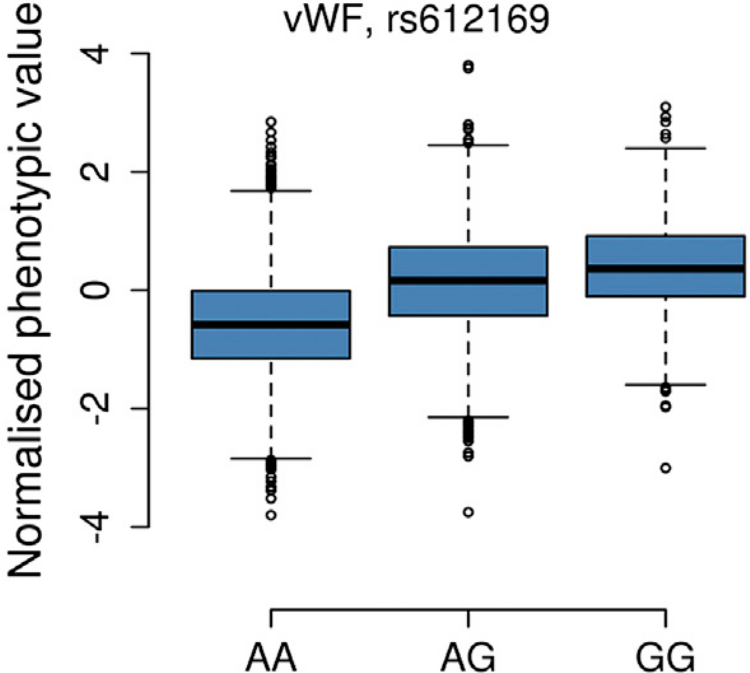

***

Zhu, Zhihong, et al. "Dominance genetic variation contributes little to the missing heritability for human complex traits." The American Journal of Human Genetics 96.3 (2015): 377-385.
Additive phenotype
========================================================
class: small-code


```r
snvs <- create_snvs(
  n_individuals = 4
)
calc_additive_phenotype <- function(snvs) {
  (rowSums(snvs == "C") / 10.0) +
    runif(nrow(snvs), min = 0.0, max = 0.01)
}
snvs$additive <- calc_additive_phenotype(snvs)
```


```r
knitr::kable(snvs)
```

***


|snv_1a |snv_1b |  additive|
|:------|:------|---------:|
|A      |A      | 0.0038967|
|A      |C      | 0.1040717|
|C      |A      | 0.1007025|
|C      |C      | 0.2061279|

Additive trait
========================================================
class: small-code


```r
additive_trait <- create_custom_trait(
  phenotype = "additive",
  mafs = 0.49,
  n_snps = 1,
  calc_phenotype_function =
    calc_additive_phenotype
)
additive_data <- create_demo_assoc_qt_params(
  traits = additive_trait,
  n_individuals = n_individuals
)
```


```r
knitr::kable(
  cbind(
    additive_data$ped_table[, -seq(1, 6)],
    additive_data$phe_table[, 3]
  )
)
```

***


|snv_1a |snv_1b |  additive|
|:------|:------|---------:|
|C      |C      | 0.2001345|
|A      |A      | 0.0035830|
|C      |A      | 0.1023847|
|C      |A      | 0.1053521|
|A      |A      | 0.0005797|
|C      |A      | 0.1069706|
|A      |C      | 0.1089242|
|A      |A      | 0.0018606|
|A      |A      | 0.0006008|
|A      |C      | 0.1050057|
|C      |A      | 0.1084381|
|A      |C      | 0.1023191|
|C      |C      | 0.2030954|
|A      |A      | 0.0059369|
|C      |C      | 0.2033870|
|A      |C      | 0.1099877|
|A      |C      | 0.1014320|
|A      |A      | 0.0080159|
|A      |A      | 0.0022211|
|C      |A      | 0.1028064|
|A      |A      | 0.0023147|
|C      |C      | 0.2085766|
|C      |C      | 0.2092915|
|C      |A      | 0.1077363|
|A      |C      | 0.1060595|
|A      |C      | 0.1000014|
|A      |C      | 0.1096937|
|C      |C      | 0.2041953|
|C      |C      | 0.2011429|
|C      |C      | 0.2035675|
|A      |A      | 0.0047397|
|A      |A      | 0.0045488|
|A      |A      | 0.0054612|
|A      |C      | 0.1020763|
|C      |C      | 0.2012229|
|C      |C      | 0.2026017|
|C      |A      | 0.1046448|
|A      |C      | 0.1052374|
|A      |A      | 0.0080201|
|A      |C      | 0.1074549|
|A      |C      | 0.1002790|
|A      |A      | 0.0056149|
|A      |A      | 0.0029349|
|C      |C      | 0.2070543|
|C      |A      | 0.1001834|
|A      |A      | 0.0098399|
|C      |A      | 0.1017337|
|A      |A      | 0.0041087|
|C      |C      | 0.2093328|
|C      |A      | 0.1089980|
|C      |C      | 0.2011987|
|C      |A      | 0.1005397|
|C      |C      | 0.2076037|
|A      |A      | 0.0010833|
|C      |C      | 0.2044853|
|C      |A      | 0.1003411|
|C      |C      | 0.2064810|
|A      |C      | 0.1045995|
|A      |A      | 0.0056039|
|A      |C      | 0.1082579|
|A      |A      | 0.0057842|
|C      |A      | 0.1051864|
|A      |C      | 0.1037307|
|C      |C      | 0.2077717|
|A      |C      | 0.1029206|
|C      |A      | 0.1033148|
|A      |C      | 0.1075623|
|C      |C      | 0.2063942|
|C      |C      | 0.2076909|
|A      |A      | 0.0092659|
|C      |A      | 0.1056850|
|C      |A      | 0.1097527|
|C      |C      | 0.2083913|
|A      |C      | 0.1035066|
|C      |C      | 0.2033116|
|A      |C      | 0.1050027|
|A      |A      | 0.0017325|
|A      |A      | 0.0005382|
|A      |A      | 0.0077776|
|C      |A      | 0.1029726|
|C      |C      | 0.2050786|
|C      |A      | 0.1003037|
|C      |C      | 0.2053894|
|C      |C      | 0.2094487|
|A      |C      | 0.1041370|
|C      |C      | 0.2039290|
|C      |C      | 0.2068436|
|A      |C      | 0.1006486|
|C      |C      | 0.2070922|
|C      |C      | 0.2066137|
|A      |C      | 0.1004581|
|A      |A      | 0.0017768|
|A      |A      | 0.0063865|
|A      |A      | 0.0068809|
|A      |A      | 0.0037155|
|A      |A      | 0.0016965|
|A      |C      | 0.1085090|
|A      |A      | 0.0021160|
|A      |C      | 0.1001600|
|A      |A      | 0.0027507|
|A      |A      | 0.0026556|
|A      |A      | 0.0002404|
|A      |C      | 0.1029901|
|C      |A      | 0.1043545|
|C      |A      | 0.1099595|
|A      |A      | 0.0086970|
|A      |C      | 0.1045438|
|A      |C      | 0.1049376|
|C      |C      | 0.2071166|
|C      |C      | 0.2079192|
|C      |C      | 0.2081927|
|C      |C      | 0.2055672|
|C      |A      | 0.1067905|
|A      |A      | 0.0015151|
|C      |C      | 0.2007278|
|A      |A      | 0.0060519|
|A      |A      | 0.0041687|
|C      |C      | 0.2024370|
|A      |C      | 0.1044643|
|C      |A      | 0.1090913|
|A      |A      | 0.0015422|
|A      |C      | 0.1025600|
|A      |A      | 0.0064843|
|C      |A      | 0.1075814|
|C      |C      | 0.2019401|
|C      |A      | 0.1025182|
|A      |A      | 0.0034234|
|C      |C      | 0.2093051|
|A      |C      | 0.1086873|
|C      |C      | 0.2007415|
|C      |A      | 0.1041916|
|A      |A      | 0.0077269|
|C      |A      | 0.1045826|
|C      |A      | 0.1048819|
|C      |C      | 0.2001348|
|A      |A      | 0.0063951|
|A      |A      | 0.0006930|
|C      |C      | 0.2097524|
|A      |A      | 0.0002169|
|C      |A      | 0.1084613|
|C      |A      | 0.1083236|
|A      |A      | 0.0029324|
|A      |A      | 0.0011612|
|A      |A      | 0.0054296|
|C      |C      | 0.2015380|
|C      |A      | 0.1036786|
|A      |C      | 0.1089022|
|C      |A      | 0.1089866|
|A      |C      | 0.1015136|
|C      |C      | 0.2041375|
|C      |C      | 0.2015008|
|C      |C      | 0.2026065|
|C      |C      | 0.2033848|
|A      |C      | 0.1052731|
|C      |C      | 0.2025727|
|A      |A      | 0.0005389|
|C      |C      | 0.2093132|
|A      |A      | 0.0043518|
|A      |A      | 0.0096246|
|A      |A      | 0.0037314|
|A      |C      | 0.1079498|
|A      |C      | 0.1097988|
|A      |A      | 0.0032608|
|C      |C      | 0.2046164|
|A      |C      | 0.1069920|
|C      |A      | 0.1001034|
|A      |C      | 0.1048619|
|C      |C      | 0.2026475|
|C      |C      | 0.2063604|
|A      |C      | 0.1084121|
|A      |C      | 0.1041226|
|C      |C      | 0.2039830|
|C      |A      | 0.1064859|
|C      |C      | 0.2090100|
|A      |C      | 0.1023748|
|C      |C      | 0.2044626|
|A      |C      | 0.1092510|
|C      |A      | 0.1017601|
|C      |A      | 0.1065368|
|A      |C      | 0.1064021|
|C      |C      | 0.2057010|
|C      |A      | 0.1076512|
|A      |C      | 0.1003910|
|A      |A      | 0.0036809|
|C      |C      | 0.2024031|
|A      |C      | 0.1090589|
|C      |A      | 0.1069486|
|A      |C      | 0.1061878|
|A      |C      | 0.1029161|
|A      |A      | 0.0023220|
|A      |C      | 0.1014354|
|C      |A      | 0.1080553|
|A      |C      | 0.1031640|
|C      |C      | 0.2075213|
|A      |A      | 0.0040311|
|C      |C      | 0.2032586|
|C      |A      | 0.1097486|
|C      |A      | 0.1012034|
|A      |A      | 0.0076690|
|A      |C      | 0.1073132|
|C      |C      | 0.2045700|
|C      |A      | 0.1098273|
|C      |C      | 0.2011183|
|A      |A      | 0.0015650|
|A      |A      | 0.0059164|
|A      |C      | 0.1029541|
|C      |C      | 0.2041919|
|A      |C      | 0.1042958|
|A      |A      | 0.0010377|
|A      |C      | 0.1035567|
|C      |C      | 0.2024033|
|C      |A      | 0.1074836|
|A      |C      | 0.1097111|
|A      |A      | 0.0038766|
|C      |C      | 0.2017587|
|C      |A      | 0.1016002|
|A      |A      | 0.0049921|
|A      |A      | 0.0070670|
|C      |A      | 0.1033418|
|C      |C      | 0.2063053|
|C      |C      | 0.2087062|
|A      |A      | 0.0008121|
|A      |C      | 0.1062835|
|A      |C      | 0.1068736|
|A      |A      | 0.0015615|
|C      |A      | 0.1033098|
|A      |C      | 0.1010805|
|A      |C      | 0.1029935|
|C      |A      | 0.1029169|
|C      |A      | 0.1047229|
|C      |A      | 0.1065302|
|A      |A      | 0.0082923|
|A      |C      | 0.1095570|
|A      |A      | 0.0094658|
|A      |A      | 0.0089069|
|A      |C      | 0.1048502|
|C      |C      | 0.2062819|
|C      |A      | 0.1054871|
|A      |C      | 0.1079688|
|C      |A      | 0.1075643|
|C      |C      | 0.2028836|
|C      |A      | 0.1043019|
|A      |A      | 0.0002519|
|C      |A      | 0.1075941|
|A      |C      | 0.1087524|
|A      |A      | 0.0042368|
|A      |C      | 0.1089094|
|C      |C      | 0.2063222|
|A      |C      | 0.1064506|
|A      |A      | 0.0050273|
|C      |C      | 0.2090311|
|A      |A      | 0.0037761|
|C      |A      | 0.1082944|
|A      |C      | 0.1051513|
|A      |C      | 0.1068148|
|C      |A      | 0.1029368|
|A      |C      | 0.1021110|
|C      |C      | 0.2028452|
|C      |A      | 0.1009362|
|C      |C      | 0.2027872|
|C      |A      | 0.1051931|
|C      |C      | 0.2095383|
|A      |A      | 0.0045381|
|C      |C      | 0.2099808|
|A      |C      | 0.1069918|
|A      |A      | 0.0073257|
|A      |A      | 0.0064326|
|A      |C      | 0.1036158|
|C      |A      | 0.1029028|
|C      |A      | 0.1024084|
|C      |A      | 0.1098565|
|C      |A      | 0.1005166|
|C      |C      | 0.2031574|
|A      |C      | 0.1097027|
|A      |A      | 0.0078638|
|C      |C      | 0.2032503|
|A      |C      | 0.1075915|
|A      |C      | 0.1036569|
|C      |A      | 0.1027754|
|C      |C      | 0.2000502|
|A      |C      | 0.1020861|
|C      |C      | 0.2026240|
|A      |C      | 0.1055614|
|C      |C      | 0.2076808|
|A      |C      | 0.1015924|
|C      |C      | 0.2051292|
|C      |A      | 0.1002043|
|A      |A      | 0.0004281|
|A      |C      | 0.1065349|
|A      |A      | 0.0079634|
|A      |C      | 0.1081532|
|C      |C      | 0.2027335|
|C      |A      | 0.1066254|
|A      |C      | 0.1075581|
|C      |A      | 0.1052134|
|A      |A      | 0.0052006|
|C      |A      | 0.1003758|
|C      |C      | 0.2054060|
|A      |C      | 0.1014441|
|A      |C      | 0.1047099|
|C      |C      | 0.2085333|
|C      |A      | 0.1076920|
|C      |C      | 0.2083775|
|C      |C      | 0.2032598|
|A      |A      | 0.0033421|
|A      |C      | 0.1042887|
|A      |A      | 0.0028927|
|A      |A      | 0.0055347|
|A      |C      | 0.1092204|
|A      |C      | 0.1001152|
|C      |C      | 0.2093101|
|A      |C      | 0.1075800|
|A      |A      | 0.0016423|
|C      |C      | 0.2039244|
|A      |A      | 0.0032759|
|C      |A      | 0.1075292|
|A      |A      | 0.0037327|
|C      |C      | 0.2088403|
|A      |A      | 0.0024771|
|A      |C      | 0.1045607|
|A      |A      | 0.0064402|
|A      |A      | 0.0087025|
|C      |A      | 0.1072772|
|A      |C      | 0.1073439|
|A      |C      | 0.1079637|
|C      |A      | 0.1041916|
|A      |A      | 0.0025665|
|A      |C      | 0.1009521|
|A      |A      | 0.0089158|
|C      |C      | 0.2066248|
|A      |C      | 0.1077897|
|C      |C      | 0.2046282|
|A      |A      | 0.0089321|
|C      |A      | 0.1024962|
|A      |C      | 0.1084776|
|A      |C      | 0.1027256|
|A      |C      | 0.1060330|
|C      |A      | 0.1013844|
|A      |C      | 0.1055542|
|C      |C      | 0.2050387|
|A      |C      | 0.1020484|
|A      |A      | 0.0003270|
|A      |A      | 0.0064196|
|C      |C      | 0.2069516|
|A      |C      | 0.1044548|
|C      |A      | 0.1076580|
|C      |C      | 0.2043757|
|A      |A      | 0.0036577|
|A      |A      | 0.0060534|
|C      |A      | 0.1094668|
|A      |C      | 0.1006972|
|A      |C      | 0.1038206|
|A      |C      | 0.1082395|
|A      |A      | 0.0087275|
|A      |C      | 0.1028011|
|C      |A      | 0.1044975|
|C      |C      | 0.2032320|
|A      |C      | 0.1000925|
|C      |A      | 0.1000832|
|C      |C      | 0.2037938|
|A      |A      | 0.0007316|
|C      |A      | 0.1013913|
|C      |C      | 0.2089102|
|A      |A      | 0.0092961|
|C      |C      | 0.2064432|
|C      |A      | 0.1091472|
|A      |A      | 0.0029493|
|A      |C      | 0.1038467|
|A      |C      | 0.1043683|
|C      |C      | 0.2000977|
|A      |A      | 0.0096264|
|C      |A      | 0.1030810|
|C      |C      | 0.2071391|
|A      |A      | 0.0036449|
|A      |A      | 0.0041078|
|C      |A      | 0.1084572|
|C      |A      | 0.1003942|
|C      |A      | 0.1097737|
|C      |A      | 0.1012496|
|C      |A      | 0.1085659|
|C      |C      | 0.2092190|
|C      |A      | 0.1069667|
|A      |A      | 0.0082523|
|C      |A      | 0.1068874|
|C      |C      | 0.2072094|
|A      |C      | 0.1015693|
|C      |C      | 0.2052441|
|C      |C      | 0.2082710|
|C      |A      | 0.1058486|
|C      |C      | 0.2010231|
|A      |A      | 0.0092764|
|A      |A      | 0.0058992|
|C      |C      | 0.2033106|
|A      |A      | 0.0042265|
|A      |A      | 0.0083598|
|C      |A      | 0.1079429|
|A      |C      | 0.1005901|
|A      |A      | 0.0071879|
|A      |A      | 0.0027791|
|C      |A      | 0.1020563|
|A      |A      | 0.0016369|
|A      |C      | 0.1035759|
|C      |C      | 0.2027799|
|C      |A      | 0.1098044|
|C      |C      | 0.2060675|
|A      |C      | 0.1019345|
|A      |A      | 0.0089523|
|A      |C      | 0.1067570|
|A      |A      | 0.0075206|
|C      |A      | 0.1084945|
|A      |C      | 0.1082591|
|A      |C      | 0.1083380|
|A      |A      | 0.0068559|
|C      |A      | 0.1007404|
|C      |A      | 0.1080892|
|A      |A      | 0.0049616|
|C      |A      | 0.1093175|
|C      |A      | 0.1016522|
|C      |C      | 0.2077733|
|A      |A      | 0.0005095|
|A      |C      | 0.1028709|
|C      |C      | 0.2034431|
|A      |A      | 0.0014703|
|A      |A      | 0.0004128|
|C      |A      | 0.1087299|
|C      |C      | 0.2046786|
|C      |A      | 0.1005526|
|C      |C      | 0.2042106|
|A      |A      | 0.0024032|
|C      |C      | 0.2087338|
|A      |C      | 0.1001473|
|A      |A      | 0.0029913|
|A      |A      | 0.0072218|
|C      |C      | 0.2041333|
|C      |C      | 0.2059208|
|C      |A      | 0.1038899|
|A      |C      | 0.1040284|
|C      |C      | 0.2095852|
|C      |A      | 0.1060037|
|A      |C      | 0.1011649|
|A      |A      | 0.0097105|
|A      |A      | 0.0057150|
|A      |C      | 0.1028203|
|A      |C      | 0.1031190|
|C      |A      | 0.1006120|
|A      |A      | 0.0031889|
|A      |C      | 0.1073314|
|C      |A      | 0.1090091|
|A      |C      | 0.1015117|
|C      |C      | 0.2089782|
|C      |A      | 0.1063983|
|C      |C      | 0.2059702|
|C      |A      | 0.1060347|
|C      |A      | 0.1090694|
|C      |C      | 0.2030218|
|A      |A      | 0.0075704|
|A      |A      | 0.0095580|
|A      |C      | 0.1086542|
|C      |A      | 0.1026623|
|A      |C      | 0.1094137|
|C      |C      | 0.2052773|
|A      |C      | 0.1006339|
|A      |C      | 0.1030232|
|C      |C      | 0.2046393|
|A      |A      | 0.0013274|
|A      |A      | 0.0095300|
|C      |C      | 0.2057215|
|A      |C      | 0.1030079|
|C      |A      | 0.1090685|
|A      |A      | 0.0001077|
|C      |C      | 0.2028376|
|C      |A      | 0.1037775|
|A      |A      | 0.0002552|
|A      |C      | 0.1040291|
|A      |A      | 0.0099021|
|C      |C      | 0.2021005|
|A      |C      | 0.1000609|
|A      |C      | 0.1036054|
|C      |C      | 0.2053793|
|C      |C      | 0.2004941|
|C      |C      | 0.2040068|
|A      |A      | 0.0019378|
|A      |C      | 0.1011605|
|C      |C      | 0.2021554|
|C      |A      | 0.1040450|
|C      |C      | 0.2055633|
|C      |A      | 0.1058654|
|C      |C      | 0.2068447|
|C      |C      | 0.2070774|
|C      |C      | 0.2044591|
|C      |A      | 0.1023905|
|C      |C      | 0.2049679|
|C      |A      | 0.1090468|
|C      |C      | 0.2076719|
|C      |A      | 0.1077369|
|C      |C      | 0.2002493|
|C      |A      | 0.1096146|
|C      |A      | 0.1035319|
|A      |A      | 0.0004373|
|C      |A      | 0.1087651|
|A      |A      | 0.0087918|
|A      |C      | 0.1001747|
|C      |A      | 0.1094938|
|A      |C      | 0.1087396|
|A      |A      | 0.0007139|
|C      |A      | 0.1060227|
|A      |C      | 0.1004070|
|A      |C      | 0.1011735|
|A      |A      | 0.0071202|
|A      |A      | 0.0023324|
|A      |C      | 0.1052538|
|A      |A      | 0.0039247|
|C      |A      | 0.1029682|
|A      |A      | 0.0001661|
|C      |A      | 0.1045111|
|C      |C      | 0.2028671|
|C      |A      | 0.1084758|
|C      |A      | 0.1050526|
|C      |C      | 0.2044098|
|A      |A      | 0.0034096|
|C      |A      | 0.1010419|
|C      |A      | 0.1002349|
|A      |C      | 0.1012938|
|A      |A      | 0.0042111|
|C      |A      | 0.1092317|
|A      |A      | 0.0005314|
|C      |A      | 0.1027641|
|A      |A      | 0.0006976|
|A      |A      | 0.0059262|
|A      |A      | 0.0090875|
|C      |A      | 0.1017007|
|C      |C      | 0.2061476|
|C      |A      | 0.1094093|
|C      |A      | 0.1074382|
|A      |A      | 0.0061305|
|A      |C      | 0.1081789|
|A      |A      | 0.0029955|
|C      |C      | 0.2059311|
|A      |C      | 0.1001573|
|C      |C      | 0.2059439|
|C      |C      | 0.2095260|
|A      |A      | 0.0002275|
|C      |A      | 0.1089683|
|C      |A      | 0.1042173|
|C      |A      | 0.1013811|
|C      |A      | 0.1075982|
|A      |A      | 0.0007373|
|C      |C      | 0.2086883|
|A      |A      | 0.0066158|
|C      |C      | 0.2089862|
|A      |C      | 0.1022184|
|C      |C      | 0.2080956|
|A      |A      | 0.0063738|
|A      |C      | 0.1026643|
|A      |C      | 0.1082529|
|A      |C      | 0.1000397|
|C      |A      | 0.1033214|
|C      |C      | 0.2097367|
|A      |A      | 0.0019888|
|C      |A      | 0.1093363|
|A      |A      | 0.0060884|
|A      |C      | 0.1017966|
|A      |C      | 0.1005280|
|A      |C      | 0.1089720|
|A      |C      | 0.1090451|
|A      |C      | 0.1017959|
|C      |C      | 0.2016410|
|C      |C      | 0.2054955|
|C      |C      | 0.2012397|
|A      |A      | 0.0031768|
|A      |A      | 0.0069890|
|A      |C      | 0.1021115|
|C      |A      | 0.1044951|
|C      |A      | 0.1092024|
|A      |C      | 0.1075797|
|A      |C      | 0.1077012|
|A      |C      | 0.1097675|
|A      |A      | 0.0022042|
|C      |C      | 0.2084285|
|C      |C      | 0.2069840|
|C      |A      | 0.1068630|
|C      |C      | 0.2097429|
|C      |A      | 0.1037399|
|A      |A      | 0.0045708|
|C      |A      | 0.1082478|
|A      |C      | 0.1057078|
|C      |C      | 0.2096548|
|A      |C      | 0.1048772|
|A      |A      | 0.0029792|
|C      |C      | 0.2017846|
|C      |C      | 0.2006963|
|C      |C      | 0.2098875|
|A      |A      | 0.0038926|
|C      |A      | 0.1010932|
|A      |A      | 0.0003468|
|A      |C      | 0.1030456|
|A      |A      | 0.0036705|
|A      |C      | 0.1078713|
|C      |A      | 0.1005561|
|A      |C      | 0.1063571|
|C      |C      | 0.2089823|
|A      |A      | 0.0085762|
|A      |A      | 0.0050809|
|C      |A      | 0.1023808|
|C      |A      | 0.1074656|
|C      |C      | 0.2072080|
|A      |C      | 0.1077854|
|A      |C      | 0.1079360|
|A      |C      | 0.1061646|
|C      |A      | 0.1072907|
|A      |C      | 0.1063067|
|C      |A      | 0.1033325|
|A      |A      | 0.0037981|
|C      |C      | 0.2086743|
|C      |A      | 0.1097386|
|C      |C      | 0.2085420|
|C      |A      | 0.1048677|
|C      |C      | 0.2055260|
|A      |A      | 0.0082194|
|A      |A      | 0.0062467|
|C      |A      | 0.1035184|
|A      |A      | 0.0030221|
|A      |C      | 0.1008503|
|A      |C      | 0.1000136|
|C      |A      | 0.1036397|
|C      |A      | 0.1062002|
|C      |A      | 0.1061710|
|C      |A      | 0.1017129|
|C      |A      | 0.1032231|
|A      |A      | 0.0063761|
|C      |C      | 0.2064750|
|C      |C      | 0.2022226|
|A      |C      | 0.1091733|
|A      |A      | 0.0064618|
|A      |A      | 0.0084215|
|C      |C      | 0.2071592|
|A      |C      | 0.1089278|
|C      |A      | 0.1063172|
|C      |A      | 0.1078012|
|A      |C      | 0.1038597|
|A      |C      | 0.1013259|
|A      |A      | 0.0071703|
|C      |C      | 0.2070604|
|C      |C      | 0.2071973|
|A      |A      | 0.0090835|
|C      |A      | 0.1054635|
|C      |A      | 0.1043283|
|A      |A      | 0.0081247|
|A      |C      | 0.1083681|
|A      |A      | 0.0056144|
|A      |C      | 0.1071056|
|C      |C      | 0.2040757|
|A      |A      | 0.0074696|
|C      |A      | 0.1017408|
|A      |C      | 0.1029973|
|C      |C      | 0.2002477|
|C      |A      | 0.1015532|
|C      |A      | 0.1063173|
|A      |A      | 0.0015141|
|A      |A      | 0.0043867|
|A      |A      | 0.0020748|
|C      |A      | 0.1016015|
|A      |C      | 0.1001028|
|C      |C      | 0.2033488|
|C      |C      | 0.2059610|
|A      |C      | 0.1084401|
|C      |C      | 0.2059321|
|A      |C      | 0.1049264|
|C      |A      | 0.1031694|
|C      |A      | 0.1003591|
|C      |A      | 0.1033975|
|A      |C      | 0.1065793|
|A      |A      | 0.0071433|
|C      |A      | 0.1007311|
|A      |A      | 0.0057025|
|A      |C      | 0.1090507|
|A      |C      | 0.1022610|
|C      |A      | 0.1080890|
|A      |C      | 0.1087481|
|A      |A      | 0.0052728|
|C      |C      | 0.2043440|
|A      |A      | 0.0033352|
|C      |C      | 0.2048579|
|A      |C      | 0.1057698|
|A      |A      | 0.0090046|
|A      |C      | 0.1024363|
|A      |A      | 0.0025662|
|A      |A      | 0.0058716|
|C      |C      | 0.2004678|
|C      |A      | 0.1069020|
|C      |C      | 0.2069458|
|C      |A      | 0.1078559|
|C      |A      | 0.1050637|
|A      |C      | 0.1082012|
|A      |A      | 0.0046341|
|A      |A      | 0.0091965|
|A      |A      | 0.0040570|
|C      |C      | 0.2053070|
|C      |A      | 0.1034255|
|A      |C      | 0.1032237|
|C      |C      | 0.2020856|
|A      |C      | 0.1013295|
|A      |C      | 0.1011642|
|A      |A      | 0.0029731|
|A      |A      | 0.0028415|
|A      |A      | 0.0090742|
|C      |C      | 0.2005457|
|A      |C      | 0.1048641|
|A      |A      | 0.0042378|
|A      |C      | 0.1026630|
|A      |A      | 0.0005094|
|C      |C      | 0.2000952|
|C      |A      | 0.1020843|
|C      |C      | 0.2050337|
|A      |A      | 0.0062792|
|C      |C      | 0.2082651|
|C      |C      | 0.2035859|
|A      |A      | 0.0058338|
|A      |C      | 0.1075437|
|A      |A      | 0.0060577|
|A      |C      | 0.1035764|
|C      |A      | 0.1056779|
|C      |A      | 0.1073068|
|C      |C      | 0.2039563|
|C      |C      | 0.2026859|
|A      |A      | 0.0036335|
|A      |C      | 0.1094857|
|A      |C      | 0.1028160|
|C      |A      | 0.1086489|
|C      |A      | 0.1073270|
|C      |C      | 0.2046995|
|A      |C      | 0.1060796|
|A      |A      | 0.0094262|
|A      |A      | 0.0038777|
|A      |A      | 0.0055042|
|C      |A      | 0.1060838|
|A      |A      | 0.0028996|
|A      |C      | 0.1036533|
|A      |A      | 0.0043957|
|C      |C      | 0.2016006|
|A      |A      | 0.0051138|
|A      |C      | 0.1065655|
|A      |C      | 0.1065747|
|A      |A      | 0.0031585|
|C      |C      | 0.2022020|
|C      |C      | 0.2095778|
|A      |C      | 0.1085457|
|C      |A      | 0.1066143|
|A      |A      | 0.0050391|
|C      |C      | 0.2065038|
|A      |C      | 0.1048536|
|A      |A      | 0.0082425|
|C      |A      | 0.1036056|
|C      |C      | 0.2012939|
|C      |A      | 0.1089108|
|C      |A      | 0.1041844|
|C      |A      | 0.1028691|
|A      |A      | 0.0054941|
|A      |C      | 0.1066732|
|C      |A      | 0.1062203|
|C      |C      | 0.2024171|
|C      |A      | 0.1082409|
|A      |A      | 0.0079531|
|C      |C      | 0.2075896|
|C      |C      | 0.2086618|
|C      |C      | 0.2009030|
|C      |C      | 0.2043583|
|A      |C      | 0.1027433|
|C      |A      | 0.1064741|
|C      |A      | 0.1084550|
|A      |C      | 0.1062956|
|C      |A      | 0.1087552|
|C      |A      | 0.1003688|
|A      |C      | 0.1076954|
|A      |A      | 0.0021614|
|C      |C      | 0.2058926|
|C      |C      | 0.2077966|
|A      |A      | 0.0088255|
|C      |C      | 0.2009546|
|C      |A      | 0.1033496|
|C      |C      | 0.2030929|
|C      |A      | 0.1094367|
|A      |A      | 0.0066950|
|C      |A      | 0.1097632|
|A      |A      | 0.0014252|
|C      |A      | 0.1026898|
|C      |C      | 0.2004895|
|A      |A      | 0.0025115|
|C      |A      | 0.1046488|
|A      |A      | 0.0028188|
|A      |C      | 0.1010309|
|C      |A      | 0.1001824|
|A      |A      | 0.0072118|
|A      |C      | 0.1070029|
|A      |A      | 0.0014907|
|C      |A      | 0.1092398|
|C      |C      | 0.2037578|
|C      |A      | 0.1079571|
|C      |C      | 0.2039170|
|A      |C      | 0.1078900|
|C      |C      | 0.2050323|
|A      |C      | 0.1007074|
|C      |A      | 0.1076159|
|A      |C      | 0.1039099|
|C      |A      | 0.1038567|
|A      |C      | 0.1028247|
|C      |A      | 0.1005284|
|C      |A      | 0.1084924|
|A      |A      | 0.0004356|
|C      |C      | 0.2057357|
|A      |A      | 0.0069600|
|A      |A      | 0.0094913|
|A      |A      | 0.0054146|
|C      |C      | 0.2030491|
|C      |C      | 0.2068785|
|A      |C      | 0.1012664|
|C      |C      | 0.2090525|
|C      |A      | 0.1034316|
|A      |A      | 0.0017198|
|A      |C      | 0.1009245|
|A      |C      | 0.1068556|
|C      |C      | 0.2017306|
|A      |C      | 0.1067565|
|C      |C      | 0.2014062|
|A      |A      | 0.0015376|
|A      |C      | 0.1047583|
|C      |A      | 0.1098352|
|C      |A      | 0.1079203|
|A      |C      | 0.1088965|
|C      |C      | 0.2084315|
|A      |C      | 0.1066086|
|C      |A      | 0.1090615|
|C      |C      | 0.2050194|
|C      |C      | 0.2067315|
|C      |C      | 0.2013299|
|A      |A      | 0.0091168|
|C      |A      | 0.1010853|
|A      |C      | 0.1045174|
|A      |A      | 0.0041893|
|A      |C      | 0.1043304|
|A      |C      | 0.1065061|
|C      |A      | 0.1075389|
|C      |C      | 0.2050606|
|A      |A      | 0.0081449|
|A      |C      | 0.1076916|
|A      |C      | 0.1053452|
|C      |A      | 0.1008132|
|A      |A      | 0.0038407|
|C      |A      | 0.1057814|
|C      |A      | 0.1080700|
|A      |C      | 0.1089578|
|C      |C      | 0.2062821|
|A      |A      | 0.0070441|
|C      |C      | 0.2093743|
|A      |C      | 0.1074053|
|C      |A      | 0.1070470|
|C      |C      | 0.2038438|
|C      |A      | 0.1095235|
|A      |A      | 0.0050486|
|C      |A      | 0.1045503|
|C      |C      | 0.2069982|
|A      |C      | 0.1057359|
|C      |A      | 0.1042752|
|A      |A      | 0.0089466|
|C      |A      | 0.1029824|
|C      |A      | 0.1031178|
|A      |A      | 0.0093870|
|C      |C      | 0.2040780|
|C      |A      | 0.1044772|
|A      |C      | 0.1099405|
|A      |C      | 0.1097643|
|C      |A      | 0.1076331|
|A      |A      | 0.0091503|
|A      |C      | 0.1092546|
|C      |A      | 0.1054719|
|C      |C      | 0.2073775|
|C      |A      | 0.1068021|
|C      |A      | 0.1007462|
|C      |A      | 0.1058175|
|A      |C      | 0.1097546|
|C      |A      | 0.1006635|
|C      |A      | 0.1086204|
|A      |C      | 0.1087185|
|A      |C      | 0.1049784|
|A      |C      | 0.1001977|
|A      |C      | 0.1015302|
|C      |C      | 0.2048015|
|A      |C      | 0.1072400|
|C      |C      | 0.2084621|
|C      |C      | 0.2087810|
|C      |A      | 0.1068725|
|C      |C      | 0.2090149|
|C      |A      | 0.1068327|
|C      |A      | 0.1044658|
|C      |C      | 0.2004135|
|A      |C      | 0.1075305|
|A      |C      | 0.1085318|
|A      |A      | 0.0059603|
|C      |C      | 0.2092286|
|A      |A      | 0.0040192|
|A      |C      | 0.1006736|
|A      |A      | 0.0084393|
|C      |C      | 0.2008492|
|A      |A      | 0.0064031|
|A      |C      | 0.1095494|
|A      |C      | 0.1077496|
|A      |C      | 0.1081119|
|C      |A      | 0.1017594|
|A      |C      | 0.1049967|
|A      |C      | 0.1053113|
|A      |C      | 0.1073927|
|C      |A      | 0.1006140|
|C      |C      | 0.2068344|
|A      |A      | 0.0008224|
|A      |C      | 0.1036102|
|A      |C      | 0.1030666|
|C      |A      | 0.1058666|
|C      |A      | 0.1012143|
|A      |A      | 0.0056010|
|A      |A      | 0.0011629|
|C      |A      | 0.1073621|
|C      |A      | 0.1093461|
|A      |A      | 0.0072568|
|A      |A      | 0.0070607|
|A      |A      | 0.0047138|
|A      |A      | 0.0053748|
|C      |A      | 0.1020702|
|C      |C      | 0.2041623|
|A      |A      | 0.0070479|
|C      |A      | 0.1073771|
|A      |C      | 0.1087822|
|C      |C      | 0.2050439|
|C      |C      | 0.2006254|
|A      |C      | 0.1097647|
|C      |A      | 0.1056063|
|A      |C      | 0.1082803|
|A      |A      | 0.0084556|
|C      |C      | 0.2058733|
|C      |A      | 0.1037796|
|A      |A      | 0.0020639|
|C      |C      | 0.2084784|
|C      |A      | 0.1099888|
|A      |C      | 0.1032313|
|A      |A      | 0.0089915|
|A      |A      | 0.0056860|
|C      |C      | 0.2023480|
|A      |C      | 0.1042078|
|A      |A      | 0.0094923|
|A      |A      | 0.0053080|
|C      |A      | 0.1051261|
|C      |A      | 0.1038632|
|A      |C      | 0.1057118|
|A      |C      | 0.1094236|
|A      |A      | 0.0094175|
|C      |A      | 0.1032157|
|C      |A      | 0.1012338|
|A      |A      | 0.0065028|
|A      |A      | 0.0035082|
|C      |C      | 0.2066001|
|A      |C      | 0.1025485|
|C      |A      | 0.1088288|
|C      |A      | 0.1016259|
|C      |A      | 0.1090762|
|C      |A      | 0.1053571|
|A      |A      | 0.0012706|
|C      |A      | 0.1047291|
|A      |C      | 0.1074995|
|C      |C      | 0.2078383|
|C      |A      | 0.1042556|
|A      |C      | 0.1050666|
|C      |A      | 0.1087901|
|C      |A      | 0.1001518|
|C      |C      | 0.2084834|
|A      |C      | 0.1076047|
|A      |A      | 0.0011402|
|A      |A      | 0.0040615|
|C      |C      | 0.2030513|
|C      |C      | 0.2001287|
|A      |C      | 0.1092634|
|A      |A      | 0.0038775|
|C      |A      | 0.1079434|
|A      |A      | 0.0093957|
|A      |C      | 0.1061099|
|C      |C      | 0.2086783|
|A      |C      | 0.1072238|
|A      |C      | 0.1057325|
|C      |A      | 0.1090037|
|A      |C      | 0.1062527|
|A      |C      | 0.1059294|
|C      |A      | 0.1050627|
|A      |A      | 0.0098811|
|C      |C      | 0.2052331|
|A      |C      | 0.1002454|
|A      |A      | 0.0088222|
|C      |A      | 0.1098436|
|C      |A      | 0.1084630|
|A      |C      | 0.1034789|
|C      |A      | 0.1088481|
|C      |C      | 0.2023805|
|A      |A      | 0.0089221|

Associations on additive data
========================================================


```r
knitr::kable(assoc_qt(additive_data))
```


| CHR|SNP   | BP| NMISS|   BETA|        SE|     R2|     T|  P|
|---:|:-----|--:|-----:|------:|---------:|------:|-----:|--:|
|   1|snp_1 |  1|  1000| 0.1001| 0.0001307| 0.9983| 766.1|  0|

Additive associations are detected awesomely!

Exclusive-or phenotype
========================================================

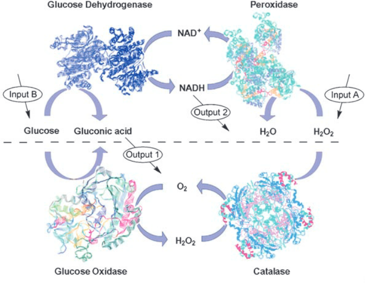

***

Baron, Ronan, et al. "Elementary arithmetic operations by enzymes: A model for metabolic pathway based computing." Angewandte Chemie International Edition 45.10 (2006): 1572-1576.


Exclusive-or phenotype
========================================================
class: small-code


```r
snvs <- create_snvs(
  n_snps = 2,
  n_individuals = 16
)
calc_xor_phenotype <- function(snvs) {
  if (ncol(snvs) < 4) {
    return(
      rep(3.14, nrow(snvs))
    )
  }
  0.1 * (snvs$snv_1a == snvs$snv_1b &
    snvs$snv_1a != snvs$snv_2a &
    snvs$snv_2a == snvs$snv_2b
  )
}
snvs$xor <- calc_xor_phenotype(snvs)
```


```r
knitr::kable(snvs)
```

***


|snv_1a |snv_1b |snv_2a |snv_2b | xor|
|:------|:------|:------|:------|---:|
|A      |A      |A      |A      | 0.0|
|A      |A      |A      |C      | 0.0|
|A      |A      |C      |A      | 0.0|
|A      |A      |C      |C      | 0.1|
|A      |C      |A      |A      | 0.0|
|A      |C      |A      |C      | 0.0|
|A      |C      |C      |A      | 0.0|
|A      |C      |C      |C      | 0.0|
|C      |A      |A      |A      | 0.0|
|C      |A      |A      |C      | 0.0|
|C      |A      |C      |A      | 0.0|
|C      |A      |C      |C      | 0.0|
|C      |C      |A      |A      | 0.1|
|C      |C      |A      |C      | 0.0|
|C      |C      |C      |A      | 0.0|
|C      |C      |C      |C      | 0.0|

Exclusive-or (XOR) trait
========================================================
class: small-code


```r
xor_trait <- create_custom_trait(
  phenotype = "xor",
  mafs = 0.49,
  n_snps = 2,
  calc_phenotype_function =
    calc_xor_phenotype
)
xor_data <- create_demo_assoc_qt_params(
  traits = xor_trait,
  n_individuals = n_individuals
)
```


```r
knitr::kable(
  cbind(
    xor_data$ped_table[, -seq(1, 6)],
    xor_data$phe_table[, 3]
  )
)
```

***


|snv_1a |snv_1b |snv_2a |snv_2b | xor|
|:------|:------|:------|:------|---:|
|C      |A      |C      |A      | 0.0|
|C      |A      |C      |A      | 0.0|
|C      |A      |A      |A      | 0.0|
|C      |A      |A      |C      | 0.0|
|A      |A      |A      |C      | 0.0|
|C      |C      |C      |A      | 0.0|
|C      |A      |A      |A      | 0.0|
|A      |A      |A      |A      | 0.0|
|A      |C      |A      |A      | 0.0|
|C      |C      |C      |C      | 0.0|
|C      |C      |A      |C      | 0.0|
|C      |C      |C      |A      | 0.0|
|A      |C      |A      |C      | 0.0|
|C      |C      |A      |A      | 0.1|
|C      |C      |C      |A      | 0.0|
|C      |C      |A      |C      | 0.0|
|A      |C      |C      |A      | 0.0|
|C      |A      |A      |C      | 0.0|
|C      |C      |C      |A      | 0.0|
|A      |C      |A      |C      | 0.0|
|C      |C      |C      |A      | 0.0|
|C      |A      |C      |C      | 0.0|
|A      |C      |A      |A      | 0.0|
|C      |C      |C      |C      | 0.0|
|C      |C      |A      |A      | 0.1|
|A      |A      |A      |C      | 0.0|
|C      |C      |C      |C      | 0.0|
|A      |A      |A      |A      | 0.0|
|A      |C      |C      |C      | 0.0|
|A      |A      |A      |A      | 0.0|
|C      |C      |A      |C      | 0.0|
|A      |C      |C      |A      | 0.0|
|A      |C      |C      |C      | 0.0|
|C      |C      |C      |C      | 0.0|
|A      |A      |A      |C      | 0.0|
|C      |C      |A      |A      | 0.1|
|C      |A      |C      |A      | 0.0|
|A      |C      |C      |A      | 0.0|
|A      |A      |C      |A      | 0.0|
|A      |A      |C      |A      | 0.0|
|A      |C      |C      |A      | 0.0|
|A      |A      |A      |A      | 0.0|
|A      |A      |C      |A      | 0.0|
|C      |C      |A      |A      | 0.1|
|A      |C      |C      |A      | 0.0|
|C      |A      |A      |A      | 0.0|
|A      |A      |C      |A      | 0.0|
|C      |C      |C      |A      | 0.0|
|A      |C      |C      |C      | 0.0|
|A      |C      |A      |C      | 0.0|
|C      |A      |C      |C      | 0.0|
|C      |C      |A      |C      | 0.0|
|C      |A      |C      |C      | 0.0|
|A      |C      |A      |A      | 0.0|
|A      |C      |A      |A      | 0.0|
|A      |C      |C      |C      | 0.0|
|A      |A      |A      |C      | 0.0|
|A      |A      |A      |A      | 0.0|
|C      |C      |C      |A      | 0.0|
|A      |A      |C      |C      | 0.1|
|C      |A      |C      |C      | 0.0|
|C      |A      |C      |A      | 0.0|
|C      |A      |C      |C      | 0.0|
|A      |A      |A      |A      | 0.0|
|A      |C      |C      |C      | 0.0|
|C      |A      |A      |C      | 0.0|
|C      |C      |C      |A      | 0.0|
|A      |A      |A      |A      | 0.0|
|C      |A      |C      |A      | 0.0|
|C      |C      |C      |A      | 0.0|
|A      |C      |A      |A      | 0.0|
|A      |C      |A      |C      | 0.0|
|A      |A      |C      |C      | 0.1|
|C      |C      |A      |A      | 0.1|
|A      |A      |A      |C      | 0.0|
|C      |C      |A      |A      | 0.1|
|C      |A      |C      |C      | 0.0|
|A      |A      |A      |C      | 0.0|
|A      |C      |C      |C      | 0.0|
|C      |C      |A      |C      | 0.0|
|C      |C      |A      |C      | 0.0|
|A      |C      |C      |A      | 0.0|
|A      |A      |A      |A      | 0.0|
|A      |A      |A      |C      | 0.0|
|A      |A      |C      |A      | 0.0|
|C      |C      |C      |A      | 0.0|
|C      |C      |C      |C      | 0.0|
|A      |C      |A      |A      | 0.0|
|C      |A      |C      |C      | 0.0|
|C      |A      |A      |C      | 0.0|
|A      |C      |C      |C      | 0.0|
|A      |A      |A      |A      | 0.0|
|C      |C      |A      |A      | 0.1|
|A      |C      |A      |A      | 0.0|
|A      |C      |A      |A      | 0.0|
|A      |C      |C      |A      | 0.0|
|A      |C      |C      |C      | 0.0|
|A      |A      |A      |A      | 0.0|
|A      |A      |A      |C      | 0.0|
|A      |C      |C      |A      | 0.0|
|C      |A      |C      |C      | 0.0|
|A      |C      |C      |C      | 0.0|
|C      |A      |A      |A      | 0.0|
|A      |C      |A      |A      | 0.0|
|C      |A      |C      |C      | 0.0|
|C      |C      |A      |A      | 0.1|
|C      |C      |A      |A      | 0.1|
|C      |C      |A      |A      | 0.1|
|A      |C      |A      |A      | 0.0|
|A      |A      |A      |C      | 0.0|
|A      |A      |C      |A      | 0.0|
|A      |C      |C      |C      | 0.0|
|C      |C      |A      |C      | 0.0|
|C      |A      |A      |C      | 0.0|
|C      |A      |A      |C      | 0.0|
|C      |A      |A      |C      | 0.0|
|A      |C      |A      |A      | 0.0|
|C      |A      |C      |C      | 0.0|
|A      |A      |A      |C      | 0.0|
|A      |C      |A      |C      | 0.0|
|A      |C      |A      |A      | 0.0|
|C      |C      |A      |C      | 0.0|
|A      |A      |C      |A      | 0.0|
|A      |A      |A      |C      | 0.0|
|A      |C      |A      |C      | 0.0|
|A      |C      |C      |C      | 0.0|
|A      |A      |C      |A      | 0.0|
|A      |C      |C      |A      | 0.0|
|C      |C      |A      |A      | 0.1|
|C      |C      |A      |C      | 0.0|
|C      |C      |C      |A      | 0.0|
|A      |C      |A      |A      | 0.0|
|C      |A      |A      |C      | 0.0|
|C      |C      |C      |A      | 0.0|
|C      |C      |C      |C      | 0.0|
|C      |C      |C      |A      | 0.0|
|A      |C      |A      |A      | 0.0|
|C      |C      |C      |C      | 0.0|
|C      |A      |A      |C      | 0.0|
|C      |C      |A      |A      | 0.1|
|C      |A      |A      |C      | 0.0|
|C      |A      |A      |A      | 0.0|
|A      |C      |A      |A      | 0.0|
|A      |A      |C      |A      | 0.0|
|A      |C      |C      |C      | 0.0|
|A      |A      |A      |A      | 0.0|
|A      |A      |A      |C      | 0.0|
|C      |A      |C      |A      | 0.0|
|A      |C      |A      |A      | 0.0|
|A      |A      |C      |C      | 0.1|
|A      |A      |C      |A      | 0.0|
|C      |A      |C      |C      | 0.0|
|C      |C      |A      |A      | 0.1|
|A      |A      |C      |C      | 0.1|
|C      |C      |C      |A      | 0.0|
|A      |C      |A      |C      | 0.0|
|A      |A      |C      |C      | 0.1|
|C      |A      |C      |A      | 0.0|
|A      |C      |C      |C      | 0.0|
|A      |C      |C      |A      | 0.0|
|C      |C      |C      |C      | 0.0|
|C      |A      |A      |A      | 0.0|
|C      |A      |C      |C      | 0.0|
|C      |C      |C      |A      | 0.0|
|A      |C      |A      |A      | 0.0|
|A      |C      |A      |C      | 0.0|
|C      |A      |A      |C      | 0.0|
|A      |C      |C      |C      | 0.0|
|C      |C      |C      |C      | 0.0|
|C      |A      |C      |A      | 0.0|
|C      |C      |C      |C      | 0.0|
|C      |A      |A      |C      | 0.0|
|A      |C      |A      |A      | 0.0|
|A      |C      |A      |C      | 0.0|
|A      |A      |A      |A      | 0.0|
|A      |A      |A      |C      | 0.0|
|C      |A      |C      |A      | 0.0|
|A      |C      |A      |C      | 0.0|
|C      |A      |A      |C      | 0.0|
|A      |A      |A      |C      | 0.0|
|A      |A      |A      |C      | 0.0|
|A      |C      |A      |A      | 0.0|
|C      |C      |C      |C      | 0.0|
|A      |C      |A      |A      | 0.0|
|C      |C      |A      |A      | 0.1|
|C      |A      |A      |C      | 0.0|
|C      |A      |C      |A      | 0.0|
|C      |A      |C      |C      | 0.0|
|C      |C      |A      |A      | 0.1|
|A      |C      |A      |A      | 0.0|
|A      |A      |A      |C      | 0.0|
|A      |C      |A      |C      | 0.0|
|C      |C      |A      |A      | 0.1|
|C      |A      |A      |A      | 0.0|
|C      |A      |A      |A      | 0.0|
|C      |C      |C      |C      | 0.0|
|A      |A      |C      |A      | 0.0|
|C      |C      |A      |A      | 0.1|
|C      |A      |A      |A      | 0.0|
|A      |C      |C      |C      | 0.0|
|C      |A      |C      |C      | 0.0|
|A      |C      |C      |C      | 0.0|
|C      |C      |A      |C      | 0.0|
|A      |C      |A      |C      | 0.0|
|A      |C      |C      |C      | 0.0|
|A      |A      |C      |C      | 0.1|
|A      |C      |C      |C      | 0.0|
|C      |A      |C      |C      | 0.0|
|C      |A      |A      |A      | 0.0|
|A      |C      |A      |C      | 0.0|
|C      |A      |A      |A      | 0.0|
|C      |C      |C      |A      | 0.0|
|A      |C      |A      |A      | 0.0|
|A      |A      |C      |C      | 0.1|
|C      |C      |A      |A      | 0.1|
|A      |C      |A      |C      | 0.0|
|C      |C      |A      |A      | 0.1|
|C      |A      |A      |A      | 0.0|
|C      |C      |A      |C      | 0.0|
|C      |A      |C      |A      | 0.0|
|C      |A      |A      |A      | 0.0|
|A      |C      |C      |A      | 0.0|
|C      |A      |A      |C      | 0.0|
|C      |A      |C      |C      | 0.0|
|A      |A      |C      |C      | 0.1|
|A      |C      |A      |C      | 0.0|
|C      |A      |C      |A      | 0.0|
|A      |C      |C      |C      | 0.0|
|A      |C      |C      |C      | 0.0|
|C      |A      |A      |C      | 0.0|
|A      |A      |C      |C      | 0.1|
|C      |C      |C      |A      | 0.0|
|A      |A      |A      |A      | 0.0|
|C      |A      |C      |C      | 0.0|
|A      |C      |A      |C      | 0.0|
|A      |A      |C      |C      | 0.1|
|C      |A      |A      |C      | 0.0|
|C      |C      |C      |C      | 0.0|
|C      |A      |A      |C      | 0.0|
|C      |A      |C      |A      | 0.0|
|C      |C      |C      |A      | 0.0|
|C      |A      |A      |A      | 0.0|
|C      |C      |A      |C      | 0.0|
|C      |A      |A      |A      | 0.0|
|A      |A      |A      |C      | 0.0|
|C      |A      |A      |A      | 0.0|
|A      |C      |A      |C      | 0.0|
|C      |A      |A      |C      | 0.0|
|C      |C      |C      |A      | 0.0|
|A      |C      |A      |C      | 0.0|
|A      |A      |C      |C      | 0.1|
|A      |C      |C      |C      | 0.0|
|C      |C      |C      |C      | 0.0|
|C      |C      |A      |A      | 0.1|
|C      |C      |C      |A      | 0.0|
|C      |A      |A      |C      | 0.0|
|C      |A      |A      |A      | 0.0|
|C      |A      |C      |C      | 0.0|
|C      |A      |C      |C      | 0.0|
|C      |C      |C      |C      | 0.0|
|C      |A      |C      |A      | 0.0|
|C      |A      |C      |A      | 0.0|
|C      |C      |A      |C      | 0.0|
|A      |C      |A      |A      | 0.0|
|C      |A      |C      |C      | 0.0|
|C      |A      |C      |C      | 0.0|
|A      |A      |C      |C      | 0.1|
|C      |A      |C      |C      | 0.0|
|A      |C      |C      |A      | 0.0|
|C      |C      |C      |A      | 0.0|
|C      |C      |A      |A      | 0.1|
|A      |A      |C      |C      | 0.1|
|A      |C      |C      |C      | 0.0|
|C      |A      |C      |C      | 0.0|
|A      |C      |C      |A      | 0.0|
|A      |A      |A      |A      | 0.0|
|A      |A      |C      |C      | 0.1|
|C      |C      |A      |A      | 0.1|
|C      |C      |C      |A      | 0.0|
|A      |A      |A      |C      | 0.0|
|A      |A      |C      |A      | 0.0|
|C      |A      |A      |A      | 0.0|
|A      |A      |A      |C      | 0.0|
|A      |A      |C      |A      | 0.0|
|C      |C      |A      |A      | 0.1|
|C      |C      |C      |A      | 0.0|
|C      |C      |C      |C      | 0.0|
|C      |C      |A      |A      | 0.1|
|C      |C      |A      |A      | 0.1|
|C      |C      |C      |A      | 0.0|
|C      |C      |A      |A      | 0.1|
|A      |A      |A      |C      | 0.0|
|C      |C      |A      |A      | 0.1|
|C      |A      |C      |A      | 0.0|
|A      |C      |C      |A      | 0.0|
|A      |A      |A      |A      | 0.0|
|A      |C      |C      |C      | 0.0|
|C      |C      |C      |A      | 0.0|
|C      |A      |C      |C      | 0.0|
|A      |A      |A      |A      | 0.0|
|C      |A      |A      |C      | 0.0|
|C      |A      |C      |C      | 0.0|
|A      |C      |A      |C      | 0.0|
|C      |A      |C      |A      | 0.0|
|A      |C      |A      |C      | 0.0|
|A      |A      |C      |A      | 0.0|
|C      |A      |C      |C      | 0.0|
|C      |A      |A      |A      | 0.0|
|C      |C      |A      |A      | 0.1|
|A      |C      |A      |C      | 0.0|
|C      |A      |C      |A      | 0.0|
|A      |C      |A      |C      | 0.0|
|C      |A      |C      |C      | 0.0|
|C      |C      |C      |A      | 0.0|
|A      |A      |A      |C      | 0.0|
|C      |C      |C      |A      | 0.0|
|C      |A      |A      |C      | 0.0|
|A      |C      |A      |C      | 0.0|
|C      |A      |A      |A      | 0.0|
|C      |C      |A      |A      | 0.1|
|C      |C      |C      |A      | 0.0|
|A      |A      |C      |A      | 0.0|
|A      |A      |A      |C      | 0.0|
|C      |C      |A      |C      | 0.0|
|C      |C      |C      |C      | 0.0|
|C      |C      |C      |A      | 0.0|
|A      |A      |A      |C      | 0.0|
|A      |A      |A      |C      | 0.0|
|A      |A      |C      |A      | 0.0|
|C      |C      |C      |A      | 0.0|
|C      |A      |A      |C      | 0.0|
|C      |A      |A      |A      | 0.0|
|A      |A      |A      |A      | 0.0|
|C      |A      |A      |C      | 0.0|
|A      |C      |A      |A      | 0.0|
|A      |A      |C      |C      | 0.1|
|C      |C      |A      |C      | 0.0|
|C      |C      |A      |A      | 0.1|
|C      |A      |C      |C      | 0.0|
|A      |C      |A      |A      | 0.0|
|C      |A      |A      |C      | 0.0|
|C      |A      |A      |A      | 0.0|
|C      |A      |A      |A      | 0.0|
|C      |A      |A      |C      | 0.0|
|A      |A      |A      |A      | 0.0|
|A      |C      |A      |A      | 0.0|
|A      |A      |A      |C      | 0.0|
|C      |A      |C      |C      | 0.0|
|A      |A      |A      |A      | 0.0|
|A      |A      |A      |A      | 0.0|
|A      |C      |A      |A      | 0.0|
|C      |A      |A      |C      | 0.0|
|C      |C      |C      |A      | 0.0|
|A      |A      |A      |A      | 0.0|
|C      |C      |A      |C      | 0.0|
|A      |A      |C      |C      | 0.1|
|A      |A      |A      |A      | 0.0|
|C      |A      |A      |C      | 0.0|
|C      |A      |C      |A      | 0.0|
|A      |C      |C      |C      | 0.0|
|C      |A      |C      |C      | 0.0|
|A      |A      |C      |A      | 0.0|
|A      |C      |C      |A      | 0.0|
|A      |A      |A      |C      | 0.0|
|A      |A      |A      |C      | 0.0|
|C      |A      |C      |A      | 0.0|
|A      |A      |A      |A      | 0.0|
|C      |A      |A      |A      | 0.0|
|C      |C      |C      |A      | 0.0|
|A      |A      |C      |A      | 0.0|
|C      |A      |C      |C      | 0.0|
|C      |C      |A      |A      | 0.1|
|A      |C      |A      |A      | 0.0|
|C      |A      |A      |C      | 0.0|
|C      |C      |A      |A      | 0.1|
|A      |C      |A      |A      | 0.0|
|A      |C      |A      |A      | 0.0|
|C      |C      |C      |C      | 0.0|
|A      |C      |A      |C      | 0.0|
|A      |C      |C      |C      | 0.0|
|C      |A      |C      |C      | 0.0|
|A      |C      |C      |C      | 0.0|
|C      |A      |A      |A      | 0.0|
|A      |C      |C      |A      | 0.0|
|A      |C      |C      |A      | 0.0|
|C      |A      |C      |C      | 0.0|
|C      |C      |A      |A      | 0.1|
|A      |C      |A      |A      | 0.0|
|C      |C      |A      |C      | 0.0|
|A      |C      |A      |A      | 0.0|
|A      |A      |C      |A      | 0.0|
|A      |C      |C      |C      | 0.0|
|C      |A      |A      |C      | 0.0|
|C      |A      |A      |A      | 0.0|
|A      |A      |C      |A      | 0.0|
|A      |C      |A      |A      | 0.0|
|A      |A      |A      |A      | 0.0|
|A      |C      |C      |A      | 0.0|
|A      |A      |C      |A      | 0.0|
|A      |C      |C      |A      | 0.0|
|A      |A      |C      |A      | 0.0|
|A      |C      |C      |C      | 0.0|
|C      |A      |A      |A      | 0.0|
|A      |A      |A      |A      | 0.0|
|C      |A      |A      |A      | 0.0|
|C      |A      |A      |C      | 0.0|
|A      |C      |A      |A      | 0.0|
|A      |A      |C      |A      | 0.0|
|C      |A      |A      |A      | 0.0|
|C      |A      |A      |A      | 0.0|
|C      |C      |C      |A      | 0.0|
|A      |A      |C      |C      | 0.1|
|C      |A      |C      |A      | 0.0|
|C      |C      |A      |A      | 0.1|
|A      |C      |A      |A      | 0.0|
|C      |A      |A      |C      | 0.0|
|A      |C      |A      |A      | 0.0|
|A      |C      |A      |A      | 0.0|
|A      |C      |A      |A      | 0.0|
|C      |C      |A      |C      | 0.0|
|C      |A      |A      |C      | 0.0|
|A      |A      |C      |A      | 0.0|
|C      |A      |C      |C      | 0.0|
|A      |C      |A      |C      | 0.0|
|A      |A      |C      |C      | 0.1|
|C      |A      |A      |C      | 0.0|
|C      |C      |C      |A      | 0.0|
|A      |A      |A      |A      | 0.0|
|A      |C      |C      |A      | 0.0|
|C      |C      |A      |A      | 0.1|
|A      |C      |A      |C      | 0.0|
|A      |A      |C      |C      | 0.1|
|A      |A      |A      |C      | 0.0|
|C      |C      |A      |A      | 0.1|
|A      |A      |A      |A      | 0.0|
|C      |A      |C      |A      | 0.0|
|A      |A      |C      |A      | 0.0|
|A      |C      |C      |A      | 0.0|
|A      |C      |A      |A      | 0.0|
|C      |A      |C      |C      | 0.0|
|C      |A      |C      |A      | 0.0|
|A      |C      |A      |C      | 0.0|
|C      |A      |C      |C      | 0.0|
|C      |A      |A      |A      | 0.0|
|A      |C      |C      |C      | 0.0|
|C      |C      |A      |C      | 0.0|
|C      |A      |C      |A      | 0.0|
|C      |A      |A      |A      | 0.0|
|C      |C      |C      |A      | 0.0|
|C      |A      |C      |C      | 0.0|
|A      |C      |A      |A      | 0.0|
|A      |A      |C      |C      | 0.1|
|A      |A      |C      |A      | 0.0|
|A      |A      |A      |C      | 0.0|
|A      |C      |A      |C      | 0.0|
|C      |A      |C      |A      | 0.0|
|A      |A      |C      |C      | 0.1|
|A      |A      |C      |C      | 0.1|
|A      |A      |A      |C      | 0.0|
|A      |C      |A      |A      | 0.0|
|A      |A      |C      |A      | 0.0|
|A      |C      |C      |C      | 0.0|
|A      |A      |C      |A      | 0.0|
|A      |A      |A      |A      | 0.0|
|A      |A      |A      |C      | 0.0|
|C      |C      |C      |C      | 0.0|
|A      |A      |C      |A      | 0.0|
|A      |C      |A      |A      | 0.0|
|C      |C      |C      |A      | 0.0|
|A      |A      |C      |A      | 0.0|
|A      |A      |A      |A      | 0.0|
|C      |A      |C      |A      | 0.0|
|C      |A      |C      |C      | 0.0|
|C      |A      |C      |A      | 0.0|
|A      |C      |C      |A      | 0.0|
|A      |C      |C      |C      | 0.0|
|C      |C      |C      |C      | 0.0|
|A      |A      |A      |A      | 0.0|
|A      |A      |C      |C      | 0.1|
|A      |A      |C      |A      | 0.0|
|A      |A      |A      |C      | 0.0|
|C      |C      |A      |A      | 0.1|
|C      |A      |C      |A      | 0.0|
|C      |A      |C      |C      | 0.0|
|C      |A      |C      |A      | 0.0|
|C      |A      |C      |C      | 0.0|
|A      |A      |C      |C      | 0.1|
|C      |C      |C      |A      | 0.0|
|A      |A      |A      |C      | 0.0|
|C      |A      |C      |C      | 0.0|
|A      |C      |C      |C      | 0.0|
|A      |A      |A      |A      | 0.0|
|A      |A      |A      |A      | 0.0|
|A      |C      |C      |A      | 0.0|
|C      |A      |C      |C      | 0.0|
|A      |A      |C      |C      | 0.1|
|C      |C      |A      |A      | 0.1|
|C      |C      |C      |C      | 0.0|
|A      |C      |A      |C      | 0.0|
|A      |A      |C      |C      | 0.1|
|A      |A      |A      |A      | 0.0|
|C      |C      |C      |A      | 0.0|
|C      |C      |C      |A      | 0.0|
|C      |A      |A      |A      | 0.0|
|A      |A      |A      |C      | 0.0|
|C      |A      |C      |A      | 0.0|
|A      |C      |A      |C      | 0.0|
|A      |C      |A      |A      | 0.0|
|A      |A      |A      |C      | 0.0|
|A      |C      |C      |A      | 0.0|
|C      |C      |A      |C      | 0.0|
|A      |A      |A      |A      | 0.0|
|C      |C      |A      |C      | 0.0|
|C      |C      |A      |C      | 0.0|
|A      |C      |C      |A      | 0.0|
|A      |A      |A      |A      | 0.0|
|C      |C      |A      |C      | 0.0|
|C      |C      |A      |A      | 0.1|
|C      |C      |C      |A      | 0.0|
|C      |C      |A      |A      | 0.1|
|A      |A      |C      |C      | 0.1|
|C      |C      |C      |A      | 0.0|
|C      |C      |C      |C      | 0.0|
|C      |A      |A      |A      | 0.0|
|A      |C      |A      |C      | 0.0|
|C      |A      |A      |A      | 0.0|
|C      |C      |A      |C      | 0.0|
|C      |C      |C      |A      | 0.0|
|A      |A      |C      |A      | 0.0|
|C      |A      |A      |C      | 0.0|
|A      |A      |C      |C      | 0.1|
|A      |C      |C      |C      | 0.0|
|A      |A      |A      |C      | 0.0|
|A      |A      |C      |C      | 0.1|
|A      |C      |A      |A      | 0.0|
|C      |A      |C      |C      | 0.0|
|A      |A      |A      |C      | 0.0|
|A      |A      |C      |A      | 0.0|
|C      |C      |C      |A      | 0.0|
|A      |A      |C      |C      | 0.1|
|A      |A      |A      |A      | 0.0|
|C      |C      |A      |A      | 0.1|
|A      |A      |A      |C      | 0.0|
|A      |A      |C      |C      | 0.1|
|A      |C      |A      |C      | 0.0|
|A      |A      |A      |C      | 0.0|
|C      |A      |C      |A      | 0.0|
|C      |A      |A      |A      | 0.0|
|A      |A      |C      |C      | 0.1|
|A      |A      |C      |C      | 0.1|
|A      |C      |A      |A      | 0.0|
|A      |A      |C      |C      | 0.1|
|C      |A      |C      |A      | 0.0|
|A      |A      |A      |C      | 0.0|
|A      |C      |C      |A      | 0.0|
|A      |C      |A      |A      | 0.0|
|A      |A      |A      |C      | 0.0|
|A      |A      |C      |C      | 0.1|
|C      |A      |A      |A      | 0.0|
|A      |C      |C      |C      | 0.0|
|A      |C      |C      |A      | 0.0|
|A      |A      |C      |A      | 0.0|
|C      |A      |C      |A      | 0.0|
|A      |A      |C      |C      | 0.1|
|C      |C      |C      |C      | 0.0|
|C      |A      |C      |C      | 0.0|
|A      |C      |A      |C      | 0.0|
|C      |C      |A      |C      | 0.0|
|A      |C      |A      |A      | 0.0|
|C      |A      |C      |A      | 0.0|
|A      |A      |A      |A      | 0.0|
|C      |C      |C      |C      | 0.0|
|A      |C      |A      |A      | 0.0|
|A      |A      |C      |C      | 0.1|
|C      |C      |C      |A      | 0.0|
|A      |A      |C      |A      | 0.0|
|A      |C      |C      |C      | 0.0|
|A      |C      |C      |C      | 0.0|
|A      |C      |A      |A      | 0.0|
|A      |A      |A      |C      | 0.0|
|A      |C      |A      |A      | 0.0|
|C      |A      |C      |A      | 0.0|
|A      |C      |C      |C      | 0.0|
|A      |C      |C      |C      | 0.0|
|C      |C      |A      |C      | 0.0|
|C      |A      |C      |C      | 0.0|
|A      |A      |A      |A      | 0.0|
|A      |A      |A      |A      | 0.0|
|A      |C      |A      |A      | 0.0|
|A      |C      |C      |C      | 0.0|
|C      |A      |A      |C      | 0.0|
|C      |C      |C      |A      | 0.0|
|C      |C      |C      |A      | 0.0|
|C      |C      |A      |C      | 0.0|
|A      |A      |C      |C      | 0.1|
|C      |A      |C      |C      | 0.0|
|C      |C      |A      |A      | 0.1|
|A      |C      |C      |C      | 0.0|
|A      |A      |C      |A      | 0.0|
|C      |A      |C      |C      | 0.0|
|C      |C      |A      |C      | 0.0|
|A      |A      |A      |C      | 0.0|
|A      |A      |A      |C      | 0.0|
|C      |A      |C      |C      | 0.0|
|A      |C      |A      |A      | 0.0|
|A      |A      |A      |A      | 0.0|
|C      |C      |A      |A      | 0.1|
|A      |A      |A      |C      | 0.0|
|A      |C      |A      |A      | 0.0|
|A      |A      |C      |C      | 0.1|
|A      |A      |C      |C      | 0.1|
|C      |C      |C      |A      | 0.0|
|A      |C      |A      |C      | 0.0|
|A      |A      |A      |A      | 0.0|
|C      |C      |C      |A      | 0.0|
|A      |A      |C      |C      | 0.1|
|C      |A      |A      |C      | 0.0|
|C      |C      |C      |C      | 0.0|
|A      |C      |A      |A      | 0.0|
|C      |A      |A      |C      | 0.0|
|C      |A      |C      |C      | 0.0|
|A      |A      |A      |A      | 0.0|
|C      |A      |A      |C      | 0.0|
|C      |C      |A      |A      | 0.1|
|C      |C      |C      |A      | 0.0|
|A      |C      |A      |A      | 0.0|
|C      |A      |C      |A      | 0.0|
|A      |A      |C      |A      | 0.0|
|A      |C      |A      |A      | 0.0|
|C      |C      |A      |C      | 0.0|
|A      |A      |C      |C      | 0.1|
|A      |A      |A      |C      | 0.0|
|A      |A      |A      |A      | 0.0|
|A      |A      |C      |A      | 0.0|
|A      |C      |A      |A      | 0.0|
|C      |A      |A      |C      | 0.0|
|A      |C      |A      |C      | 0.0|
|C      |A      |A      |C      | 0.0|
|A      |C      |C      |C      | 0.0|
|A      |C      |C      |C      | 0.0|
|A      |C      |C      |C      | 0.0|
|A      |C      |C      |C      | 0.0|
|C      |A      |A      |A      | 0.0|
|A      |A      |C      |A      | 0.0|
|A      |C      |C      |A      | 0.0|
|C      |A      |C      |C      | 0.0|
|C      |C      |C      |A      | 0.0|
|C      |A      |A      |C      | 0.0|
|C      |A      |C      |C      | 0.0|
|C      |A      |C      |A      | 0.0|
|C      |A      |A      |A      | 0.0|
|A      |A      |A      |A      | 0.0|
|C      |C      |C      |A      | 0.0|
|C      |C      |C      |C      | 0.0|
|C      |A      |C      |C      | 0.0|
|C      |A      |C      |A      | 0.0|
|A      |A      |C      |A      | 0.0|
|C      |A      |A      |C      | 0.0|
|C      |C      |C      |A      | 0.0|
|C      |C      |A      |A      | 0.1|
|A      |C      |C      |A      | 0.0|
|A      |A      |C      |A      | 0.0|
|A      |C      |C      |A      | 0.0|
|A      |A      |C      |C      | 0.1|
|C      |A      |C      |C      | 0.0|
|A      |C      |A      |C      | 0.0|
|A      |A      |C      |A      | 0.0|
|C      |A      |A      |A      | 0.0|
|C      |C      |A      |A      | 0.1|
|A      |A      |A      |C      | 0.0|
|A      |C      |C      |C      | 0.0|
|C      |A      |A      |A      | 0.0|
|C      |C      |C      |C      | 0.0|
|A      |C      |A      |A      | 0.0|
|C      |C      |C      |A      | 0.0|
|C      |A      |A      |A      | 0.0|
|C      |A      |A      |C      | 0.0|
|A      |C      |C      |A      | 0.0|
|A      |A      |C      |C      | 0.1|
|A      |A      |C      |C      | 0.1|
|C      |C      |A      |C      | 0.0|
|C      |A      |C      |A      | 0.0|
|C      |C      |C      |C      | 0.0|
|A      |C      |A      |C      | 0.0|
|A      |A      |C      |A      | 0.0|
|C      |C      |A      |C      | 0.0|
|C      |C      |A      |A      | 0.1|
|C      |A      |C      |A      | 0.0|
|A      |C      |A      |C      | 0.0|
|C      |A      |A      |A      | 0.0|
|A      |C      |A      |C      | 0.0|
|C      |A      |A      |A      | 0.0|
|C      |A      |A      |C      | 0.0|
|C      |C      |C      |A      | 0.0|
|A      |C      |C      |C      | 0.0|
|C      |C      |A      |C      | 0.0|
|C      |A      |C      |C      | 0.0|
|C      |C      |A      |A      | 0.1|
|A      |A      |A      |A      | 0.0|
|A      |A      |A      |A      | 0.0|
|A      |C      |C      |C      | 0.0|
|C      |C      |A      |C      | 0.0|
|C      |C      |A      |A      | 0.1|
|C      |C      |C      |C      | 0.0|
|A      |C      |C      |A      | 0.0|
|C      |C      |C      |A      | 0.0|
|C      |A      |A      |A      | 0.0|
|C      |C      |C      |A      | 0.0|
|A      |A      |C      |C      | 0.1|
|C      |C      |C      |C      | 0.0|
|A      |C      |A      |A      | 0.0|
|A      |C      |A      |A      | 0.0|
|C      |A      |C      |A      | 0.0|
|A      |C      |C      |A      | 0.0|
|C      |C      |A      |C      | 0.0|
|C      |C      |C      |C      | 0.0|
|A      |C      |C      |A      | 0.0|
|A      |C      |A      |A      | 0.0|
|C      |C      |C      |C      | 0.0|
|C      |C      |A      |C      | 0.0|
|C      |C      |A      |C      | 0.0|
|A      |C      |A      |A      | 0.0|
|A      |A      |A      |C      | 0.0|
|A      |A      |A      |C      | 0.0|
|A      |C      |C      |A      | 0.0|
|C      |C      |C      |C      | 0.0|
|C      |C      |A      |A      | 0.1|
|C      |A      |C      |A      | 0.0|
|C      |C      |C      |C      | 0.0|
|C      |A      |C      |A      | 0.0|
|A      |A      |A      |C      | 0.0|
|C      |A      |C      |C      | 0.0|
|C      |A      |C      |A      | 0.0|
|A      |C      |A      |C      | 0.0|
|A      |A      |C      |C      | 0.1|
|A      |C      |A      |A      | 0.0|
|A      |A      |A      |A      | 0.0|
|A      |A      |A      |C      | 0.0|
|A      |A      |C      |C      | 0.1|
|A      |A      |C      |C      | 0.1|
|A      |A      |C      |C      | 0.1|
|C      |C      |C      |C      | 0.0|
|A      |A      |C      |A      | 0.0|
|A      |C      |A      |A      | 0.0|
|A      |A      |A      |A      | 0.0|
|A      |C      |A      |C      | 0.0|
|A      |A      |C      |A      | 0.0|
|C      |C      |A      |C      | 0.0|
|A      |A      |A      |A      | 0.0|
|A      |A      |A      |C      | 0.0|
|A      |C      |A      |A      | 0.0|
|C      |C      |A      |A      | 0.1|
|C      |A      |A      |A      | 0.0|
|A      |C      |A      |A      | 0.0|
|A      |A      |A      |A      | 0.0|
|C      |A      |A      |A      | 0.0|
|C      |A      |A      |A      | 0.0|
|A      |A      |C      |C      | 0.1|
|A      |C      |C      |C      | 0.0|
|C      |A      |A      |A      | 0.0|
|C      |A      |C      |A      | 0.0|
|A      |A      |A      |A      | 0.0|
|C      |C      |C      |A      | 0.0|
|C      |C      |A      |C      | 0.0|
|A      |C      |A      |C      | 0.0|
|A      |A      |C      |C      | 0.1|
|C      |A      |C      |A      | 0.0|
|C      |A      |C      |C      | 0.0|
|A      |C      |A      |A      | 0.0|
|A      |A      |A      |C      | 0.0|
|C      |A      |A      |A      | 0.0|
|C      |A      |A      |C      | 0.0|
|C      |A      |A      |C      | 0.0|
|A      |C      |A      |C      | 0.0|
|C      |A      |A      |C      | 0.0|
|A      |C      |A      |A      | 0.0|
|A      |C      |C      |A      | 0.0|
|C      |A      |A      |C      | 0.0|
|C      |C      |C      |A      | 0.0|
|C      |A      |A      |C      | 0.0|
|C      |C      |A      |A      | 0.1|
|C      |A      |C      |A      | 0.0|
|C      |C      |A      |A      | 0.1|
|C      |C      |C      |A      | 0.0|
|C      |A      |A      |A      | 0.0|
|C      |C      |C      |C      | 0.0|
|A      |C      |C      |C      | 0.0|
|A      |A      |C      |C      | 0.1|
|C      |C      |A      |A      | 0.1|
|C      |A      |C      |A      | 0.0|
|A      |A      |A      |C      | 0.0|
|A      |A      |C      |A      | 0.0|
|A      |C      |A      |A      | 0.0|
|A      |C      |C      |C      | 0.0|
|A      |A      |C      |A      | 0.0|
|C      |A      |A      |A      | 0.0|
|A      |A      |A      |C      | 0.0|
|A      |C      |C      |C      | 0.0|
|C      |A      |A      |A      | 0.0|
|C      |A      |C      |C      | 0.0|
|C      |A      |C      |A      | 0.0|
|A      |C      |C      |A      | 0.0|
|C      |A      |C      |A      | 0.0|
|C      |C      |C      |A      | 0.0|
|C      |A      |C      |A      | 0.0|
|A      |A      |A      |C      | 0.0|
|C      |C      |C      |C      | 0.0|
|A      |C      |A      |C      | 0.0|
|C      |C      |C      |C      | 0.0|
|A      |C      |C      |A      | 0.0|
|A      |C      |A      |C      | 0.0|
|A      |A      |C      |A      | 0.0|
|C      |C      |C      |C      | 0.0|
|C      |A      |A      |C      | 0.0|
|A      |C      |A      |C      | 0.0|
|A      |C      |A      |C      | 0.0|
|C      |A      |A      |C      | 0.0|
|C      |A      |C      |C      | 0.0|
|A      |A      |A      |A      | 0.0|
|A      |A      |A      |A      | 0.0|
|C      |C      |A      |C      | 0.0|
|C      |A      |C      |A      | 0.0|
|C      |C      |A      |A      | 0.1|
|A      |A      |A      |C      | 0.0|
|A      |C      |A      |A      | 0.0|
|A      |C      |C      |A      | 0.0|
|A      |C      |C      |A      | 0.0|
|C      |A      |C      |C      | 0.0|
|A      |A      |C      |C      | 0.1|
|A      |A      |C      |A      | 0.0|
|A      |C      |A      |C      | 0.0|
|A      |C      |C      |C      | 0.0|
|C      |C      |C      |C      | 0.0|
|A      |C      |A      |C      | 0.0|
|A      |A      |C      |C      | 0.1|
|A      |A      |A      |C      | 0.0|
|A      |C      |C      |C      | 0.0|
|A      |A      |C      |A      | 0.0|
|A      |C      |A      |A      | 0.0|
|A      |C      |C      |C      | 0.0|
|C      |C      |C      |C      | 0.0|
|C      |C      |C      |C      | 0.0|
|C      |A      |A      |C      | 0.0|
|A      |C      |C      |C      | 0.0|
|C      |A      |C      |A      | 0.0|
|C      |A      |C      |C      | 0.0|
|A      |C      |A      |A      | 0.0|
|A      |C      |C      |C      | 0.0|
|A      |C      |C      |A      | 0.0|
|C      |C      |A      |A      | 0.1|
|A      |C      |A      |C      | 0.0|
|C      |A      |A      |C      | 0.0|
|A      |A      |C      |A      | 0.0|
|A      |C      |C      |C      | 0.0|
|A      |C      |C      |C      | 0.0|
|A      |C      |A      |C      | 0.0|
|C      |A      |A      |C      | 0.0|
|A      |A      |C      |C      | 0.1|
|C      |C      |C      |A      | 0.0|
|C      |C      |C      |A      | 0.0|
|A      |C      |A      |C      | 0.0|
|C      |A      |C      |A      | 0.0|
|C      |C      |C      |C      | 0.0|
|C      |A      |C      |A      | 0.0|
|A      |A      |A      |A      | 0.0|
|C      |A      |A      |A      | 0.0|
|A      |C      |A      |A      | 0.0|
|A      |C      |A      |C      | 0.0|
|A      |C      |A      |C      | 0.0|
|C      |C      |A      |C      | 0.0|
|C      |A      |C      |A      | 0.0|
|A      |C      |C      |C      | 0.0|
|C      |A      |C      |A      | 0.0|
|C      |C      |C      |C      | 0.0|
|C      |A      |A      |A      | 0.0|
|A      |A      |C      |C      | 0.1|
|A      |C      |C      |C      | 0.0|
|A      |A      |C      |A      | 0.0|
|A      |C      |A      |C      | 0.0|
|C      |A      |A      |A      | 0.0|
|C      |A      |A      |A      | 0.0|
|A      |A      |A      |C      | 0.0|
|C      |A      |C      |A      | 0.0|
|C      |C      |A      |C      | 0.0|
|C      |A      |A      |C      | 0.0|
|C      |C      |C      |C      | 0.0|
|A      |A      |C      |C      | 0.1|
|C      |A      |C      |A      | 0.0|
|A      |A      |C      |A      | 0.0|
|A      |A      |C      |C      | 0.1|
|C      |A      |A      |A      | 0.0|
|C      |C      |A      |A      | 0.1|
|C      |A      |A      |C      | 0.0|
|C      |C      |A      |A      | 0.1|
|C      |C      |C      |C      | 0.0|
|A      |C      |A      |A      | 0.0|
|C      |A      |C      |A      | 0.0|
|A      |A      |A      |A      | 0.0|
|C      |C      |C      |C      | 0.0|
|A      |C      |A      |C      | 0.0|
|A      |A      |C      |A      | 0.0|
|A      |C      |A      |A      | 0.0|
|C      |A      |A      |A      | 0.0|
|C      |A      |A      |C      | 0.0|
|A      |A      |A      |A      | 0.0|
|C      |C      |A      |C      | 0.0|
|C      |C      |C      |C      | 0.0|
|C      |C      |C      |C      | 0.0|
|C      |A      |C      |A      | 0.0|
|A      |A      |A      |A      | 0.0|
|A      |A      |A      |C      | 0.0|
|A      |C      |C      |C      | 0.0|
|C      |A      |A      |C      | 0.0|
|A      |C      |C      |C      | 0.0|
|C      |A      |C      |C      | 0.0|
|A      |C      |C      |A      | 0.0|
|A      |A      |C      |A      | 0.0|
|C      |A      |A      |C      | 0.0|
|C      |A      |A      |A      | 0.0|
|C      |C      |A      |C      | 0.0|
|C      |A      |A      |C      | 0.0|
|A      |C      |A      |A      | 0.0|
|A      |A      |C      |C      | 0.1|
|C      |A      |C      |C      | 0.0|
|A      |A      |A      |A      | 0.0|
|A      |C      |C      |C      | 0.0|
|C      |A      |C      |C      | 0.0|
|C      |C      |A      |A      | 0.1|
|C      |A      |C      |C      | 0.0|
|C      |A      |A      |A      | 0.0|
|C      |C      |A      |A      | 0.1|
|A      |C      |A      |C      | 0.0|
|A      |C      |C      |C      | 0.0|
|C      |A      |C      |C      | 0.0|
|C      |C      |C      |C      | 0.0|
|A      |C      |C      |C      | 0.0|
|A      |C      |A      |C      | 0.0|
|A      |C      |A      |A      | 0.0|
|C      |A      |A      |C      | 0.0|
|C      |A      |C      |A      | 0.0|
|C      |C      |C      |A      | 0.0|
|A      |C      |A      |C      | 0.0|
|A      |A      |C      |A      | 0.0|
|A      |C      |C      |A      | 0.0|
|A      |C      |C      |C      | 0.0|
|A      |C      |C      |C      | 0.0|
|C      |A      |A      |C      | 0.0|
|A      |A      |C      |A      | 0.0|
|C      |C      |A      |C      | 0.0|
|A      |C      |A      |C      | 0.0|
|A      |C      |A      |A      | 0.0|
|A      |A      |A      |C      | 0.0|
|C      |A      |A      |A      | 0.0|
|C      |A      |C      |A      | 0.0|
|A      |C      |C      |C      | 0.0|
|C      |C      |A      |C      | 0.0|
|A      |C      |C      |A      | 0.0|
|C      |C      |C      |A      | 0.0|
|C      |C      |A      |A      | 0.1|
|A      |C      |A      |A      | 0.0|
|A      |C      |C      |A      | 0.0|
|A      |A      |A      |A      | 0.0|
|A      |C      |C      |C      | 0.0|
|C      |A      |C      |A      | 0.0|
|A      |A      |A      |A      | 0.0|
|A      |C      |C      |C      | 0.0|
|A      |C      |A      |A      | 0.0|
|C      |C      |A      |C      | 0.0|
|A      |A      |C      |A      | 0.0|
|C      |C      |A      |C      | 0.0|
|C      |A      |A      |A      | 0.0|
|C      |A      |A      |A      | 0.0|
|C      |A      |A      |C      | 0.0|
|C      |C      |C      |A      | 0.0|
|C      |C      |A      |C      | 0.0|
|C      |C      |A      |A      | 0.1|
|A      |A      |A      |C      | 0.0|
|A      |A      |A      |C      | 0.0|
|C      |A      |A      |A      | 0.0|
|C      |C      |A      |A      | 0.1|
|A      |A      |C      |C      | 0.1|
|A      |A      |A      |A      | 0.0|
|A      |A      |C      |C      | 0.1|
|A      |C      |C      |A      | 0.0|
|C      |C      |A      |C      | 0.0|
|A      |A      |C      |A      | 0.0|
|C      |A      |C      |C      | 0.0|
|A      |C      |C      |A      | 0.0|
|A      |A      |A      |A      | 0.0|
|A      |C      |A      |C      | 0.0|
|A      |C      |C      |A      | 0.0|
|A      |A      |C      |C      | 0.1|
|C      |A      |C      |C      | 0.0|
|A      |A      |A      |A      | 0.0|
|A      |C      |C      |C      | 0.0|
|C      |A      |A      |C      | 0.0|
|C      |A      |C      |C      | 0.0|
|A      |C      |A      |A      | 0.0|
|A      |C      |C      |A      | 0.0|
|C      |C      |C      |A      | 0.0|

Associations on exclusive-or (XOR) data
========================================================


```r
knitr::kable(assoc_qt(xor_data))
```


| CHR|SNP   | BP| NMISS|      BETA|       SE|        R2|      T|      P|
|---:|:-----|--:|-----:|---------:|--------:|---------:|------:|------:|
|   1|snp_1 |  1|  1000| 0.0005299| 0.001523| 0.0001212| 0.3479| 0.7280|
|   2|snp_2 |  2|  1000| 0.0004813| 0.001452| 0.0001101| 0.3315| 0.7403|

 * XOR cannot be detected
 * Very artificial example

ML can do exclusive-or (XOR)
========================================================

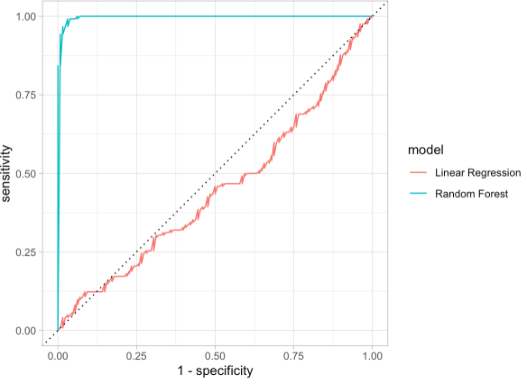

***


Exponential phenotype
========================================================

Exponential

Exponential phenotype
========================================================
class: small-code


```r
snvs <- create_snvs(
  n_snps = 3,
  n_individuals = 16
)
calc_exp_phenotype <- function(snvs) {
  as <- seq(1, ncol(snvs), by = 2)
  bs <- as + 1
  h <- snvs[, as] == snvs[, bs] & snvs[, as] == "C"
  10 ^ rowSums(h)
}
snvs$exp <- calc_exp_phenotype(snvs)
```


```r
knitr::kable(snvs)
```

***


|snv_1a |snv_1b |snv_2a |snv_2b |snv_3a |snv_3b | exp|
|:------|:------|:------|:------|:------|:------|---:|
|A      |A      |A      |A      |A      |A      |   1|
|A      |A      |A      |A      |A      |C      |   1|
|A      |A      |A      |A      |C      |A      |   1|
|A      |A      |A      |A      |C      |C      |  10|
|A      |A      |A      |C      |A      |A      |   1|
|A      |A      |A      |C      |A      |C      |   1|
|A      |A      |A      |C      |C      |A      |   1|
|A      |A      |A      |C      |C      |C      |  10|
|A      |A      |C      |A      |A      |A      |   1|
|A      |A      |C      |A      |A      |C      |   1|
|A      |A      |C      |A      |C      |A      |   1|
|A      |A      |C      |A      |C      |C      |  10|
|A      |A      |C      |C      |A      |A      |  10|
|A      |A      |C      |C      |A      |C      |  10|
|A      |A      |C      |C      |C      |A      |  10|
|A      |A      |C      |C      |C      |C      | 100|

Exponential trait
========================================================
class: small-code


```r
exp_trait <- create_custom_trait(
  phenotype = "exp",
  mafs = 0.49,
  n_snps = 8,
  calc_phenotype_function =
    calc_exp_phenotype
)
exp_data <- create_demo_assoc_qt_params(
  traits = exp_trait,
  n_individuals = n_individuals
)
```


```r
knitr::kable(
  cbind(
    exp_data$ped_table[, -seq(1, 18)],
    exp_data$phe_table[, 3]
  )
)
```

***


|snv_4a |snv_4b |snv_5a |snv_5b |snv_6a |snv_6b |snv_7a |snv_7b |snv_8a |snv_8b |   exp|
|:------|:------|:------|:------|:------|:------|:------|:------|:------|:------|-----:|
|C      |C      |A      |C      |A      |A      |A      |C      |A      |C      | 1e+01|
|A      |A      |A      |C      |A      |A      |C      |A      |C      |A      | 1e+00|
|C      |C      |A      |A      |A      |C      |C      |A      |C      |A      | 1e+02|
|A      |C      |A      |C      |C      |C      |A      |C      |C      |C      | 1e+03|
|A      |C      |C      |A      |A      |A      |A      |C      |C      |C      | 1e+02|
|C      |C      |C      |A      |C      |C      |C      |A      |A      |A      | 1e+02|
|C      |A      |C      |C      |A      |A      |A      |A      |A      |C      | 1e+01|
|A      |A      |C      |C      |C      |A      |C      |A      |C      |A      | 1e+01|
|C      |A      |C      |C      |A      |C      |A      |A      |A      |C      | 1e+02|
|A      |C      |C      |C      |A      |C      |A      |C      |A      |A      | 1e+03|
|A      |A      |A      |C      |C      |C      |C      |C      |A      |A      | 1e+04|
|A      |C      |C      |A      |A      |A      |A      |C      |A      |C      | 1e+00|
|A      |A      |C      |C      |A      |C      |A      |A      |C      |A      | 1e+01|
|C      |C      |C      |C      |C      |C      |A      |A      |C      |C      | 1e+04|
|A      |A      |A      |A      |A      |C      |C      |C      |C      |A      | 1e+01|
|A      |C      |C      |A      |A      |C      |A      |C      |C      |C      | 1e+02|
|C      |A      |C      |A      |C      |C      |A      |C      |C      |A      | 1e+01|
|A      |A      |C      |C      |A      |C      |C      |A      |A      |A      | 1e+01|
|A      |A      |A      |C      |A      |A      |C      |A      |A      |C      | 1e+00|
|A      |A      |A      |C      |C      |A      |C      |A      |A      |C      | 1e+01|
|C      |A      |A      |C      |C      |C      |C      |C      |C      |C      | 1e+04|
|A      |A      |C      |C      |C      |A      |C      |A      |C      |C      | 1e+02|
|C      |C      |A      |C      |C      |A      |A      |C      |C      |C      | 1e+03|
|A      |C      |A      |A      |C      |C      |C      |A      |A      |A      | 1e+02|
|C      |A      |C      |A      |C      |A      |A      |A      |A      |A      | 1e+00|
|A      |A      |C      |C      |C      |A      |C      |A      |A      |C      | 1e+02|
|A      |A      |A      |A      |C      |C      |C      |C      |A      |A      | 1e+03|
|C      |A      |A      |C      |A      |A      |C      |A      |A      |A      | 1e+01|
|C      |C      |A      |A      |C      |C      |C      |A      |C      |A      | 1e+02|
|A      |A      |C      |A      |C      |A      |A      |C      |A      |C      | 1e+00|
|C      |A      |A      |A      |A      |A      |C      |A      |A      |A      | 1e+00|
|A      |C      |A      |A      |A      |A      |C      |C      |C      |A      | 1e+01|
|A      |C      |A      |C      |C      |C      |A      |A      |A      |A      | 1e+01|
|A      |A      |C      |C      |A      |A      |C      |A      |C      |A      | 1e+01|
|A      |A      |A      |C      |C      |C      |C      |C      |C      |C      | 1e+03|
|C      |C      |A      |A      |C      |C      |C      |C      |A      |C      | 1e+04|
|C      |A      |C      |A      |C      |C      |A      |A      |C      |A      | 1e+02|
|C      |A      |C      |C      |A      |A      |C      |C      |A      |C      | 1e+03|
|A      |A      |C      |C      |C      |C      |C      |C      |C      |A      | 1e+04|
|C      |C      |C      |A      |C      |A      |A      |A      |A      |A      | 1e+02|
|A      |C      |C      |C      |C      |A      |A      |A      |A      |A      | 1e+01|
|A      |A      |C      |A      |A      |A      |C      |C      |A      |C      | 1e+01|
|C      |C      |C      |A      |A      |A      |A      |C      |C      |C      | 1e+04|
|A      |C      |C      |C      |C      |C      |A      |A      |A      |C      | 1e+04|
|A      |C      |A      |C      |A      |C      |C      |C      |A      |C      | 1e+01|
|A      |C      |A      |A      |A      |A      |A      |A      |A      |A      | 1e+01|
|A      |C      |C      |A      |C      |A      |A      |A      |A      |A      | 1e+01|
|C      |C      |A      |A      |A      |A      |C      |A      |A      |A      | 1e+01|
|A      |C      |C      |A      |A      |A      |A      |C      |A      |C      | 1e+01|
|A      |C      |A      |C      |C      |C      |C      |A      |C      |A      | 1e+02|
|C      |A      |A      |C      |C      |A      |A      |C      |A      |A      | 1e+01|
|C      |A      |C      |A      |A      |C      |C      |C      |C      |C      | 1e+02|
|C      |A      |A      |C      |A      |C      |C      |C      |C      |A      | 1e+01|
|A      |C      |C      |C      |C      |A      |A      |A      |C      |C      | 1e+02|
|A      |C      |C      |A      |C      |A      |C      |A      |A      |A      | 1e+02|
|C      |C      |C      |C      |A      |A      |A      |C      |C      |C      | 1e+04|
|C      |C      |A      |C      |A      |A      |A      |A      |A      |C      | 1e+01|
|A      |A      |A      |A      |A      |A      |C      |C      |A      |A      | 1e+01|
|C      |A      |C      |C      |A      |C      |A      |A      |A      |A      | 1e+03|
|C      |A      |C      |C      |C      |C      |C      |A      |C      |C      | 1e+04|
|C      |C      |C      |A      |C      |C      |C      |C      |A      |C      | 1e+04|
|C      |C      |A      |C      |C      |A      |A      |C      |A      |A      | 1e+02|
|A      |C      |A      |A      |C      |A      |C      |C      |A      |A      | 1e+03|
|A      |A      |C      |A      |C      |A      |C      |C      |A      |A      | 1e+02|
|C      |C      |C      |C      |A      |A      |C      |C      |A      |C      | 1e+04|
|C      |A      |C      |A      |C      |C      |A      |C      |A      |A      | 1e+01|
|C      |C      |C      |A      |A      |C      |C      |A      |A      |A      | 1e+01|
|A      |C      |C      |C      |C      |A      |C      |A      |C      |A      | 1e+01|
|A      |C      |A      |C      |A      |C      |A      |C      |C      |A      | 1e+01|
|A      |A      |C      |C      |C      |C      |C      |C      |A      |A      | 1e+03|
|A      |C      |C      |A      |C      |A      |A      |C      |A      |A      | 1e+01|
|C      |A      |A      |A      |A      |C      |A      |A      |C      |A      | 1e+01|
|A      |A      |C      |A      |C      |C      |A      |C      |A      |A      | 1e+02|
|A      |A      |C      |C      |A      |A      |C      |C      |A      |C      | 1e+02|
|C      |C      |A      |C      |C      |A      |A      |C      |C      |A      | 1e+02|
|C      |C      |C      |C      |A      |C      |C      |A      |A      |A      | 1e+03|
|C      |C      |A      |A      |A      |A      |A      |A      |A      |A      | 1e+02|
|C      |C      |C      |A      |C      |C      |C      |C      |C      |A      | 1e+03|
|C      |C      |A      |C      |A      |C      |A      |A      |C      |C      | 1e+02|
|A      |A      |A      |A      |A      |A      |A      |A      |C      |C      | 1e+01|
|A      |C      |C      |A      |A      |C      |A      |A      |C      |C      | 1e+02|
|A      |C      |C      |C      |A      |A      |A      |C      |A      |C      | 1e+03|
|A      |C      |A      |C      |A      |A      |C      |C      |A      |A      | 1e+02|
|C      |A      |C      |A      |A      |A      |C      |C      |C      |A      | 1e+01|
|C      |C      |A      |A      |A      |C      |A      |A      |A      |C      | 1e+01|
|C      |A      |A      |A      |C      |C      |C      |C      |C      |C      | 1e+04|
|C      |A      |A      |C      |C      |A      |C      |C      |A      |A      | 1e+02|
|C      |A      |A      |C      |A      |A      |C      |C      |A      |A      | 1e+02|
|C      |C      |C      |A      |A      |C      |C      |C      |A      |A      | 1e+02|
|C      |C      |A      |C      |A      |C      |A      |A      |C      |A      | 1e+01|
|A      |A      |C      |A      |C      |A      |C      |C      |A      |C      | 1e+01|
|C      |C      |A      |A      |C      |A      |C      |A      |A      |A      | 1e+01|
|A      |C      |C      |C      |A      |C      |A      |A      |C      |A      | 1e+01|
|C      |C      |A      |A      |C      |C      |A      |A      |C      |A      | 1e+03|
|C      |A      |C      |C      |A      |A      |C      |A      |A      |A      | 1e+01|
|A      |C      |A      |C      |C      |A      |A      |A      |A      |A      | 1e+00|
|A      |C      |A      |C      |A      |A      |C      |A      |A      |C      | 1e+00|
|A      |C      |C      |C      |C      |C      |A      |C      |C      |C      | 1e+03|
|C      |C      |C      |A      |A      |C      |A      |A      |C      |C      | 1e+03|
|A      |A      |C      |C      |C      |A      |C      |A      |C      |A      | 1e+01|
|C      |C      |C      |C      |A      |A      |C      |C      |C      |A      | 1e+04|
|A      |A      |C      |C      |C      |A      |C      |A      |A      |C      | 1e+02|
|C      |C      |A      |C      |C      |C      |C      |A      |A      |A      | 1e+04|
|C      |C      |C      |A      |A      |C      |A      |A      |C      |C      | 1e+03|
|C      |C      |C      |C      |C      |A      |C      |C      |C      |C      | 1e+04|
|A      |A      |A      |A      |A      |A      |C      |A      |C      |C      | 1e+01|
|A      |C      |C      |A      |C      |A      |C      |C      |C      |C      | 1e+05|
|C      |C      |A      |A      |C      |A      |A      |A      |A      |A      | 1e+01|
|A      |A      |A      |A      |A      |C      |A      |C      |A      |A      | 1e+03|
|A      |C      |C      |A      |A      |A      |C      |C      |C      |C      | 1e+03|
|C      |A      |A      |C      |A      |C      |C      |A      |C      |C      | 1e+01|
|A      |C      |C      |A      |C      |C      |A      |C      |A      |A      | 1e+02|
|A      |A      |A      |C      |C      |A      |A      |C      |C      |A      | 1e+00|
|C      |A      |A      |A      |A      |A      |C      |C      |A      |C      | 1e+02|
|C      |A      |C      |A      |C      |A      |C      |A      |A      |A      | 1e+00|
|C      |A      |C      |C      |C      |C      |C      |A      |A      |C      | 1e+04|
|C      |C      |A      |A      |C      |A      |A      |C      |A      |C      | 1e+03|
|A      |A      |C      |A      |A      |A      |C      |A      |A      |A      | 1e+00|
|A      |A      |A      |C      |A      |A      |A      |C      |A      |A      | 1e+00|
|C      |A      |C      |C      |A      |C      |C      |A      |C      |A      | 1e+01|
|A      |A      |A      |C      |C      |C      |A      |C      |C      |A      | 1e+01|
|A      |C      |A      |C      |A      |C      |C      |A      |A      |A      | 1e+00|
|A      |A      |A      |C      |A      |A      |A      |C      |C      |A      | 1e+00|
|C      |A      |A      |A      |A      |A      |C      |C      |A      |A      | 1e+03|
|C      |A      |C      |A      |C      |C      |A      |A      |C      |A      | 1e+01|
|C      |C      |C      |A      |A      |A      |C      |C      |C      |C      | 1e+03|
|C      |C      |C      |C      |C      |C      |C      |A      |C      |A      | 1e+03|
|A      |C      |C      |C      |C      |A      |A      |C      |C      |C      | 1e+04|
|C      |C      |A      |A      |A      |C      |A      |C      |A      |A      | 1e+02|
|A      |C      |A      |C      |C      |A      |A      |C      |A      |C      | 1e+01|
|C      |C      |A      |C      |A      |C      |A      |C      |A      |A      | 1e+01|
|C      |C      |A      |A      |C      |C      |A      |C      |A      |A      | 1e+02|
|C      |C      |A      |A      |A      |C      |A      |A      |A      |C      | 1e+01|
|C      |C      |C      |A      |A      |C      |C      |A      |C      |A      | 1e+03|
|A      |C      |A      |A      |A      |A      |C      |A      |A      |A      | 1e+01|
|A      |C      |A      |A      |C      |A      |C      |A      |C      |A      | 1e+00|
|C      |C      |C      |A      |A      |C      |C      |A      |A      |A      | 1e+02|
|A      |C      |A      |C      |A      |C      |A      |A      |A      |A      | 1e+01|
|C      |A      |C      |A      |C      |C      |A      |C      |A      |A      | 1e+02|
|C      |A      |C      |C      |C      |A      |A      |C      |A      |A      | 1e+01|
|A      |A      |A      |A      |A      |A      |C      |C      |A      |C      | 1e+03|
|C      |C      |A      |A      |C      |C      |C      |A      |A      |C      | 1e+03|
|C      |A      |C      |A      |A      |C      |C      |C      |A      |C      | 1e+02|
|A      |A      |C      |A      |C      |A      |A      |C      |A      |C      | 1e+01|
|A      |A      |C      |A      |C      |A      |C      |C      |A      |C      | 1e+01|
|A      |A      |A      |A      |A      |A      |A      |C      |C      |A      | 1e+02|
|A      |C      |C      |A      |C      |C      |C      |C      |A      |A      | 1e+03|
|A      |A      |A      |A      |C      |C      |A      |C      |A      |C      | 1e+02|
|C      |A      |C      |A      |C      |C      |C      |A      |C      |A      | 1e+01|
|C      |C      |C      |C      |A      |A      |A      |A      |C      |A      | 1e+02|
|A      |A      |A      |C      |A      |A      |A      |A      |C      |C      | 1e+01|
|C      |A      |A      |A      |C      |C      |C      |C      |C      |C      | 1e+04|
|C      |A      |A      |A      |C      |C      |C      |A      |C      |A      | 1e+01|
|C      |A      |A      |A      |C      |A      |C      |A      |C      |C      | 1e+01|
|A      |C      |C      |A      |C      |C      |C      |A      |A      |A      | 1e+02|
|A      |A      |A      |C      |A      |A      |C      |C      |A      |C      | 1e+03|
|A      |A      |C      |C      |A      |C      |C      |A      |C      |A      | 1e+03|
|A      |C      |C      |A      |A      |A      |A      |A      |A      |C      | 1e+02|
|C      |C      |C      |C      |C      |A      |A      |A      |C      |A      | 1e+03|
|A      |C      |A      |A      |C      |A      |A      |C      |C      |C      | 1e+02|
|C      |C      |A      |A      |A      |C      |C      |A      |C      |C      | 1e+02|
|C      |A      |A      |C      |C      |A      |A      |A      |C      |A      | 1e+02|
|A      |C      |A      |C      |A      |A      |C      |A      |C      |A      | 1e+00|
|A      |C      |C      |C      |C      |C      |C      |A      |C      |C      | 1e+06|
|A      |C      |A      |C      |C      |C      |C      |A      |C      |A      | 1e+03|
|C      |C      |C      |C      |C      |C      |A      |A      |C      |C      | 1e+05|
|C      |A      |A      |C      |A      |C      |A      |C      |C      |A      | 1e+00|
|C      |C      |A      |C      |A      |A      |C      |A      |C      |A      | 1e+02|
|A      |A      |C      |A      |A      |C      |A      |C      |C      |A      | 1e+00|
|A      |C      |C      |A      |C      |C      |A      |C      |C      |A      | 1e+03|
|A      |A      |A      |A      |C      |C      |C      |A      |C      |C      | 1e+04|
|A      |A      |C      |C      |A      |A      |C      |A      |C      |A      | 1e+01|
|C      |A      |A      |C      |A      |A      |C      |A      |C      |C      | 1e+02|
|C      |A      |C      |A      |C      |A      |C      |C      |C      |A      | 1e+01|
|C      |C      |A      |C      |A      |C      |C      |C      |A      |C      | 1e+03|
|C      |A      |A      |A      |A      |A      |C      |A      |A      |C      | 1e+01|
|A      |A      |A      |A      |C      |A      |A      |A      |A      |C      | 1e+02|
|A      |A      |A      |C      |A      |A      |A      |C      |A      |A      | 1e+01|
|C      |A      |C      |C      |C      |C      |A      |A      |C      |C      | 1e+04|
|A      |C      |C      |A      |C      |A      |C      |C      |A      |C      | 1e+03|
|C      |A      |A      |A      |A      |A      |A      |C      |C      |C      | 1e+01|
|A      |A      |C      |C      |A      |C      |C      |A      |A      |C      | 1e+02|
|A      |C      |C      |C      |A      |C      |A      |C      |A      |C      | 1e+01|
|C      |C      |C      |C      |C      |A      |C      |A      |A      |C      | 1e+03|
|C      |C      |A      |C      |A      |A      |C      |C      |C      |A      | 1e+02|
|C      |A      |A      |A      |A      |A      |C      |A      |C      |A      | 1e+00|
|C      |A      |A      |C      |C      |C      |A      |C      |A      |C      | 1e+01|
|C      |C      |A      |C      |C      |C      |C      |C      |A      |A      | 1e+05|
|A      |C      |A      |C      |A      |A      |A      |C      |A      |A      | 1e+01|
|C      |C      |C      |A      |C      |C      |C      |C      |A      |C      | 1e+03|
|C      |A      |A      |A      |C      |A      |C      |C      |A      |A      | 1e+02|
|A      |C      |C      |C      |C      |A      |C      |C      |C      |C      | 1e+05|
|C      |C      |C      |A      |A      |C      |A      |C      |A      |A      | 1e+01|
|C      |C      |A      |C      |A      |A      |A      |A      |A      |A      | 1e+01|
|A      |C      |A      |C      |A      |C      |C      |C      |A      |A      | 1e+02|
|A      |A      |A      |C      |C      |A      |C      |C      |C      |C      | 1e+03|
|C      |C      |C      |C      |C      |A      |C      |A      |C      |A      | 1e+04|
|C      |A      |C      |C      |A      |A      |A      |A      |A      |C      | 1e+01|
|A      |A      |C      |A      |A      |C      |A      |C      |A      |A      | 1e+02|
|A      |A      |A      |A      |A      |A      |A      |A      |C      |C      | 1e+02|
|C      |A      |A      |C      |A      |A      |C      |A      |A      |A      | 1e+00|
|C      |C      |A      |A      |C      |A      |C      |C      |A      |C      | 1e+02|
|C      |C      |C      |C      |A      |A      |C      |A      |A      |A      | 1e+02|
|C      |A      |A      |A      |A      |A      |C      |A      |C      |A      | 1e+00|
|A      |C      |A      |C      |A      |A      |C      |C      |C      |A      | 1e+01|
|A      |A      |C      |C      |A      |A      |A      |A      |C      |A      | 1e+01|
|A      |C      |A      |C      |A      |A      |A      |C      |A      |C      | 1e+00|
|C      |C      |A      |A      |A      |A      |C      |A      |A      |A      | 1e+02|
|A      |C      |A      |A      |C      |C      |A      |C      |A      |A      | 1e+01|
|C      |A      |C      |A      |A      |C      |A      |A      |A      |A      | 1e+01|
|A      |A      |C      |A      |C      |C      |A      |A      |C      |A      | 1e+02|
|A      |C      |C      |C      |C      |C      |A      |A      |A      |A      | 1e+02|
|A      |A      |C      |C      |A      |A      |A      |C      |A      |A      | 1e+01|
|A      |C      |C      |C      |C      |C      |A      |A      |A      |A      | 1e+03|
|A      |A      |A      |A      |C      |A      |A      |A      |A      |A      | 1e+00|
|C      |C      |A      |A      |C      |C      |C      |C      |C      |C      | 1e+06|
|C      |A      |C      |A      |C      |A      |A      |A      |C      |A      | 1e+01|
|A      |A      |C      |C      |C      |C      |A      |A      |A      |A      | 1e+02|
|C      |C      |A      |A      |A      |C      |C      |C      |A      |C      | 1e+02|
|A      |C      |A      |C      |A      |C      |C      |A      |C      |A      | 1e+00|
|A      |A      |C      |C      |A      |A      |A      |A      |C      |A      | 1e+02|
|C      |A      |C      |A      |C      |C      |A      |C      |C      |A      | 1e+01|
|A      |C      |C      |C      |C      |A      |A      |C      |A      |C      | 1e+02|
|A      |A      |A      |C      |A      |A      |A      |A      |C      |C      | 1e+01|
|C      |A      |C      |A      |A      |A      |A      |A      |A      |A      | 1e+00|
|C      |C      |C      |C      |C      |C      |C      |A      |C      |C      | 1e+04|
|C      |C      |C      |A      |C      |A      |A      |C      |A      |C      | 1e+01|
|C      |A      |A      |A      |A      |A      |A      |A      |A      |A      | 1e+00|
|A      |A      |A      |C      |C      |C      |C      |C      |C      |C      | 1e+03|
|C      |A      |C      |A      |C      |C      |C      |C      |A      |A      | 1e+05|
|C      |C      |A      |A      |A      |A      |C      |A      |C      |C      | 1e+03|
|A      |C      |C      |A      |A      |C      |C      |C      |A      |A      | 1e+03|
|A      |C      |A      |C      |A      |C      |A      |A      |C      |A      | 1e+01|
|A      |C      |A      |A      |A      |C      |C      |C      |C      |A      | 1e+01|
|C      |C      |A      |A      |A      |A      |A      |C      |C      |C      | 1e+03|
|A      |C      |A      |C      |A      |A      |C      |A      |C      |A      | 1e+01|
|C      |C      |A      |A      |C      |A      |A      |A      |A      |A      | 1e+03|
|C      |C      |C      |A      |C      |C      |A      |A      |C      |C      | 1e+03|
|A      |A      |C      |A      |C      |A      |C      |C      |C      |A      | 1e+01|
|C      |A      |C      |A      |A      |A      |C      |A      |C      |A      | 1e+01|
|A      |A      |A      |C      |A      |A      |A      |A      |A      |A      | 1e+01|
|C      |A      |C      |C      |A      |C      |A      |A      |C      |A      | 1e+02|
|C      |A      |C      |C      |A      |A      |C      |A      |C      |A      | 1e+01|
|A      |A      |A      |C      |C      |C      |C      |A      |C      |A      | 1e+01|
|C      |C      |C      |A      |C      |A      |C      |C      |C      |C      | 1e+04|
|A      |C      |A      |C      |A      |C      |C      |A      |C      |A      | 1e+01|
|A      |C      |C      |C      |A      |C      |A      |C      |C      |A      | 1e+01|
|C      |A      |C      |A      |C      |C      |C      |C      |A      |C      | 1e+03|
|C      |C      |A      |A      |C      |A      |C      |C      |C      |A      | 1e+03|
|A      |C      |A      |C      |A      |A      |A      |A      |A      |C      | 1e+01|
|A      |C      |A      |A      |C      |A      |C      |A      |A      |C      | 1e+00|
|C      |C      |A      |A      |C      |C      |C      |A      |A      |A      | 1e+04|
|A      |A      |C      |C      |C      |A      |A      |C      |A      |A      | 1e+03|
|C      |C      |A      |C      |A      |C      |A      |C      |A      |C      | 1e+02|
|C      |A      |C      |A      |C      |A      |C      |C      |C      |C      | 1e+03|
|C      |C      |C      |A      |C      |A      |A      |A      |C      |C      | 1e+02|
|C      |A      |A      |C      |A      |C      |C      |C      |C      |A      | 1e+03|
|C      |A      |A      |A      |C      |C      |A      |C      |C      |A      | 1e+01|
|C      |C      |C      |C      |C      |C      |A      |C      |C      |C      | 1e+04|
|A      |A      |C      |C      |A      |C      |C      |A      |C      |C      | 1e+02|
|C      |A      |A      |A      |A      |C      |A      |C      |A      |A      | 1e+01|
|A      |C      |C      |A      |A      |C      |C      |A      |A      |C      | 1e+01|
|C      |C      |A      |A      |C      |C      |C      |C      |A      |C      | 1e+03|
|A      |C      |C      |C      |A      |A      |C      |C      |A      |C      | 1e+03|
|A      |C      |A      |C      |C      |C      |A      |A      |A      |C      | 1e+01|
|A      |A      |C      |C      |A      |A      |C      |A      |A      |C      | 1e+02|
|A      |C      |A      |C      |A      |A      |A      |A      |A      |C      | 1e+01|
|A      |A      |A      |C      |C      |C      |C      |C      |C      |C      | 1e+04|
|A      |C      |A      |A      |A      |A      |A      |C      |A      |A      | 1e+01|
|C      |C      |C      |C      |C      |C      |C      |C      |C      |A      | 1e+05|
|C      |A      |A      |A      |C      |A      |A      |C      |A      |A      | 1e+02|
|A      |C      |C      |C      |C      |A      |A      |C      |A      |C      | 1e+03|
|C      |C      |A      |A      |C      |A      |A      |C      |C      |A      | 1e+01|
|C      |C      |C      |C      |C      |C      |C      |C      |C      |A      | 1e+04|
|A      |C      |C      |C      |A      |C      |C      |A      |A      |C      | 1e+01|
|A      |A      |A      |A      |C      |A      |A      |C      |C      |A      | 1e+00|
|A      |C      |C      |A      |A      |C      |A      |A      |A      |A      | 1e+00|
|C      |C      |C      |C      |A      |C      |C      |C      |A      |A      | 1e+04|
|C      |A      |A      |A      |A      |C      |C      |A      |A      |C      | 1e+00|
|A      |A      |A      |A      |A      |C      |C      |C      |A      |C      | 1e+01|
|A      |C      |C      |A      |A      |C      |A      |C      |C      |A      | 1e+00|
|C      |A      |A      |C      |A      |C      |A      |C      |C      |C      | 1e+02|
|C      |A      |A      |A      |A      |C      |A      |A      |C      |A      | 1e+00|
|C      |C      |A      |C      |A      |C      |A      |A      |A      |A      | 1e+03|
|A      |C      |A      |A      |C      |C      |C      |A      |A      |C      | 1e+01|
|C      |A      |A      |A      |C      |A      |A      |C      |C      |A      | 1e+01|
|C      |A      |C      |A      |A      |A      |C      |C      |A      |A      | 1e+01|
|A      |A      |C      |C      |C      |A      |A      |C      |C      |C      | 1e+03|
|C      |C      |A      |A      |C      |C      |A      |C      |C      |C      | 1e+03|
|C      |A      |C      |A      |A      |A      |C      |A      |A      |C      | 1e+01|
|A      |C      |C      |A      |A      |C      |C      |C      |C      |C      | 1e+03|
|A      |A      |C      |A      |A      |A      |A      |C      |C      |C      | 1e+01|
|C      |C      |A      |C      |A      |C      |C      |A      |C      |A      | 1e+02|
|C      |A      |A      |A      |A      |C      |C      |A      |A      |C      | 1e+01|
|A      |C      |A      |A      |A      |C      |A      |A      |C      |C      | 1e+02|
|A      |C      |A      |C      |A      |C      |A      |A      |C      |A      | 1e+03|
|A      |C      |A      |C      |C      |A      |C      |A      |C      |C      | 1e+01|
|A      |C      |A      |C      |A      |C      |A      |A      |A      |A      | 1e+01|
|A      |A      |C      |C      |A      |A      |A      |C      |C      |A      | 1e+02|
|C      |A      |C      |C      |C      |C      |C      |A      |A      |C      | 1e+03|
|A      |C      |C      |C      |C      |C      |A      |C      |C      |C      | 1e+04|
|C      |A      |A      |C      |C      |A      |C      |A      |A      |A      | 1e+01|
|C      |C      |C      |A      |A      |A      |C      |A      |A      |A      | 1e+01|
|C      |A      |A      |A      |A      |C      |C      |C      |A      |A      | 1e+01|
|C      |A      |C      |A      |A      |C      |C      |C      |A      |C      | 1e+02|
|A      |C      |A      |A      |A      |C      |C      |C      |C      |C      | 1e+03|
|C      |C      |C      |A      |A      |C      |C      |C      |A      |A      | 1e+03|
|C      |C      |C      |A      |A      |C      |A      |A      |A      |A      | 1e+01|
|A      |A      |A      |C      |C      |A      |A      |C      |C      |A      | 1e+00|
|A      |C      |A      |C      |A      |C      |A      |A      |C      |A      | 1e+01|
|C      |A      |A      |C      |A      |C      |A      |A      |A      |A      | 1e+01|
|C      |A      |A      |C      |C      |A      |A      |C      |C      |C      | 1e+03|
|C      |C      |C      |A      |A      |C      |C      |C      |C      |A      | 1e+02|
|A      |C      |C      |A      |C      |A      |A      |A      |A      |C      | 1e+00|
|C      |C      |C      |A      |A      |A      |A      |A      |C      |A      | 1e+02|
|A      |A      |A      |C      |C      |C      |A      |A      |C      |A      | 1e+02|
|C      |A      |C      |A      |A      |C      |C      |C      |A      |C      | 1e+02|
|C      |A      |C      |A      |A      |A      |C      |C      |C      |C      | 1e+04|
|C      |C      |C      |C      |C      |C      |A      |A      |A      |A      | 1e+04|
|C      |C      |C      |A      |A      |C      |A      |C      |A      |C      | 1e+02|
|C      |C      |A      |C      |C      |C      |A      |A      |C      |C      | 1e+04|
|C      |C      |A      |C      |C      |C      |C      |A      |C      |C      | 1e+03|
|C      |C      |A      |A      |C      |A      |C      |C      |C      |C      | 1e+03|
|C      |A      |A      |A      |A      |C      |C      |C      |C      |A      | 1e+02|
|A      |C      |A      |C      |A      |C      |C      |A      |C      |A      | 1e+00|
|C      |A      |A      |A      |A      |C      |A      |C      |A      |A      | 1e+02|
|C      |A      |A      |C      |C      |C      |A      |C      |C      |C      | 1e+04|
|C      |C      |C      |C      |A      |A      |A      |A      |A      |C      | 1e+03|
|C      |C      |A      |C      |A      |A      |C      |C      |C      |A      | 1e+03|
|C      |A      |C      |C      |A      |C      |C      |C      |C      |C      | 1e+04|
|A      |C      |A      |A      |A      |A      |A      |A      |A      |A      | 1e+00|
|C      |A      |A      |C      |A      |A      |A      |A      |A      |C      | 1e+01|
|C      |A      |C      |A      |C      |C      |C      |A      |A      |A      | 1e+03|
|A      |A      |A      |A      |A      |A      |C      |A      |C      |C      | 1e+02|
|C      |C      |A      |A      |A      |A      |A      |A      |C      |A      | 1e+03|
|C      |A      |C      |C      |A      |C      |C      |C      |A      |A      | 1e+03|
|A      |C      |C      |A      |A      |A      |C      |C      |A      |A      | 1e+01|
|C      |C      |A      |A      |C      |A      |C      |A      |C      |C      | 1e+03|
|A      |C      |C      |A      |A      |A      |C      |A      |C      |A      | 1e+00|
|A      |C      |C      |C      |C      |A      |A      |A      |C      |C      | 1e+03|
|C      |C      |C      |C      |C      |C      |A      |C      |C      |A      | 1e+03|
|C      |C      |C      |A      |A      |C      |A      |C      |A      |C      | 1e+01|
|A      |A      |A      |C      |C      |A      |A      |A      |A      |C      | 1e+00|
|C      |C      |C      |A      |A      |C      |A      |A      |A      |A      | 1e+01|
|C      |C      |A      |A      |A      |A      |A      |C      |A      |C      | 1e+01|
|C      |C      |C      |A      |A      |A      |A      |A      |C      |A      | 1e+01|
|A      |C      |A      |C      |C      |A      |C      |A      |C      |A      | 1e+00|
|A      |C      |A      |C      |A      |A      |C      |C      |C      |A      | 1e+02|
|A      |C      |A      |A      |C      |A      |C      |A      |C      |C      | 1e+01|
|A      |A      |A      |C      |A      |A      |C      |C      |C      |A      | 1e+01|
|A      |C      |C      |A      |C      |A      |A      |A      |A      |A      | 1e+00|
|C      |C      |C      |C      |A      |A      |A      |C      |A      |C      | 1e+03|
|A      |A      |A      |C      |A      |A      |A      |C      |C      |C      | 1e+01|
|C      |C      |A      |C      |C      |A      |C      |A      |A      |C      | 1e+02|
|A      |A      |C      |A      |A      |C      |A      |C      |C      |C      | 1e+02|
|A      |C      |A      |A      |A      |C      |C      |A      |A      |C      | 1e+01|
|C      |C      |A      |A      |C      |C      |C      |C      |C      |C      | 1e+06|
|C      |C      |C      |A      |C      |A      |C      |C      |A      |A      | 1e+02|
|C      |C      |C      |A      |A      |C      |A      |A      |A      |C      | 1e+01|
|A      |A      |A      |C      |A      |A      |A      |A      |C      |A      | 1e+00|
|C      |C      |A      |A      |C      |C      |A      |A      |A      |C      | 1e+02|
|C      |C      |A      |A      |A      |A      |A      |C      |A      |C      | 1e+02|
|A      |A      |A      |A      |C      |C      |A      |C      |C      |C      | 1e+04|
|A      |C      |A      |A      |C      |C      |C      |C      |C      |A      | 1e+04|
|C      |C      |C      |A      |C      |C      |C      |A      |C      |A      | 1e+03|
|C      |C      |C      |C      |A      |C      |A      |C      |C      |C      | 1e+04|
|A      |A      |C      |C      |C      |C      |C      |C      |A      |A      | 1e+04|
|C      |C      |C      |C      |C      |A      |A      |A      |A      |C      | 1e+02|
|A      |A      |C      |C      |A      |A      |A      |C      |A      |C      | 1e+01|
|C      |A      |C      |A      |A      |C      |A      |C      |C      |C      | 1e+01|
|C      |A      |C      |C      |A      |C      |A      |C      |A      |C      | 1e+01|
|A      |A      |C      |A      |C      |C      |A      |C      |C      |A      | 1e+02|
|A      |A      |C      |C      |A      |A      |A      |A      |A      |C      | 1e+01|
|A      |C      |C      |C      |C      |C      |C      |C      |C      |A      | 1e+03|
|A      |C      |C      |A      |C      |C      |C      |C      |A      |C      | 1e+02|
|A      |C      |A      |A      |A      |A      |A      |C      |C      |C      | 1e+01|
|A      |C      |C      |C      |A      |C      |A      |C      |A      |C      | 1e+03|
|C      |A      |A      |A      |A      |C      |A      |A      |C      |A      | 1e+00|
|C      |A      |A      |A      |A      |A      |C      |C      |C      |C      | 1e+02|
|C      |C      |A      |C      |C      |A      |C      |C      |C      |A      | 1e+03|
|A      |C      |A      |C      |C      |A      |C      |A      |C      |C      | 1e+01|
|C      |A      |C      |C      |A      |A      |A      |A      |A      |A      | 1e+01|
|C      |A      |C      |A      |C      |A      |A      |A      |C      |A      | 1e+02|
|C      |C      |A      |C      |C      |A      |C      |C      |C      |A      | 1e+02|
|C      |C      |A      |A      |A      |A      |C      |A      |A      |A      | 1e+01|
|A      |A      |A      |A      |A      |A      |C      |A      |C      |C      | 1e+02|
|A      |C      |A      |C      |C      |A      |A      |C      |A      |A      | 1e+01|
|A      |A      |C      |A      |C      |C      |C      |A      |C      |A      | 1e+02|
|C      |A      |A      |A      |C      |C      |C      |C      |C      |A      | 1e+02|
|C      |C      |A      |A      |C      |A      |C      |C      |C      |C      | 1e+03|
|A      |C      |A      |A      |C      |A      |A      |C      |C      |A      | 1e+01|
|A      |A      |A      |A      |A      |C      |A      |A      |A      |C      | 1e+02|
|A      |A      |A      |C      |C      |A      |A      |C      |A      |A      | 1e+00|
|A      |A      |A      |A      |C      |C      |C      |C      |A      |A      | 1e+03|
|C      |A      |C      |A      |C      |A      |C      |A      |A      |C      | 1e+01|
|C      |C      |C      |A      |C      |A      |C      |C      |C      |A      | 1e+04|
|A      |C      |A      |C      |C      |A      |C      |A      |A      |A      | 1e+01|
|C      |C      |A      |C      |A      |C      |A      |A      |A      |A      | 1e+01|
|C      |A      |C      |C      |A      |C      |C      |A      |C      |A      | 1e+01|
|C      |A      |A      |C      |A      |C      |A      |C      |C      |A      | 1e+02|
|A      |C      |C      |A      |A      |C      |C      |A      |C      |A      | 1e+00|
|C      |A      |C      |C      |C      |A      |C      |A      |C      |C      | 1e+02|
|C      |A      |C      |C      |A      |C      |C      |A      |A      |C      | 1e+02|
|C      |A      |C      |C      |C      |A      |C      |C      |A      |A      | 1e+02|
|C      |A      |C      |A      |A      |C      |C      |C      |A      |A      | 1e+02|
|C      |A      |A      |C      |A      |A      |A      |A      |C      |C      | 1e+02|
|C      |C      |C      |C      |A      |A      |C      |C      |A      |C      | 1e+04|
|A      |C      |C      |C      |C      |C      |A      |A      |C      |A      | 1e+04|
|A      |A      |C      |C      |C      |C      |A      |A      |C      |C      | 1e+03|
|A      |C      |C      |C      |C      |A      |A      |C      |C      |A      | 1e+01|
|C      |C      |C      |A      |A      |C      |A      |A      |A      |C      | 1e+01|
|C      |A      |C      |A      |C      |A      |C      |A      |A      |A      | 1e+01|
|A      |C      |C      |C      |A      |A      |A      |C      |C      |C      | 1e+03|
|C      |C      |A      |A      |A      |C      |C      |C      |A      |C      | 1e+02|
|A      |A      |A      |C      |C      |C      |A      |C      |C      |C      | 1e+02|
|A      |A      |A      |C      |A      |C      |A      |C      |C      |C      | 1e+01|
|C      |A      |C      |C      |C      |C      |A      |A      |C      |C      | 1e+04|
|C      |A      |A      |A      |C      |A      |A      |C      |C      |A      | 1e+02|
|A      |A      |A      |C      |A      |A      |C      |C      |C      |C      | 1e+03|
|C      |A      |C      |A      |C      |C      |C      |C      |C      |A      | 1e+04|
|C      |A      |C      |A      |A      |A      |A      |A      |C      |C      | 1e+01|
|A      |A      |A      |A      |A      |A      |A      |C      |A      |A      | 1e+01|
|C      |C      |A      |A      |A      |C      |C      |A      |C      |C      | 1e+02|
|A      |A      |C      |A      |C      |C      |A      |C      |C      |A      | 1e+03|
|C      |A      |A      |C      |A      |A      |C      |A      |A      |A      | 1e+01|
|C      |C      |A      |C      |C      |A      |C      |A      |C      |C      | 1e+02|
|A      |C      |A      |A      |A      |A      |C      |A      |A      |C      | 1e+01|
|A      |A      |C      |C      |C      |C      |C      |C      |A      |C      | 1e+05|
|C      |A      |C      |A      |C      |A      |A      |C      |A      |C      | 1e+00|
|C      |A      |C      |A      |C      |A      |A      |A      |C      |C      | 1e+01|
|C      |A      |A      |A      |C      |C      |A      |C      |A      |C      | 1e+02|
|C      |A      |C      |A      |C      |C      |A      |A      |C      |A      | 1e+02|
|A      |A      |C      |C      |A      |C      |A      |C      |A      |C      | 1e+02|
|C      |A      |A      |C      |A      |A      |A      |C      |C      |A      | 1e+00|
|A      |C      |C      |A      |A      |C      |C      |C      |A      |C      | 1e+01|
|A      |C      |C      |A      |C      |A      |C      |C      |C      |C      | 1e+05|
|A      |A      |C      |C      |A      |C      |C      |A      |C      |C      | 1e+03|
|A      |C      |A      |C      |C      |A      |A      |A      |C      |C      | 1e+01|
|C      |C      |A      |A      |C      |C      |A      |C      |A      |A      | 1e+03|
|C      |A      |A      |A      |A      |A      |C      |C      |A      |A      | 1e+02|
|A      |C      |A      |A      |C      |C      |C      |A      |A      |C      | 1e+02|
|A      |C      |A      |C      |C      |A      |A      |A      |A      |C      | 1e+00|
|C      |C      |C      |A      |C      |A      |C      |C      |C      |C      | 1e+04|
|A      |C      |A      |A      |C      |A      |C      |C      |C      |C      | 1e+02|
|C      |A      |C      |C      |C      |C      |A      |A      |C      |C      | 1e+04|
|C      |C      |A      |C      |C      |C      |A      |C      |A      |A      | 1e+03|
|A      |C      |A      |A      |A      |C      |A      |C      |C      |C      | 1e+02|
|A      |A      |C      |A      |A      |C      |C      |A      |A      |A      | 1e+00|
|C      |C      |A      |C      |C      |C      |A      |C      |A      |C      | 1e+04|
|C      |C      |C      |A      |A      |C      |A      |C      |A      |A      | 1e+02|
|C      |A      |A      |C      |A      |C      |C      |C      |A      |C      | 1e+01|
|C      |A      |C      |C      |C      |C      |A      |A      |A      |A      | 1e+02|
|A      |C      |C      |C      |C      |C      |A      |A      |A      |C      | 1e+03|
|C      |C      |C      |A      |A      |C      |A      |C      |A      |A      | 1e+02|
|C      |C      |C      |C      |C      |C      |C      |C      |C      |C      | 1e+06|
|C      |A      |A      |A      |A      |C      |C      |C      |C      |A      | 1e+01|
|A      |C      |A      |C      |C      |C      |A      |C      |A      |C      | 1e+02|
|A      |C      |C      |C      |C      |A      |C      |C      |C      |A      | 1e+03|
|C      |A      |A      |C      |A      |C      |C      |A      |C      |A      | 1e+01|
|C      |A      |C      |A      |C      |A      |C      |C      |A      |C      | 1e+02|
|C      |A      |A      |A      |A      |C      |A      |A      |C      |A      | 1e+00|
|C      |A      |A      |C      |C      |A      |A      |C      |C      |A      | 1e+00|
|A      |A      |A      |A      |A      |C      |A      |C      |C      |A      | 1e+01|
|A      |C      |C      |A      |A      |C      |C      |C      |C      |A      | 1e+01|
|A      |C      |C      |A      |A      |A      |C      |C      |C      |A      | 1e+01|
|C      |C      |A      |A      |A      |A      |A      |A      |A      |A      | 1e+03|
|A      |C      |A      |C      |C      |C      |C      |A      |C      |C      | 1e+04|
|C      |A      |A      |C      |A      |A      |A      |A      |C      |A      | 1e+00|
|C      |C      |A      |A      |C      |C      |A      |C      |C      |A      | 1e+04|
|C      |A      |A      |A      |A      |C      |C      |A      |A      |C      | 1e+00|
|C      |A      |C      |A      |A      |A      |C      |A      |C      |C      | 1e+02|
|C      |A      |A      |C      |C      |C      |A      |C      |A      |A      | 1e+01|
|A      |C      |A      |C      |C      |A      |A      |A      |C      |A      | 1e+00|
|A      |C      |C      |C      |C      |C      |C      |A      |C      |C      | 1e+03|
|A      |C      |A      |A      |C      |C      |C      |C      |C      |A      | 1e+03|
|A      |C      |A      |A      |C      |A      |C      |A      |C      |C      | 1e+02|
|C      |C      |C      |C      |C      |A      |A      |A      |A      |A      | 1e+02|
|C      |C      |A      |C      |C      |A      |A      |A      |A      |A      | 1e+01|
|C      |A      |A      |A      |A      |C      |C      |C      |C      |A      | 1e+01|
|A      |A      |C      |A      |A      |C      |C      |C      |C      |C      | 1e+03|
|A      |C      |A      |A      |A      |C      |A      |A      |A      |C      | 1e+01|
|A      |A      |A      |C      |C      |C      |C      |A      |A      |C      | 1e+01|
|C      |C      |C      |C      |C      |A      |C      |A      |A      |C      | 1e+04|
|A      |C      |A      |A      |C      |C      |A      |C      |C      |C      | 1e+02|
|C      |A      |A      |C      |C      |A      |C      |A      |C      |A      | 1e+00|
|A      |A      |A      |C      |A      |C      |A      |A      |C      |A      | 1e+00|
|A      |A      |A      |C      |A      |A      |C      |C      |C      |C      | 1e+04|
|A      |C      |A      |C      |C      |A      |C      |A      |C      |A      | 1e+01|
|A      |C      |C      |A      |C      |C      |C      |C      |A      |C      | 1e+03|
|A      |A      |C      |A      |A      |A      |A      |A      |C      |A      | 1e+00|
|A      |A      |A      |C      |A      |A      |A      |C      |A      |A      | 1e+01|
|C      |A      |C      |A      |A      |C      |A      |A      |A      |A      | 1e+00|
|C      |A      |A      |A      |C      |A      |C      |A      |A      |C      | 1e+01|
|A      |A      |A      |A      |A      |C      |C      |C      |A      |A      | 1e+03|
|A      |C      |A      |C      |A      |C      |C      |C      |C      |C      | 1e+04|
|A      |A      |A      |C      |C      |A      |C      |C      |A      |C      | 1e+02|
|A      |A      |C      |A      |C      |C      |C      |A      |C      |A      | 1e+01|
|C      |C      |C      |C      |C      |C      |A      |A      |A      |C      | 1e+03|
|C      |A      |C      |C      |A      |A      |C      |A      |A      |C      | 1e+01|
|C      |C      |C      |A      |A      |C      |A      |A      |A      |C      | 1e+01|
|C      |A      |A      |A      |A      |A      |A      |C      |A      |C      | 1e+00|
|C      |C      |C      |C      |A      |C      |A      |A      |A      |C      | 1e+03|
|C      |A      |A      |C      |C      |A      |C      |C      |A      |A      | 1e+01|
|C      |C      |C      |C      |C      |C      |C      |C      |A      |A      | 1e+05|
|A      |C      |A      |C      |C      |C      |A      |C      |A      |A      | 1e+02|
|C      |C      |A      |C      |C      |A      |A      |A      |A      |A      | 1e+02|
|C      |A      |A      |C      |A      |A      |A      |C      |A      |C      | 1e+02|
|A      |A      |C      |A      |C      |C      |A      |C      |A      |C      | 1e+01|
|A      |C      |A      |C      |C      |C      |A      |C      |A      |C      | 1e+02|
|C      |A      |A      |A      |C      |C      |C      |C      |A      |C      | 1e+04|
|A      |C      |C      |C      |C      |A      |A      |A      |C      |C      | 1e+02|
|A      |A      |C      |A      |C      |C      |C      |C      |C      |C      | 1e+05|
|C      |C      |A      |C      |C      |C      |C      |C      |C      |C      | 1e+04|
|C      |C      |C      |A      |C      |A      |C      |C      |A      |C      | 1e+02|
|A      |A      |C      |A      |A      |C      |C      |A      |C      |C      | 1e+01|
|C      |C      |C      |A      |A      |C      |A      |C      |C      |A      | 1e+02|
|C      |C      |C      |C      |C      |C      |C      |A      |A      |C      | 1e+03|
|A      |A      |A      |C      |C      |C      |A      |A      |A      |C      | 1e+01|
|C      |A      |C      |C      |C      |C      |A      |C      |C      |C      | 1e+05|
|C      |C      |A      |A      |A      |C      |A      |C      |C      |C      | 1e+03|
|A      |C      |C      |C      |C      |C      |A      |A      |A      |C      | 1e+02|
|C      |C      |A      |C      |A      |C      |A      |C      |C      |C      | 1e+03|
|C      |A      |C      |A      |C      |A      |C      |C      |C      |C      | 1e+02|
|C      |C      |A      |C      |C      |C      |C      |A      |C      |A      | 1e+02|
|A      |A      |C      |C      |A      |C      |A      |A      |A      |A      | 1e+01|
|A      |A      |A      |A      |A      |C      |A      |C      |C      |C      | 1e+01|
|A      |A      |A      |C      |A      |A      |A      |A      |A      |C      | 1e+01|
|A      |C      |A      |A      |A      |A      |A      |A      |C      |A      | 1e+02|
|C      |C      |A      |C      |C      |A      |C      |C      |A      |C      | 1e+03|
|C      |C      |C      |C      |C      |C      |A      |C      |A      |A      | 1e+03|
|C      |C      |A      |A      |A      |C      |A      |A      |C      |A      | 1e+02|
|C      |C      |C      |A      |A      |C      |A      |A      |C      |C      | 1e+02|
|C      |A      |C      |A      |A      |A      |A      |A      |A      |C      | 1e+00|
|C      |C      |A      |C      |A      |C      |A      |C      |C      |C      | 1e+03|
|C      |C      |C      |A      |C      |A      |A      |C      |C      |A      | 1e+02|
|A      |A      |A      |A      |C      |C      |C      |C      |C      |A      | 1e+02|
|A      |C      |A      |A      |C      |C      |C      |C      |C      |A      | 1e+02|
|A      |C      |C      |A      |C      |C      |C      |C      |A      |A      | 1e+04|
|C      |A      |A      |C      |A      |C      |C      |C      |A      |A      | 1e+02|
|C      |C      |A      |A      |C      |A      |C      |A      |C      |C      | 1e+02|
|A      |A      |C      |A      |A      |A      |C      |A      |A      |A      | 1e+02|
|C      |C      |A      |C      |C      |C      |C      |A      |C      |C      | 1e+03|
|C      |C      |A      |C      |A      |C      |A      |A      |A      |A      | 1e+01|
|A      |A      |A      |C      |C      |A      |A      |A      |C      |A      | 1e+01|
|A      |A      |C      |C      |A      |C      |A      |C      |C      |A      | 1e+02|
|A      |A      |A      |C      |C      |A      |A      |A      |A      |C      | 1e+00|
|A      |A      |C      |C      |C      |A      |A      |C      |A      |C      | 1e+02|
|A      |A      |A      |C      |C      |A      |C      |C      |A      |C      | 1e+02|
|A      |A      |A      |C      |C      |C      |C      |C      |C      |C      | 1e+03|
|A      |C      |C      |C      |C      |C      |C      |A      |C      |A      | 1e+04|
|A      |A      |A      |C      |C      |C      |A      |C      |A      |C      | 1e+04|
|C      |A      |C      |C      |C      |C      |A      |A      |C      |C      | 1e+04|
|C      |A      |A      |A      |A      |A      |A      |C      |C      |A      | 1e+00|
|C      |A      |A      |A      |C      |A      |C      |C      |A      |C      | 1e+01|
|A      |C      |A      |C      |A      |C      |C      |A      |A      |C      | 1e+00|
|C      |A      |C      |C      |A      |C      |C      |A      |A      |A      | 1e+02|
|A      |A      |C      |A      |A      |A      |C      |C      |C      |A      | 1e+01|
|C      |A      |A      |A      |A      |A      |C      |A      |C      |A      | 1e+01|
|C      |C      |C      |A      |A      |C      |A      |A      |A      |A      | 1e+02|
|C      |A      |C      |C      |C      |A      |A      |A      |C      |A      | 1e+02|
|A      |A      |C      |A      |A      |C      |A      |A      |C      |C      | 1e+03|
|A      |C      |A      |A      |A      |C      |A      |C      |A      |A      | 1e+01|
|C      |A      |C      |A      |A      |C      |A      |C      |A      |C      | 1e+02|
|C      |C      |A      |C      |A      |C      |A      |A      |A      |C      | 1e+01|
|A      |C      |A      |C      |C      |C      |A      |A      |C      |C      | 1e+02|
|C      |C      |A      |A      |A      |A      |A      |C      |A      |A      | 1e+03|
|A      |C      |A      |A      |A      |C      |A      |A      |A      |C      | 1e+00|
|C      |C      |A      |C      |C      |A      |C      |C      |C      |C      | 1e+03|
|C      |A      |C      |C      |C      |C      |A      |A      |A      |C      | 1e+02|
|C      |A      |C      |C      |A      |A      |A      |A      |A      |C      | 1e+02|
|A      |A      |C      |A      |C      |C      |C      |A      |A      |C      | 1e+02|
|C      |A      |C      |A      |C      |A      |A      |A      |C      |A      | 1e+00|
|C      |A      |C      |C      |A      |A      |C      |C      |C      |C      | 1e+04|
|A      |C      |A      |A      |C      |A      |C      |A      |C      |A      | 1e+00|
|C      |C      |A      |A      |A      |A      |A      |C      |C      |C      | 1e+03|
|C      |C      |C      |C      |A      |A      |A      |A      |A      |C      | 1e+02|
|A      |A      |C      |C      |C      |A      |C      |C      |A      |A      | 1e+03|
|C      |A      |C      |C      |A      |A      |A      |C      |A      |A      | 1e+02|
|C      |C      |A      |A      |A      |A      |A      |A      |C      |C      | 1e+02|
|A      |A      |A      |C      |A      |C      |C      |C      |C      |C      | 1e+03|
|A      |C      |C      |A      |A      |A      |C      |C      |C      |C      | 1e+03|
|A      |C      |A      |C      |C      |A      |C      |A      |A      |A      | 1e+00|
|A      |A      |A      |A      |C      |A      |C      |C      |A      |C      | 1e+03|
|C      |A      |C      |A      |A      |A      |C      |A      |A      |A      | 1e+01|
|C      |A      |A      |A      |A      |A      |C      |A      |C      |C      | 1e+02|
|A      |A      |C      |C      |C      |C      |A      |C      |C      |A      | 1e+02|
|A      |A      |C      |A      |C      |A      |C      |A      |C      |C      | 1e+02|
|C      |C      |A      |A      |C      |C      |A      |C      |A      |C      | 1e+02|
|A      |A      |A      |A      |A      |C      |C      |A      |C      |C      | 1e+01|
|C      |C      |A      |A      |A      |C      |C      |C      |C      |C      | 1e+03|
|A      |A      |A      |C      |C      |A      |A      |C      |A      |A      | 1e+00|
|C      |C      |A      |C      |C      |C      |A      |C      |A      |C      | 1e+02|
|C      |A      |C      |C      |A      |A      |C      |C      |A      |A      | 1e+03|
|A      |C      |C      |C      |A      |A      |A      |C      |A      |A      | 1e+02|
|A      |A      |C      |A      |C      |A      |C      |C      |C      |A      | 1e+03|
|A      |C      |A      |C      |A      |C      |C      |C      |C      |A      | 1e+03|
|C      |A      |A      |C      |C      |C      |C      |C      |A      |C      | 1e+05|
|C      |A      |A      |C      |A      |A      |A      |A      |C      |A      | 1e+01|
|A      |C      |C      |A      |C      |C      |C      |C      |A      |C      | 1e+03|
|C      |C      |C      |C      |A      |A      |C      |A      |C      |C      | 1e+04|
|A      |C      |A      |C      |C      |C      |A      |A      |C      |A      | 1e+02|
|C      |C      |C      |C      |C      |C      |A      |C      |A      |C      | 1e+03|
|A      |A      |A      |C      |C      |C      |A      |C      |C      |C      | 1e+03|
|C      |C      |A      |A      |A      |C      |C      |A      |A      |C      | 1e+02|
|A      |C      |C      |A      |A      |C      |A      |A      |A      |C      | 1e+00|
|C      |C      |C      |A      |A      |C      |A      |A      |C      |A      | 1e+02|
|C      |C      |C      |C      |C      |A      |A      |C      |C      |A      | 1e+03|
|C      |A      |C      |C      |C      |A      |C      |A      |A      |A      | 1e+02|
|C      |A      |A      |C      |C      |A      |C      |C      |C      |A      | 1e+03|
|A      |C      |C      |C      |A      |C      |C      |C      |A      |A      | 1e+02|
|C      |C      |A      |A      |A      |A      |A      |A      |C      |A      | 1e+02|
|C      |C      |C      |A      |C      |C      |C      |C      |A      |C      | 1e+04|
|A      |A      |A      |A      |C      |A      |A      |A      |C      |A      | 1e+01|
|C      |C      |A      |A      |A      |A      |A      |A      |C      |A      | 1e+01|
|C      |A      |A      |C      |C      |C      |C      |A      |A      |C      | 1e+02|
|A      |A      |A      |C      |A      |C      |A      |A      |A      |C      | 1e+00|
|A      |C      |C      |A      |C      |A      |A      |C      |A      |A      | 1e+00|
|A      |A      |A      |C      |C      |A      |A      |C      |C      |A      | 1e+00|
|A      |A      |C      |A      |C      |C      |A      |C      |A      |C      | 1e+01|
|A      |C      |C      |A      |C      |C      |C      |C      |A      |C      | 1e+03|
|A      |A      |A      |A      |C      |A      |A      |A      |C      |C      | 1e+02|
|A      |A      |A      |C      |C      |A      |C      |A      |A      |A      | 1e+00|
|A      |A      |A      |A      |A      |C      |C      |C      |C      |A      | 1e+01|
|C      |C      |A      |C      |A      |A      |A      |A      |A      |A      | 1e+02|
|A      |A      |C      |A      |C      |C      |A      |A      |C      |A      | 1e+02|
|A      |C      |C      |C      |C      |C      |A      |A      |A      |C      | 1e+03|
|A      |C      |A      |C      |A      |C      |A      |A      |C      |C      | 1e+03|
|A      |A      |A      |A      |C      |A      |A      |C      |A      |C      | 1e+01|
|A      |C      |A      |A      |A      |A      |C      |A      |A      |A      | 1e+00|
|C      |A      |A      |A      |A      |A      |C      |A      |C      |A      | 1e+00|
|C      |C      |C      |C      |A      |A      |C      |A      |C      |C      | 1e+04|
|A      |A      |A      |A      |C      |C      |A      |C      |C      |A      | 1e+02|
|C      |C      |A      |A      |C      |C      |A      |C      |C      |A      | 1e+02|
|A      |A      |C      |C      |C      |C      |C      |C      |C      |C      | 1e+05|
|C      |C      |C      |A      |C      |A      |A      |C      |A      |A      | 1e+01|
|A      |A      |C      |A      |C      |C      |C      |A      |A      |A      | 1e+01|
|C      |C      |C      |A      |C      |A      |A      |A      |A      |A      | 1e+01|
|C      |A      |A      |C      |A      |A      |C      |A      |A      |C      | 1e+02|
|A      |A      |A      |A      |C      |A      |A      |A      |C      |A      | 1e+01|
|C      |C      |A      |A      |C      |A      |A      |A      |C      |A      | 1e+01|
|A      |C      |A      |C      |A      |C      |C      |C      |A      |A      | 1e+02|
|A      |C      |C      |C      |C      |A      |C      |A      |A      |A      | 1e+02|
|C      |A      |C      |C      |A      |A      |C      |A      |C      |A      | 1e+01|
|A      |C      |A      |A      |A      |A      |C      |A      |C      |C      | 1e+02|
|A      |A      |A      |A      |A      |A      |C      |A      |C      |A      | 1e+02|
|A      |A      |A      |A      |A      |A      |A      |C      |C      |C      | 1e+01|
|A      |A      |A      |A      |A      |C      |C      |A      |A      |A      | 1e+00|
|A      |A      |C      |C      |C      |A      |A      |C      |A      |C      | 1e+01|
|C      |C      |A      |A      |C      |A      |C      |A      |A      |C      | 1e+02|
|A      |A      |C      |C      |A      |C      |A      |A      |A      |A      | 1e+02|
|A      |A      |C      |C      |C      |C      |C      |C      |C      |C      | 1e+04|
|A      |A      |C      |C      |A      |C      |C      |A      |C      |C      | 1e+02|
|C      |C      |A      |C      |A      |A      |A      |A      |C      |C      | 1e+02|
|A      |C      |A      |C      |A      |A      |C      |C      |C      |C      | 1e+04|
|A      |A      |A      |C      |C      |C      |C      |C      |C      |A      | 1e+03|
|A      |A      |C      |A      |C      |A      |A      |C      |A      |A      | 1e+00|
|C      |C      |C      |C      |C      |C      |A      |A      |A      |A      | 1e+04|
|A      |A      |C      |A      |C      |A      |C      |A      |C      |C      | 1e+01|
|A      |A      |A      |A      |C      |C      |C      |C      |C      |C      | 1e+05|
|A      |C      |A      |C      |A      |C      |A      |C      |A      |C      | 1e+00|
|A      |C      |A      |C      |A      |C      |C      |A      |A      |A      | 1e+00|
|C      |C      |A      |C      |A      |A      |A      |A      |A      |C      | 1e+03|
|C      |A      |A      |C      |C      |A      |A      |C      |A      |C      | 1e+00|
|C      |A      |A      |C      |A      |C      |A      |A      |C      |A      | 1e+00|
|A      |C      |C      |C      |A      |A      |A      |C      |A      |A      | 1e+01|
|C      |A      |A      |C      |C      |C      |C      |C      |A      |C      | 1e+03|
|C      |C      |C      |A      |C      |A      |A      |A      |C      |A      | 1e+01|
|C      |C      |C      |A      |A      |C      |C      |A      |A      |A      | 1e+01|
|C      |A      |A      |C      |A      |C      |A      |A      |A      |C      | 1e+00|
|A      |A      |A      |C      |C      |C      |C      |C      |A      |C      | 1e+03|
|C      |A      |A      |C      |A      |C      |C      |C      |C      |A      | 1e+02|
|C      |A      |A      |C      |C      |C      |A      |C      |A      |A      | 1e+03|
|A      |C      |A      |C      |C      |A      |A      |A      |A      |C      | 1e+00|
|C      |A      |A      |C      |C      |A      |A      |A      |C      |C      | 1e+02|
|A      |A      |C      |C      |C      |A      |A      |C      |A      |C      | 1e+01|
|A      |A      |C      |A      |A      |C      |A      |A      |A      |A      | 1e+02|
|C      |A      |A      |A      |C      |A      |A      |A      |A      |A      | 1e+01|
|C      |A      |C      |C      |C      |C      |C      |C      |A      |C      | 1e+04|
|C      |A      |A      |A      |C      |A      |A      |C      |A      |A      | 1e+00|
|C      |C      |A      |A      |A      |A      |C      |A      |C      |C      | 1e+02|
|C      |A      |C      |C      |A      |A      |A      |C      |A      |A      | 1e+02|
|C      |A      |A      |A      |C      |C      |C      |C      |C      |C      | 1e+03|
|A      |C      |A      |A      |A      |C      |C      |A      |A      |A      | 1e+00|
|C      |C      |A      |A      |A      |A      |A      |C      |A      |A      | 1e+02|
|C      |A      |C      |C      |A      |C      |C      |A      |C      |A      | 1e+03|
|C      |C      |A      |A      |A      |A      |C      |C      |A      |C      | 1e+02|
|C      |A      |C      |A      |A      |A      |C      |C      |A      |A      | 1e+02|
|A      |A      |C      |A      |A      |A      |A      |C      |A      |A      | 1e+00|
|A      |A      |C      |A      |C      |A      |C      |A      |A      |A      | 1e+01|
|A      |C      |A      |C      |A      |C      |A      |A      |A      |C      | 1e+01|
|A      |C      |C      |A      |C      |C      |C      |C      |A      |C      | 1e+03|
|C      |C      |A      |C      |A      |A      |C      |C      |C      |C      | 1e+03|
|C      |C      |A      |A      |A      |A      |C      |C      |A      |C      | 1e+04|
|A      |A      |C      |A      |A      |C      |A      |A      |A      |A      | 1e+01|
|A      |C      |C      |C      |C      |A      |C      |A      |A      |C      | 1e+02|
|C      |C      |A      |A      |A      |A      |A      |C      |C      |C      | 1e+04|
|A      |C      |C      |A      |C      |A      |A      |C      |A      |C      | 1e+01|
|A      |C      |A      |A      |C      |C      |A      |C      |C      |A      | 1e+03|
|C      |A      |C      |C      |A      |C      |A      |A      |C      |C      | 1e+03|
|C      |A      |C      |C      |C      |A      |A      |C      |A      |C      | 1e+02|
|A      |A      |C      |C      |A      |A      |C      |C      |A      |A      | 1e+02|
|C      |C      |A      |A      |A      |C      |A      |C      |C      |A      | 1e+01|
|C      |A      |C      |A      |A      |A      |C      |A      |C      |C      | 1e+02|
|A      |A      |A      |A      |C      |C      |A      |C      |A      |C      | 1e+02|
|A      |C      |A      |C      |A      |A      |C      |A      |A      |A      | 1e+00|
|A      |C      |C      |A      |C      |A      |A      |A      |A      |C      | 1e+01|
|C      |A      |C      |A      |A      |A      |A      |C      |C      |A      | 1e+03|
|A      |C      |C      |C      |C      |C      |C      |A      |A      |C      | 1e+02|
|C      |C      |A      |C      |A      |C      |C      |C      |A      |C      | 1e+02|
|C      |C      |C      |C      |C      |A      |C      |A      |C      |C      | 1e+04|
|C      |C      |C      |C      |A      |A      |C      |A      |A      |A      | 1e+04|
|C      |C      |C      |A      |C      |A      |C      |A      |A      |A      | 1e+02|
|A      |C      |A      |A      |C      |A      |A      |A      |A      |C      | 1e+00|
|C      |A      |A      |C      |C      |C      |C      |C      |A      |A      | 1e+04|
|A      |A      |A      |C      |C      |C      |A      |A      |C      |C      | 1e+03|
|C      |A      |C      |A      |C      |A      |A      |A      |A      |C      | 1e+01|
|A      |C      |A      |C      |A      |A      |C      |A      |A      |A      | 1e+01|
|A      |C      |A      |A      |C      |C      |C      |A      |C      |C      | 1e+02|
|C      |A      |C      |C      |C      |A      |A      |A      |C      |A      | 1e+01|
|C      |C      |A      |C      |A      |A      |A      |C      |C      |A      | 1e+03|
|A      |A      |A      |C      |A      |A      |A      |C      |C      |A      | 1e+02|
|A      |C      |A      |A      |C      |C      |A      |A      |C      |A      | 1e+01|
|A      |C      |C      |A      |A      |C      |C      |A      |C      |C      | 1e+02|
|A      |C      |C      |A      |C      |C      |C      |A      |A      |C      | 1e+03|
|A      |C      |C      |A      |A      |C      |C      |A      |A      |A      | 1e+00|
|C      |C      |A      |A      |A      |A      |C      |C      |A      |C      | 1e+03|
|A      |A      |C      |C      |A      |A      |C      |A      |A      |C      | 1e+03|
|C      |A      |A      |A      |A      |C      |C      |A      |A      |C      | 1e+01|
|A      |A      |A      |A      |A      |A      |A      |C      |A      |C      | 1e+00|
|A      |A      |C      |C      |A      |C      |A      |A      |C      |C      | 1e+03|
|A      |A      |C      |C      |C      |C      |A      |C      |C      |A      | 1e+03|
|C      |C      |A      |C      |C      |A      |C      |C      |C      |C      | 1e+04|
|C      |C      |C      |C      |C      |C      |A      |A      |C      |C      | 1e+05|
|A      |A      |A      |A      |C      |A      |C      |C      |C      |C      | 1e+02|
|A      |A      |C      |C      |C      |A      |C      |A      |C      |C      | 1e+02|
|A      |C      |A      |C      |C      |C      |A      |A      |C      |A      | 1e+03|
|A      |A      |A      |C      |C      |C      |A      |C      |A      |C      | 1e+02|
|A      |A      |C      |A      |A      |A      |A      |C      |C      |C      | 1e+01|
|A      |A      |A      |A      |C      |C      |C      |C      |C      |A      | 1e+03|
|A      |C      |A      |A      |A      |C      |A      |C      |A      |C      | 1e+00|
|A      |A      |C      |C      |C      |A      |A      |A      |A      |C      | 1e+03|
|C      |A      |C      |C      |C      |C      |C      |A      |C      |A      | 1e+03|
|A      |C      |A      |A      |C      |C      |A      |C      |C      |C      | 1e+03|
|A      |A      |C      |C      |C      |C      |C      |A      |A      |C      | 1e+03|
|A      |A      |C      |C      |A      |C      |C      |C      |C      |C      | 1e+04|
|C      |A      |C      |A      |C      |C      |A      |C      |C      |C      | 1e+03|
|A      |C      |A      |C      |A      |C      |A      |C      |C      |A      | 1e+01|
|A      |A      |A      |C      |A      |C      |A      |C      |A      |A      | 1e+01|
|C      |C      |A      |A      |A      |C      |A      |C      |A      |C      | 1e+02|
|C      |A      |A      |A      |A      |C      |A      |C      |C      |A      | 1e+01|
|A      |C      |A      |C      |A      |A      |A      |A      |A      |C      | 1e+00|
|A      |C      |C      |C      |A      |C      |C      |C      |C      |C      | 1e+03|
|C      |A      |A      |C      |A      |A      |C      |C      |C      |C      | 1e+02|
|A      |C      |C      |A      |C      |C      |A      |C      |C      |C      | 1e+03|
|A      |A      |A      |A      |C      |C      |C      |A      |C      |C      | 1e+03|
|A      |A      |A      |A      |A      |A      |C      |A      |C      |A      | 1e+01|
|C      |C      |C      |A      |A      |A      |A      |C      |A      |A      | 1e+01|
|A      |A      |C      |A      |C      |C      |C      |C      |A      |A      | 1e+03|
|C      |A      |A      |A      |A      |C      |A      |A      |A      |C      | 1e+01|
|A      |A      |C      |A      |C      |C      |C      |C      |A      |A      | 1e+02|
|A      |A      |A      |A      |C      |A      |C      |C      |A      |A      | 1e+01|
|C      |A      |A      |A      |C      |A      |A      |A      |C      |C      | 1e+01|
|A      |C      |C      |C      |C      |C      |C      |A      |A      |A      | 1e+04|
|A      |A      |A      |A      |C      |C      |A      |A      |C      |C      | 1e+03|
|C      |C      |C      |C      |C      |A      |A      |C      |C      |C      | 1e+03|
|C      |A      |C      |C      |A      |A      |A      |A      |A      |C      | 1e+01|
|A      |C      |C      |C      |A      |A      |C      |C      |A      |A      | 1e+02|
|A      |A      |A      |A      |C      |C      |A      |C      |C      |C      | 1e+02|
|A      |C      |A      |A      |A      |A      |A      |A      |C      |A      | 1e+00|
|C      |A      |A      |A      |A      |A      |C      |A      |A      |C      | 1e+00|
|A      |C      |C      |A      |C      |C      |A      |A      |A      |A      | 1e+01|
|A      |C      |C      |C      |A      |A      |A      |C      |A      |C      | 1e+01|
|A      |C      |C      |A      |A      |C      |A      |A      |A      |C      | 1e+00|
|C      |C      |A      |A      |C      |C      |C      |A      |A      |C      | 1e+04|
|A      |C      |A      |A      |A      |A      |A      |C      |C      |C      | 1e+02|
|C      |A      |A      |A      |C      |A      |A      |C      |C      |C      | 1e+02|
|A      |A      |C      |A      |C      |A      |C      |C      |A      |A      | 1e+02|
|A      |A      |C      |A      |A      |C      |A      |C      |A      |A      | 1e+02|
|C      |A      |A      |A      |A      |A      |C      |A      |A      |C      | 1e+00|
|A      |A      |A      |C      |A      |C      |A      |A      |A      |C      | 1e+01|
|C      |C      |A      |C      |A      |C      |A      |A      |A      |A      | 1e+03|
|A      |A      |C      |A      |C      |A      |C      |A      |A      |C      | 1e+01|
|C      |C      |C      |A      |A      |A      |C      |A      |C      |C      | 1e+03|
|A      |A      |A      |C      |A      |A      |A      |C      |A      |C      | 1e+01|
|C      |A      |A      |C      |C      |A      |C      |A      |A      |C      | 1e+02|
|A      |C      |A      |C      |A      |A      |C      |C      |C      |A      | 1e+03|
|C      |A      |C      |C      |C      |C      |A      |C      |C      |A      | 1e+03|
|A      |A      |A      |C      |A      |A      |C      |C      |C      |C      | 1e+02|
|A      |C      |C      |A      |A      |A      |C      |A      |C      |A      | 1e+00|
|C      |A      |C      |A      |C      |A      |C      |A      |A      |A      | 1e+01|
|A      |C      |A      |A      |A      |A      |A      |C      |C      |C      | 1e+02|
|A      |A      |C      |A      |C      |A      |A      |A      |C      |C      | 1e+02|
|A      |C      |C      |A      |A      |A      |C      |A      |A      |C      | 1e+03|
|A      |C      |C      |A      |C      |A      |A      |C      |A      |C      | 1e+00|
|A      |C      |C      |C      |A      |A      |A      |C      |A      |A      | 1e+01|
|C      |C      |C      |C      |A      |C      |C      |A      |A      |A      | 1e+03|
|C      |A      |A      |A      |A      |A      |C      |C      |A      |C      | 1e+01|
|C      |A      |A      |A      |C      |A      |C      |C      |A      |A      | 1e+04|
|C      |A      |C      |A      |C      |C      |A      |C      |C      |A      | 1e+01|
|A      |A      |C      |C      |C      |C      |C      |A      |A      |C      | 1e+03|
|C      |C      |C      |C      |A      |A      |C      |A      |C      |A      | 1e+03|
|A      |C      |C      |C      |A      |C      |A      |C      |C      |A      | 1e+01|
|A      |C      |A      |C      |A      |A      |A      |C      |C      |C      | 1e+03|
|C      |A      |A      |C      |A      |C      |A      |A      |A      |C      | 1e+01|
|C      |C      |C      |A      |C      |C      |A      |C      |A      |C      | 1e+04|
|C      |A      |C      |C      |C      |C      |A      |C      |A      |A      | 1e+03|
|C      |A      |A      |C      |A      |C      |A      |C      |C      |A      | 1e+01|
|A      |C      |C      |C      |C      |C      |A      |C      |C      |A      | 1e+03|
|C      |A      |C      |A      |A      |A      |A      |C      |C      |A      | 1e+00|
|A      |C      |C      |A      |A      |A      |C      |C      |A      |A      | 1e+03|
|A      |A      |A      |A      |C      |C      |C      |A      |A      |A      | 1e+01|
|A      |A      |C      |A      |C      |C      |A      |C      |A      |A      | 1e+02|
|A      |C      |A      |A      |C      |C      |C      |A      |C      |A      | 1e+03|
|A      |C      |A      |A      |A      |A      |A      |A      |C      |A      | 1e+02|
|A      |A      |C      |A      |A      |C      |A      |C      |C      |C      | 1e+01|
|A      |C      |C      |A      |C      |C      |A      |C      |A      |C      | 1e+01|
|C      |A      |C      |C      |C      |C      |A      |A      |A      |A      | 1e+02|
|C      |A      |C      |A      |C      |A      |C      |C      |C      |C      | 1e+02|
|A      |A      |C      |A      |C      |A      |A      |A      |C      |C      | 1e+01|
|C      |A      |C      |C      |A      |A      |A      |A      |C      |A      | 1e+02|
|C      |A      |C      |C      |C      |A      |C      |A      |C      |C      | 1e+02|
|A      |C      |A      |A      |C      |A      |A      |C      |C      |A      | 1e+01|
|A      |A      |C      |A      |A      |C      |A      |C      |A      |A      | 1e+00|
|A      |C      |A      |A      |A      |A      |C      |C      |A      |C      | 1e+01|
|A      |A      |A      |A      |A      |C      |C      |C      |C      |A      | 1e+01|
|A      |C      |C      |C      |A      |A      |A      |A      |A      |C      | 1e+02|
|A      |A      |C      |C      |C      |A      |C      |A      |C      |A      | 1e+01|
|A      |A      |C      |A      |A      |C      |A      |A      |A      |A      | 1e+01|
|A      |A      |C      |C      |C      |A      |A      |C      |C      |A      | 1e+02|
|A      |A      |A      |A      |C      |C      |C      |A      |C      |A      | 1e+02|
|C      |C      |A      |C      |C      |A      |C      |A      |A      |A      | 1e+02|
|A      |C      |C      |A      |A      |A      |C      |A      |A      |A      | 1e+00|
|A      |A      |C      |C      |A      |A      |A      |A      |C      |A      | 1e+02|
|A      |C      |A      |A      |C      |A      |A      |A      |C      |A      | 1e+00|
|C      |C      |C      |C      |A      |A      |A      |C      |C      |A      | 1e+02|
|A      |A      |A      |A      |A      |C      |C      |A      |A      |C      | 1e+01|
|C      |A      |A      |A      |C      |A      |C      |A      |C      |A      | 1e+00|
|C      |A      |A      |A      |A      |A      |C      |C      |A      |C      | 1e+01|
|A      |A      |C      |C      |C      |C      |A      |A      |A      |A      | 1e+03|
|C      |A      |A      |A      |C      |C      |C      |A      |A      |A      | 1e+02|
|A      |A      |A      |A      |C      |C      |C      |C      |A      |A      | 1e+03|
|C      |C      |A      |C      |A      |C      |C      |C      |C      |A      | 1e+03|
|A      |A      |C      |C      |C      |A      |A      |C      |C      |C      | 1e+03|
|A      |A      |C      |C      |C      |A      |A      |A      |C      |C      | 1e+04|
|A      |C      |C      |C      |A      |A      |A      |A      |A      |A      | 1e+03|
|A      |A      |C      |C      |C      |C      |A      |C      |C      |C      | 1e+04|
|A      |C      |C      |A      |C      |A      |C      |C      |A      |A      | 1e+02|
|A      |C      |A      |A      |C      |C      |C      |C      |C      |C      | 1e+04|
|A      |A      |C      |A      |A      |A      |C      |A      |A      |C      | 1e+01|
|A      |A      |C      |C      |C      |C      |C      |C      |A      |C      | 1e+04|
|C      |C      |A      |C      |A      |A      |A      |A      |A      |C      | 1e+02|
|A      |A      |A      |A      |C      |C      |A      |C      |C      |C      | 1e+03|
|A      |A      |C      |C      |C      |A      |A      |A      |C      |C      | 1e+02|
|C      |C      |C      |C      |C      |A      |C      |A      |C      |A      | 1e+02|
|C      |C      |C      |C      |A      |A      |A      |A      |C      |A      | 1e+02|
|C      |A      |C      |C      |A      |A      |A      |C      |C      |C      | 1e+02|
|C      |C      |A      |A      |A      |A      |C      |C      |C      |C      | 1e+04|
|C      |C      |A      |C      |C      |C      |C      |A      |A      |C      | 1e+04|
|C      |A      |A      |C      |C      |C      |C      |A      |C      |A      | 1e+02|
|A      |A      |A      |A      |A      |C      |A      |C      |C      |C      | 1e+03|
|C      |A      |C      |C      |A      |A      |C      |A      |C      |C      | 1e+02|
|A      |C      |A      |A      |C      |C      |A      |C      |C      |A      | 1e+01|
|C      |C      |A      |A      |A      |A      |A      |C      |A      |A      | 1e+02|
|C      |A      |A      |A      |A      |A      |A      |A      |A      |C      | 1e+01|
|C      |A      |C      |A      |A      |C      |C      |A      |C      |C      | 1e+01|
|C      |A      |A      |A      |A      |C      |A      |A      |C      |A      | 1e+01|
|C      |C      |A      |A      |C      |A      |C      |C      |A      |C      | 1e+03|
|A      |A      |A      |A      |A      |A      |C      |C      |C      |C      | 1e+03|
|A      |A      |C      |C      |C      |C      |C      |A      |A      |C      | 1e+03|
|C      |C      |C      |C      |A      |A      |A      |A      |C      |C      | 1e+03|
|A      |C      |A      |C      |C      |A      |C      |A      |A      |C      | 1e+01|
|A      |C      |A      |C      |A      |C      |C      |C      |C      |C      | 1e+03|
|C      |A      |A      |C      |A      |C      |A      |A      |A      |A      | 1e+00|
|C      |A      |C      |C      |C      |A      |C      |A      |A      |A      | 1e+02|
|A      |C      |C      |A      |C      |A      |A      |A      |A      |C      | 1e+01|
|A      |C      |A      |A      |A      |C      |A      |C      |A      |A      | 1e+00|
|C      |C      |A      |C      |A      |C      |C      |A      |C      |C      | 1e+03|
|A      |A      |C      |C      |C      |A      |A      |A      |C      |C      | 1e+02|
|C      |A      |A      |A      |C      |A      |A      |A      |C      |A      | 1e+00|
|A      |C      |A      |C      |A      |A      |A      |A      |A      |C      | 1e+01|
|A      |A      |A      |A      |A      |C      |A      |A      |A      |C      | 1e+01|
|A      |A      |C      |C      |A      |C      |C      |C      |C      |A      | 1e+03|
|C      |A      |A      |A      |C      |A      |A      |A      |C      |C      | 1e+01|
|C      |A      |A      |A      |A      |A      |C      |A      |A      |A      | 1e+00|
|C      |C      |C      |A      |C      |C      |C      |C      |A      |C      | 1e+04|
|A      |A      |C      |A      |A      |C      |A      |C      |A      |C      | 1e+01|
|A      |A      |A      |A      |C      |C      |A      |C      |A      |C      | 1e+02|
|A      |C      |A      |A      |A      |A      |C      |C      |A      |A      | 1e+01|
|C      |A      |C      |C      |C      |A      |A      |A      |C      |C      | 1e+02|
|A      |C      |C      |A      |C      |A      |A      |A      |A      |A      | 1e+00|
|A      |A      |C      |A      |C      |C      |A      |C      |C      |A      | 1e+02|
|C      |C      |C      |A      |C      |A      |C      |A      |A      |C      | 1e+01|
|A      |C      |C      |A      |A      |C      |A      |A      |C      |C      | 1e+03|
|A      |C      |C      |C      |A      |A      |A      |C      |C      |C      | 1e+04|
|C      |C      |C      |A      |A      |A      |C      |A      |A      |C      | 1e+01|
|A      |A      |A      |A      |C      |C      |A      |C      |A      |A      | 1e+01|
|A      |A      |C      |C      |C      |C      |A      |C      |A      |C      | 1e+03|
|C      |C      |C      |A      |A      |A      |C      |A      |A      |C      | 1e+02|
|C      |A      |A      |C      |A      |A      |A      |A      |A      |A      | 1e+01|
|C      |C      |A      |A      |A      |A      |A      |C      |C      |C      | 1e+03|
|A      |A      |A      |C      |C      |A      |C      |A      |C      |A      | 1e+00|
|C      |A      |C      |A      |C      |A      |C      |A      |A      |C      | 1e+00|
|C      |C      |A      |C      |A      |A      |A      |C      |A      |C      | 1e+01|
|C      |C      |C      |C      |C      |C      |A      |C      |A      |A      | 1e+03|
|A      |C      |C      |C      |A      |C      |C      |A      |C      |A      | 1e+04|
|C      |C      |A      |C      |C      |C      |A      |A      |A      |A      | 1e+03|
|C      |A      |A      |A      |A      |A      |C      |C      |C      |A      | 1e+01|
|A      |A      |C      |C      |A      |A      |C      |A      |A      |C      | 1e+03|
|A      |A      |C      |A      |A      |A      |A      |C      |A      |A      | 1e+02|
|A      |C      |C      |C      |A      |A      |C      |C      |C      |A      | 1e+03|
|A      |A      |C      |C      |C      |A      |C      |C      |A      |A      | 1e+02|
|C      |A      |A      |A      |A      |C      |C      |C      |C      |A      | 1e+01|
|C      |C      |C      |C      |C      |A      |A      |C      |A      |C      | 1e+03|
|C      |A      |A      |A      |C      |C      |C      |C      |C      |C      | 1e+04|
|C      |C      |A      |C      |C      |A      |A      |C      |A      |A      | 1e+02|
|A      |C      |C      |C      |A      |A      |C      |C      |C      |C      | 1e+03|
|C      |C      |C      |C      |C      |A      |C      |C      |A      |C      | 1e+04|
|A      |C      |A      |A      |A      |C      |C      |A      |C      |A      | 1e+01|
|C      |A      |A      |A      |C      |A      |A      |C      |C      |C      | 1e+02|
|A      |A      |A      |C      |A      |A      |A      |A      |A      |A      | 1e+00|
|A      |A      |A      |A      |C      |C      |C      |A      |C      |A      | 1e+02|
|C      |A      |A      |A      |A      |A      |A      |A      |C      |C      | 1e+02|
|A      |C      |A      |A      |A      |C      |A      |A      |C      |C      | 1e+02|
|A      |A      |A      |A      |A      |A      |A      |A      |A      |A      | 1e+00|
|A      |A      |A      |A      |A      |A      |C      |A      |A      |A      | 1e+01|
|C      |C      |C      |A      |C      |C      |C      |A      |C      |A      | 1e+02|
|C      |A      |A      |C      |C      |C      |C      |A      |C      |A      | 1e+01|
|C      |A      |C      |A      |A      |A      |C      |A      |C      |A      | 1e+01|
|C      |A      |C      |C      |C      |A      |A      |C      |A      |A      | 1e+01|
|C      |C      |C      |A      |C      |C      |A      |A      |C      |A      | 1e+03|
|A      |A      |C      |C      |C      |A      |C      |C      |C      |A      | 1e+03|
|C      |A      |C      |C      |A      |C      |A      |A      |C      |C      | 1e+02|
|A      |A      |C      |A      |A      |A      |C      |A      |A      |C      | 1e+01|
|A      |A      |C      |C      |C      |A      |A      |A      |C      |C      | 1e+03|
|C      |A      |C      |C      |C      |A      |A      |C      |C      |C      | 1e+02|
|C      |A      |A      |C      |C      |C      |C      |C      |A      |C      | 1e+02|
|A      |A      |C      |C      |A      |A      |A      |A      |A      |A      | 1e+02|
|A      |A      |A      |C      |A      |C      |C      |C      |A      |C      | 1e+03|
|C      |A      |C      |C      |C      |C      |C      |C      |C      |C      | 1e+04|
|C      |A      |C      |A      |C      |C      |A      |A      |A      |A      | 1e+01|
|C      |C      |A      |C      |A      |C      |C      |A      |A      |C      | 1e+02|
|C      |C      |C      |C      |A      |A      |C      |A      |A      |C      | 1e+03|
|A      |C      |A      |C      |C      |A      |C      |A      |C      |C      | 1e+01|
|A      |A      |C      |A      |A      |C      |C      |C      |C      |C      | 1e+02|
|A      |A      |A      |A      |C      |C      |C      |C      |A      |C      | 1e+04|
|A      |C      |A      |C      |A      |C      |A      |A      |A      |C      | 1e+00|
|C      |C      |C      |C      |A      |A      |C      |A      |C      |A      | 1e+03|
|A      |C      |A      |A      |A      |A      |A      |A      |C      |A      | 1e+01|
|A      |A      |C      |A      |C      |A      |A      |A      |C      |A      | 1e+00|
|C      |A      |C      |A      |C      |A      |A      |A      |C      |C      | 1e+01|
|A      |A      |A      |A      |A      |A      |A      |C      |A      |A      | 1e+01|
|A      |A      |C      |C      |A      |A      |A      |A      |A      |A      | 1e+01|
|C      |A      |C      |C      |C      |A      |A      |A      |A      |A      | 1e+02|
|A      |C      |C      |A      |A      |C      |A      |C      |C      |A      | 1e+01|
|A      |C      |C      |A      |A      |C      |C      |A      |C      |A      | 1e+00|
|C      |A      |C      |A      |C      |A      |C      |C      |A      |A      | 1e+01|
|A      |A      |C      |A      |A      |C      |C      |A      |C      |A      | 1e+01|
|A      |C      |A      |C      |A      |A      |C      |A      |C      |A      | 1e+00|
|A      |A      |C      |A      |A      |C      |A      |A      |C      |A      | 1e+00|
|C      |C      |A      |A      |C      |C      |A      |C      |C      |A      | 1e+02|
|A      |C      |C      |C      |C      |A      |C      |A      |A      |C      | 1e+02|
|A      |A      |C      |A      |A      |C      |C      |A      |A      |C      | 1e+01|
|A      |A      |C      |C      |C      |C      |A      |A      |C      |C      | 1e+03|
|A      |A      |C      |A      |A      |A      |A      |A      |A      |C      | 1e+00|
|A      |A      |C      |A      |C      |A      |A      |A      |C      |C      | 1e+02|
|A      |C      |A      |C      |A      |A      |A      |C      |A      |C      | 1e+01|
|A      |A      |A      |A      |C      |C      |C      |A      |A      |A      | 1e+02|
|A      |C      |C      |C      |A      |C      |A      |C      |C      |A      | 1e+03|
|C      |C      |A      |A      |C      |A      |A      |A      |A      |A      | 1e+02|
|C      |A      |C      |A      |A      |A      |C      |C      |A      |C      | 1e+03|
|A      |C      |C      |C      |A      |A      |A      |A      |A      |A      | 1e+02|
|C      |C      |A      |A      |C      |A      |A      |C      |C      |A      | 1e+01|
|A      |C      |C      |A      |C      |C      |C      |A      |A      |A      | 1e+01|
|A      |A      |A      |C      |A      |A      |C      |A      |C      |A      | 1e+00|
|C      |C      |A      |A      |A      |A      |C      |A      |C      |C      | 1e+03|
|C      |C      |A      |C      |C      |A      |C      |A      |A      |A      | 1e+02|
|A      |A      |A      |A      |A      |A      |A      |A      |A      |A      | 1e+00|
|A      |A      |C      |A      |A      |A      |A      |C      |C      |A      | 1e+01|
|A      |C      |A      |A      |A      |C      |C      |A      |A      |A      | 1e+00|
|C      |C      |A      |C      |C      |C      |A      |A      |C      |C      | 1e+04|
|A      |A      |A      |C      |A      |C      |C      |C      |A      |A      | 1e+01|
|C      |C      |C      |A      |C      |C      |C      |C      |A      |C      | 1e+04|
|A      |A      |C      |C      |C      |C      |C      |A      |C      |A      | 1e+03|
|A      |A      |C      |C      |C      |C      |A      |C      |C      |A      | 1e+03|
|A      |C      |A      |C      |C      |C      |C      |C      |C      |C      | 1e+03|
|C      |C      |C      |C      |A      |A      |A      |A      |C      |C      | 1e+05|
|A      |A      |C      |A      |A      |C      |C      |C      |A      |A      | 1e+01|
|C      |C      |C      |C      |C      |C      |A      |A      |C      |A      | 1e+03|
|A      |A      |C      |A      |C      |A      |A      |A      |A      |A      | 1e+02|
|C      |A      |A      |C      |C      |A      |C      |C      |C      |C      | 1e+05|
|C      |A      |A      |C      |A      |A      |A      |A      |C      |C      | 1e+01|
|C      |A      |A      |A      |C      |C      |C      |A      |A      |A      | 1e+01|
|A      |C      |C      |A      |A      |C      |C      |C      |A      |A      | 1e+03|
|C      |C      |A      |C      |A      |A      |C      |C      |C      |A      | 1e+03|
|C      |A      |A      |A      |A      |A      |C      |A      |C      |A      | 1e+00|
|A      |A      |C      |C      |C      |A      |A      |C      |C      |C      | 1e+03|
|A      |A      |A      |C      |A      |C      |A      |C      |C      |A      | 1e+00|
|C      |C      |A      |C      |A      |C      |A      |A      |A      |A      | 1e+03|
|A      |A      |C      |A      |A      |C      |A      |A      |A      |A      | 1e+01|
|A      |A      |C      |A      |C      |C      |C      |C      |A      |C      | 1e+02|

Associations on exp data
========================================================


```r
knitr::kable(assoc_qt(exp_data))
```


| CHR|SNP   | BP| NMISS|  BETA|   SE|        R2|      T|         P|
|---:|:-----|--:|-----:|-----:|----:|---------:|------:|---------:|
|   1|snp_1 |  1|  1000|  8780| 2889| 0.0091700| 3.0390| 0.0024340|
|   2|snp_2 |  2|  1000|  4418| 2881| 0.0023510| 1.5330| 0.1255000|
|   3|snp_3 |  3|  1000|  8600| 2866| 0.0089410| 3.0010| 0.0027610|
|   4|snp_4 |  4|  1000|  7132| 2836| 0.0062980| 2.5150| 0.0120600|
|   5|snp_5 |  5|  1000|  2470| 2861| 0.0007464| 0.8634| 0.3881000|
|   6|snp_6 |  6|  1000| 10940| 2802| 0.0150400| 3.9040| 0.0001011|
|   7|snp_7 |  7|  1000|  9149| 2882| 0.0099980| 3.1750| 0.0015460|
|   8|snp_8 |  8|  1000| 10860| 2888| 0.0139800| 3.7620| 0.0001785|

Features of examples
========================================================

 * Pro: Clear, simple structure, only genetic
 * Con: Artificial, lacks complex structure and covariates

***


Your example
========================================================

Could you come up with

 * a biologically (more) relevant example
 * that fails now
 * with a complex structure
 * that would convince you of GCAE

I'll be happy try it!

Conclusion
========================================================

 * GCAE appears promising, yet needs work
 * Could use a more convincing proof of concept

Questions
========================================================

?

Publishing strategy
========================================================

Publication model      |Classical     |Registered report
-----------------------|--------------|-----------------
Significant results    |Can publish   |Can publish
No significant results |Cannot publish|Can publish

> Publication pressure was associated with higher odds of engaging frequently
> in ≥1 QRP (OR 1.22, 95% CI: 1.14, 1.30)

 * [1] Gopalakrishna et al., 2021, Prevalence of questionable research practices, research misconduct and their potential explanatory factors [...]
 * [2] Wicherts, Jelte M. "The weak spots in contemporary science (and how to fix them)." Animals 7.12 (2017): 90.

